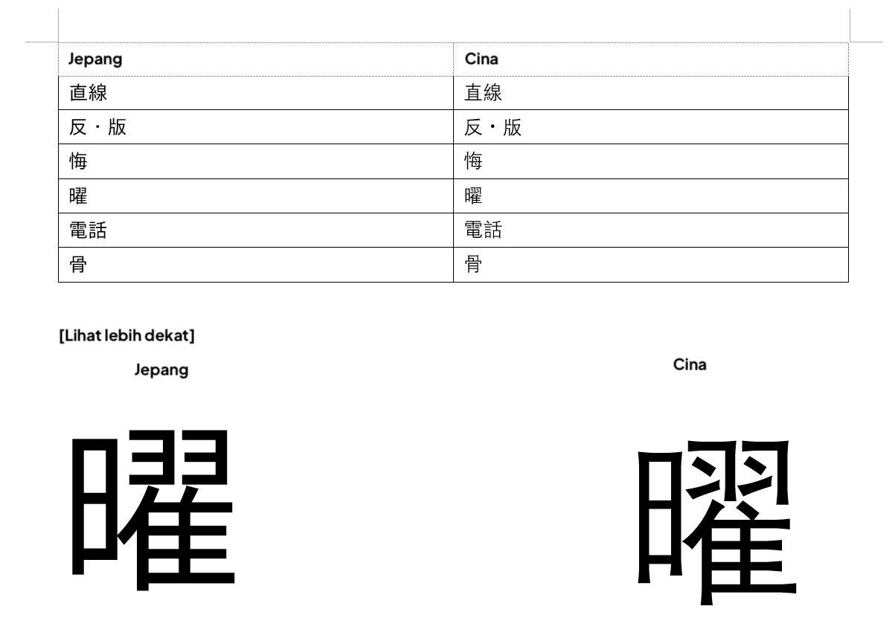
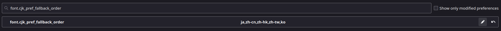
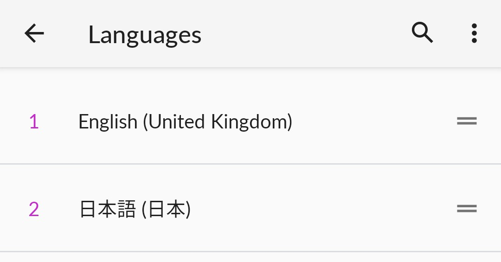

# Apakah kamu sudah pakai font yang benar? 

??? warning "Perhatian <small>(klik di sini)</small>"
    - Panduan ini adalah terjemahan dari [TheMoeWay](https://learnjapanese.moe/font/) dengan beberapa pengubahan referensi dan lokalisasi sumber Bahasa Indonesia

    - Jika kamu bisa bahasa inggris, kamu bisa kunjungi panduan di sana



Secara default, komputer / HP kamu biasanya bakal nampilin kanji pakai font China. Kanji Jepang itu bentuknya sedikit beda, dan bisa jadi masalah kalau kamu kebiasaan lihat bentuk kanji versi China, bukan versi Jepangnya.  

**Cara cek apakah browser kamu udah pakai font Jepang**  

Salah satu karakter yang kelihatan banget bedanya antara font Jepang dan China adalah [直](https://jisho.org/search/%E7%9B%B4%20%23kanji) yang dipakai di kata [直す](https://jpdb.io/search?q=%E7%9B%B4%E3%81%99) (*naosu*) yang artinya *menyembuhkan, memperbaiki, membetulkan*.  


<div style="display: flex; gap: 20px;">
  <figure style="text-align: center;">
    
    <figcaption>Naosu di font China (DengXian)</figcaption>
  </figure>

  <figure style="text-align: center;">
    
    <figcaption>Naosu di font Jepang (IPAex Gothic)</figcaption>
  </figure>
</div>

Kalau 直 kamu bentuknya kayak gambar kedua, selamat! Berarti kamu udah pakai font Jepang. Kalau belum, ganti font kamu.  

## Windows 10

Tekan ++win+i++ buat buka **Settings** > **System** > **Optional features** > **Add a feature** > Cari **"Japanese supplemental fonts"** terus **Install**  

??? tip "Buat yang mau cara advanced: Powershell"
	Font Jepang juga bisa diinstal lewat **Windows Powershell (Administrator)**:
	```powershell
	Get-WindowsCapability -Online -Name Language.Fonts.Jpan~~~und-JPAN* | Add-WindowsCapability -Online
	```  
	Nggak perlu restart.

??? question "Kamu juga punya Chinese supplemental fonts?"
	Kamu harus ubah locale ke Japanese (Japan).
	!!! abstract "Cara ganti locale ke Jepang"
		1. Buka kotak dialog Run dengan ++windows+r++
		2. Ketik `intl.cpl` lalu tekan ++enter++
		3. Klik tab *Administrative*, pilih *Change system locale...*, terus pilih **Japanese (Japan)** lalu klik OK.
		
Kalau kamu pakai browser berbasis Chromium (contoh: Google Chrome, Brave, Thorium), buka Menu :material-dots-vertical: > **Settings** > klik **Appearance/Content (Brave)** di kiri > **Customize fonts**.  

Atur kayak gini:  
- Standard font: Meiryo UI  
- Serif font: Yu Mincho  
- Sans-serif font: Meiryo  
- Monospace: MS Gothic   

Kalau pakai Firefox, biasanya udah otomatis diatur.  

## macOS

Cukup tambahin bahasa Jepang sebagai bahasa preferensi di System Preferences.  
 > System Preferences > Language & Region > General > Add a language > pilih Japanese 日本語  

## Linux

Kamu harus punya `ja_JP.UTF-8` sebagai salah satu locale. Kalau belum ada, hilangkan tanda komentar di baris `#ja_JP.UTF-8 UTF-8` dalam file `/etc/locale.gen` lalu jalankan:

``` bash
sudo locale-gen
```

Sekarang pasang paket [noto-fonts-cjk](https://archlinux.org/packages/extra/any/noto-fonts-cjk/). Paket ini tersedia di repositori resmi Arch dan sudah dikenal bisa otomatis mengatur aturan fontconfig yang diperlukan ketika diinstal di Arch.  

Kalau _**ada bagian**_ dari proses di atas yang nggak cocok buat kamu (misalnya distro beda, font beda, cara instalasi beda), fontconfig bisa jadi sudah atau belum diatur dengan benar.  
Kalau nggak tahu cara cek, bikin aja file baru berisi aturan fontconfig yang diperlukan di direktori `~/.config/fontconfig/conf.d` (buat direktori ini kalau belum ada) khusus untuk teks Jepang. Kamu bisa pakai [bagian ini](https://wiki.archlinux.org/title/Font_configuration/Examples#Japanese) dari Arch Wiki atau [file contoh config yang keren ini](https://github.com/tatsumoto-ren/dotfiles/blob/main/.config/fontconfig/conf.d/99-japanese-fonts.conf) dari tatsumoto-ren sebagai referensi.  

#### Catatan

#### Browser

##### Chromium-based

Kadang font China masih aja muncul walaupun setting udah bener (entah kenapa), jadi kamu mungkin harus maksa ganti dengan cara ini:
 
:material-dots-vertical: > **Settings** > klik **Appearance** di sebelah kiri > **Customize fonts**

Standard font: Noto Sans CJK JP Regular  
Serif font: Noto Serif CJK JP Regular  
Sans-serif font: Noto Sans CJK JP Regular  

##### Firefox

Kalau Firefox nggak diset salah satu bahasanya ke Jepang atau halaman web (atau sebagian halamannya) nggak secara eksplisit nyantumin `lang="ja"`, biasanya dia bakal fallback ke font China. Ini karena font China umumnya punya cakupan karakter lebih lengkap.  
Biar nggak begitu, lakukan ini:

1. Buka tab baru ke `about:config`
2. Lewati halaman peringatan (kalau muncul)
3. Cari `font.cjk_pref_fallback_order`
4. Pindahkan `ja` ke posisi paling depan di value tersebut

!!! warning "Koma penting banget"
	Koma ini memisahkan kode bahasa di value itu, jangan sampai kehapus.

Sebelum:


Sesudah:


## Android

Cukup tambahkan bahasa Jepang (tulisannya 日本語) sebagai bahasa kedua, ini nggak bakal bikin bahasa tampilan berubah kecuali kamu geser ke urutan teratas.  



## iOS

Tambahin keyboard Jepang (boleh kana atau romaji, terserah yang nyaman) udah cukup.  

## Anki

Menurutku font China di kartu Anki paling parah tampilannya, soalnya kana bisa jadi pake sans-serif sementara kanji pake serif, terus ukurannya nggak proporsional, DAN tampilannya ala China, jadinya aneh banget.

<figure>
  
  <figcaption>Ya Tuhan. Seriusan banyak kartu orang yang tampilannya kayak gini.</figcaption>
</figure>

Kalau font Jepang udah diinstal di sistem, harusnya Anki otomatis pakai font Jepang. Kalau nggak, kamu bisa paksa ganti.  

### Paksa font Jepang di Anki

IPAex Gothic adalah font sans-serif Jepang yang bagus dan aku rekomendasiin buat Anki. Bisa diunduh [di sini](https://moji.or.jp/wp-content/ipafont/IPAexfont/ipaexg00401.zip).  

Instal font-nya di sistem lalu restart.  

Windows: Klik dua kali dan pilih Install  
macOS: Seret font ke Font Book  
Linux: Pindahkan file ke `~/.local/share/fonts/` lalu jalankan `fc-cache -f -v`  

Sekarang di Anki klik "Add", lalu "Cards", lalu "Styling" dan atur font-family sesuai font yang dipasang.  

```css
.card {
 font-family: IPAexGothic; /* di sini font diset */
}
```

Kamu juga bisa ganti font dengan cara taruh font tersebut ke dalam direktori `collection.media` di Anki.

Windows: `C:\\Users\\<user>\\AppData\\Roaming\\Anki2\\(profile)\\collection.media`  
macOS: ` ~/Library/Application Support/Anki2/(profile)/collection.media`  
Linux: `~/.local/share/Anki2/(profile)/collection.media`  
Android: `/storage/emulated/0/AnkiDroid/collection.media`  

Sekarang di Anki klik "Add" lalu klik "Cards" lalu "Styling" dan ubah font family sesuai yang kamu mau.

!!! warning "Jangan copas persis!"
    Tambahkan aja yang belum ada di setting kamu.

```css
.card {
 font-family: CustomFont; /* ini tempat kamu set font */

 @font-face { 
 \tfont-family: CustomFont; src: url('ipaexg.ttf'); } /* ini tempat kamu define font */

}
```

Preview:

<figure>  <figcaption>Dengan definisi full bahasa Jepang.</figcaption> </figure> <figure>  <figcaption>Dengan definisi bilingual.</figcaption> </figure>
Sekarang ganti juga font untuk editor di Anki. Klik "Add" lalu "Fields" dan ganti Editing font di setiap field ke salah satu dari ini (atau font Jepang lain yang kamu tahu):


IPAexGothic  
Meiryo  
MS Gothic  
Yu Gothic  
Hiragino Kaku Gothic Pro  
Noto Sans CJK JP Regular  

# Yomitan

Font di Yomitan seharusnya ngikut font browser kamu, tapi kalau nggak, kamu bisa paksa pakai font Jepang.

Pakai Popup CSS...

```css
.kanji-link {
   font-family: IPAexGothic;
}

.source-text {
   font-family: IPAexGothic;
}

.gloss-content {
   font-family: IPAexGothic;
}

.tag-label-content {
   font-family: IPAexGothic;
}
```  


<figure>
  
  <figcaption>Definisi Jepang ke Jepang dengan font IPAexゴシック.</figcaption>
</figure>


