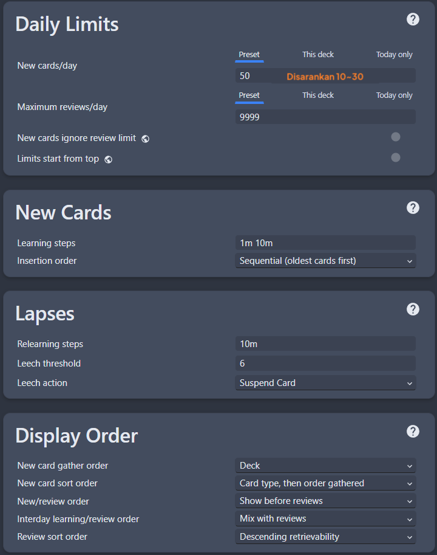
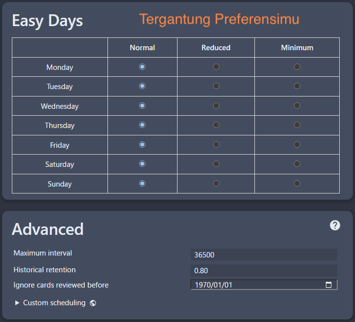
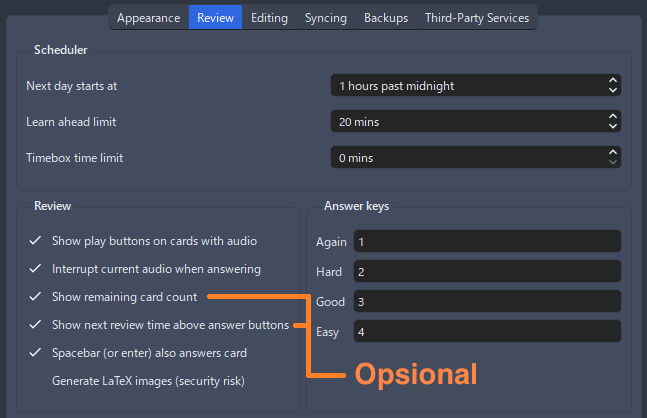

---
hide:
  - footer
---
# Panduan Ringkas Belajar Bahasa Jepang

??? warning "Perhatian <small>(klik di sini)</small>"
    - Panduan ini adalah terjemahan dari [LazyGuide](https://lazyguidejp.github.io/jp-lazy-guide/conciseGuideToJumpstartJP/) dengan beberapa pengubahan referensi dan lokalisasi sumber Bahasa Indonesia

    - Jika kamu bisa bahasa inggris, silakan kunjungi panduan di sana

- Panduan super singkat buat ngelawan panduan lain yang isinya tembok teks dan link ke hal-hal berbayar yang sebenernya nggak perlu, apalagi buat pemula yang malah bikin makin bingung

- Aku lulus JLPT N2 (2022) waktu nulis ini dan pendapatku masih sama sampai sekarang

## Tips

??? tips "5 Tips buat Pemula <small>(klik di sini)</small>"
    - `Konsisten dan fokus itu kuncinya`, nggak ada trik lain yang beneran manjur

    - `Jangan bandingin dirimu sama orang lain`, jangan nyerah, jangan percaya sama yang bilang bisa jago dalam waktu cepat

    - Lakuin aja, `banyak orang malah lebih banyak mikir daripada beneran mulai`, kamu nggak akan pernah siap kalau nggak mulai-mulai

    - `Waktu/Jumlah yang ditulis di sini nggak saklek`, meskipun kamu butuh waktu 10x lebih lama atau lebih cepat dari yang aku tulis, itu cuma patokan dasar aja

    - Nggak, `kamu nggak bodoh/terlalu tua`, kalau kamu bisa belajar bahasa ibu kamu, kamu juga bisa belajar bahasa lain, bahkan burung beo aja bisa

---

## Langkah-Langkah

1. Belajar `Kana`; [Hiragana](https://youtu.be/icK6kVTegDA/)(duluan) lalu [Katakana](https://youtu.be/5lC9rhjrHxU?/)(setelahnya)
    - `Pelajari 15 Kana baru per hari`
    - Kamu bisa lewati penjelasan panjangnya, langsung ke bagian `mempelajari hurufnya`
    - Langsung kerjain [Kana Quiz](https://kana-quiz.tofugu.com/) `setiap kali udah belajar +5 kana`, kasih jeda antar review, misalnya 15 menit / 30 menit / 1 jam / 8 jam
    - Harusnya selesai dalam waktu 2 minggu

2. Download [Anki](https://apps.ankiweb.net/) dan [add-on Anki](https://drive.google.com/drive/folders/1dfmYAp0eg_bhhAkohUISYaS6B6QOBtww?usp=sharing) punyaku
    - Extract ([?](https://www.webhostinghub.com/help/learn/website/managing-files/extract-file)) `Anki add-on`-nya (Password: `lazyguide`) terus paste ke folder:
        - Windows: `C:\Users\YourUser\AppData\Roaming\Anki2`
        - Mac    : `/Users/macbookair/Library/Application Support/Anki2/addons21`
    - Restart `Anki` kamu

3. Download [Kaishi.1.5k.apkg](https://github.com/donkuri/Kaishi/releases/latest) (`deck kosakata 1.5k`) atau [Kaishi 1.5k Indonesia Simplified.apkg](https://github.com/yaaacha/Yaacha-Anki-Deck-Archive/blob/main/Kaishi%201.5k%20Indonesia%20Simplified.apkg) terus buka filenya
    - Waktu ngerjain deck-nya, cukup pake tombol `again (1 = aku nggak tahu jawabannya)` atau `good (spasi atau 3 = aku tahu jawabannya)`, jadi kamu nggak perlu mikir mau `easy (2)` atau `hard (4)`

4. Masuk ke menu `Deck` > klik ikon gear > salin [pengaturannya](conciseGuideToJumpstartJP.md/#__tabbed_1_1) di bawah
    - (Bar Menu - Kiri Atas) `Tools` > `Preferences` dan sesuaikan dengan [pengaturan ini](conciseGuideToJumpstartJP.md/#__tabbed_1_5)

    ??? info "Pengaturan Anki <small>(klik di sini)</small>"
    
        === "Pengaturan 1"
            {height=300 width=600}
        === "Pengaturan 2"
            {height=300 width=600}
        === "Pengaturan 3"
            {height=300 width=600}
        === "Pengaturan 4"
            {height=300 width=600}
        === "Pengaturan Preferences Anki"
            {height=300 width=600}

5. Kerjain `Deck Kosakata Kaishi 1.5k`, mulai dengan `10 kartu baru/hari` (maksimal 30; jangan berlebihan) barengin juga dengan `panduan grammar` di `langkah 6`;
    - Kanji udah ada di deck ini; motonya adalah `belajar kosakata, bukan kanji terpisah`

6. Pakai salah satu: [Panduan Grammar Teks Tae Kim](https://guidetojapanese.org/learn/grammar/basic) atau [Panduan Grammar Video-nya Cure Dolly](https://www.youtube.com/playlist?list=PLg9uYxuZf8x_A-vcqqyOFZu06WlhnypWj) (Cukup 34 video pertama aja)
    - Nggak, kamu nggak perlu sempurna kerjain quiz-nya, `bahkan bisa dilewatin`
    - Yang penting itu `nangkep isi materinya` atau minimal tahu garis besarnya karena `kamu bakal balik lagi ke situ ratusan kali nantinya`
    - Untuk sumber belajar bunpou bahasa indonesia bisa cek [sumber daya di discord](https://discord.com/channels/1370274344571240552/1394673355910545471/1394673744546369577)

7. Setelah selesai `Deck Kosakata Kaishi 1.5k` dan `Panduan Grammar Teks` atau `Panduan Grammar Video`, sekarang kamu bisa mulai `mining` dan `melakukan immersion beneran`
    - Ini `biasanya butuh waktu 2-4 bulan` tergantung usaha kamu buat bisa mulai immersion

8. Saat immersion kamu bisa cek cepat `poin grammar` dari [DoJG](https://dojglite.github.io/main/) (Pemula) dan [Nihongokyoshi](https://nihongokyoshi-net.com/jlpt-grammars/) (Menengah+)
    - `Baca/tonton hal yang kamu suka`, tapi cukup sampai level kesulitan sedang aja, atau 4-5/10 di [jpdb](https://jpdb.io/), awalnya bakal berat banget, tapi lakuin aja

9. Buka [Panduan Lazy Mining](index.md) yang aku bikin buat setup gampang alat mining terbaru buat semua jenis media
    - Mining = proses `bikin kartu dari media` yang kamu pakai buat immersion, tools-ku `bisa bikin mining cukup dengan sekali klik`

---

### Penutup

- Ini `versi yang super disederhanakan`, jadi emang nggak lengkap, langsung aja jalanin sambil belajar, kalau bingung bisa tanya di server-server Japanese Immersion atau cari aku di Discord

- `Nggak ada buku teks omong kosong`, `nggak perlu langganan`, dan nggak usah terjebak bertahun-tahun belajar doang sambil mikir kamu belum siap, karena kamu nggak akan pernah siap kalau nggak mulai immersion
