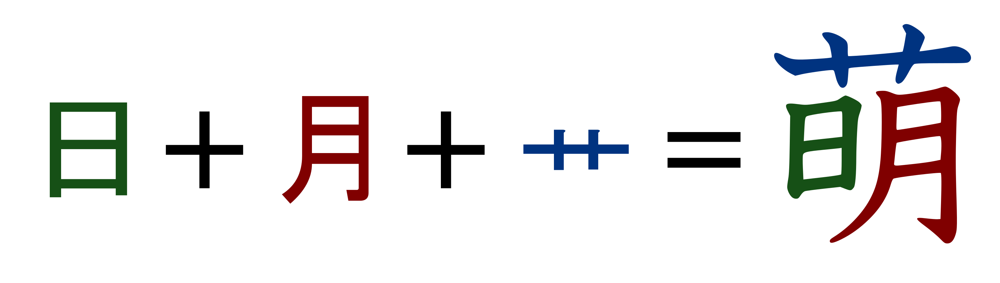

# Panduan Bahasa Jepang

??? warning "Perhatian <small>(klik di sini)</small>"
    - Panduan ini adalah terjemahan dari [TheMoeWay](https://learnjapanese.moe/guide/) dengan beberapa pengubahan referensi dan lokalisasi sumber Bahasa Indonesia

    - Jika kamu bisa bahasa inggris, kamu bisa kunjungi panduan di sana

*Kalau kamu nggak butuh pengantar, langsung aja loncat ke [2.1 Cara belajar bahasa Jepang](#21-cara-belajar-bahasa-jepang)*  

## 1.1 Kenapa banyak orang “gagal” belajar bahasa Jepang

Banyak orang punya tujuan sederhana waktu belajar bahasa Jepang: biar bisa menikmati konten Jepang yang belum diterjemahin dan bisa ngomong bahasa Jepang lancar. Hampir semua orang jawabannya mirip kalau ditanya soal tujuan belajar. Tapi kenyataannya, banyak juga yang gagal nyampe ke tujuan itu bahkan setelah bertahun-tahun belajar. Apakah bahasanya terlalu susah? Atau mereka nggak cukup giat belajar?

Menurutku, sebenarnya ini bukan sepenuhnya salah mereka, tapi salah metode belajarnya. Dalam belajar bahasa, metode yang dipakai itu punya pengaruh besar banget ke progres yang bakal kamu capai.

Ternyata, mencapai tujuan tadi itu nggak bisa dilakukan cuma dengan metode belajar bahasa Jepang “tradisional”. Banyak pelajar yang akhirnya gagal karena mereka nggak masukin satu elemen penting dalam rutinitas belajar mereka, yaitu **immersion**. **Immersion** maksudnya adalah mendengar atau membaca konten asli yang dibuat untuk penutur asli bahasa tersebut. Misalnya, anime itu aslinya memang dalam bahasa Jepang tanpa subtitle, jadi kalau dinikmati dalam bentuk aslinya, itu yang disebut immersion.

## 1.2 Masalah dengan metode tradisional

{:  style="display: block; margin: 0 auto; max-width:40%; height:auto;" }  

Seorang pembelajar bahasa Jepang yang ngikutin metode belajar “tradisional” biasanya bakal lewat langkah-langkah kayak gini:

- Belajar alfabet (hiragana, katakana, dan kadang langsung kenalan sama kanji).
- Belajar kalimat-kalimat dasar kayak salam atau perkenalan diri.
- Belajar struktur bunpou dasar dan kosakata dasar.
- Nyusun kalimat sendiri, entah lewat ngobrol sama tutor/partner belajar, atau lewat nulis.
- Menerjemahkan kalimat contoh dari bahasa ibu ke bahasa target dan sebaliknya.
- Cari materi tambahan soal struktur bunpou dan kosakata dari buku teks atau video YouTube yang direkomendasiin tutor.
- Latihan ngobrol pakai pengetahuan yang udah dipelajari.
- Ngumpulin lebih banyak kosakata dan struktur bunpou, yang biasanya dijadiin ukuran progres belajar.
- Dan terakhir, di tahap “endgame”, pindah atau liburan ke Jepang dengan harapan bisa punya banyak kesempatan latihan langsung.

Semua langkah itu sebenarnya nggak salah—malah bisa dibilang udah cukup oke buat belajar. Tapi sayangnya, itu aja nggak cukup buat bikin kamu sampai di level kemampuan yang tinggi. Masalahnya, mereka sebenarnya nggak benar-benar berinteraksi sama bahasa aslinya—nah, maksudnya “bahasa asli” di sini apa?
Kita ambil contoh renang. Kamu nggak bisa cuma main di kolam anak pake pelampung dan berharap jadi pro di kolam anak dulu sebelum coba berenang di kolam yang beneran. Itu nggak akan bikin kamu jadi perenang hebat. Kamu juga nggak bisa berharap jadi jago berenang cuma dengan belajar teori teknik renang secara terpisah dan latihan tanpa pernah nyemplung ke kolam beneran.

Contoh yang mungkin lebih nyambung: game kompetitif. Kamu nggak akan jadi jago cuma dengan main lawan AI atau nge-grind di training mode seharian. Kamu harus main di game yang sebenarnya lawan orang lain, walaupun kamu pikir bakal kalah telak. Ini yang namanya "main beneran", tanpa basa-basi.  

  Penting banget buat belajar gimana caranya lanjut ke tahap berikutnya!

Salah satu jebakan umum yang dialamin pelajar bahasa adalah terlalu lama ngendon di materi level pemula.  

Mereka pengen pastiin udah paham semua detail dasar sampai-sampai nolak buat nyentuh bahasa aslinya. Mereka nggak mau nyoba hal-hal yang bikin nggak nyaman karena takut banget nggak paham apa-apa. Kadang mereka ngerasa “belum siap”. Padahal penting banget buat ninggalin materi pemula secepatnya, karena kenyataannya kamu nggak akan pernah “siap” sampai bener-bener mulai berinteraksi sama bahasa aslinya dan membiasakan diri dengannya.  

Perfeksionisme itu bisa jadi pedang bermata dua dalam belajar bahasa. Aku sendiri perfeksionis, dan sering malah lebih banyak rugi daripada untung gara-gara terlalu pengen nguasain detail-detail kecil yang sebenernya nggak begitu penting kalau dilihat dari gambaran besarnya.  

Belajar bahasa itu kayak nanjak gunung. Kamu bisa nyoba manjat gunung tanpa alat bantu sama sekali, dan meskipun bakal susah banget, kalau terus berusaha kamu akan sampai juga. Belajar tradisional itu kayak bikin tali biar manjatnya lebih gampang, tapi kamu nggak akan bisa sampai puncak cuma dengan bikin tali doang! Pada akhirnya kamu tetep harus mulai manjat, karena nggak peduli seberapa panjang tali yang kamu buat, nanjak gunung itu tetep bakal susah dan makan waktu.

## 1.3 Skala sebuah bahasa

Bahasa itu… luas banget. Ada begitu banyak hal di dalamnya yang jauh melampaui batasan kelas atau aplikasi belajar bahasa yang cuma ngajarin dengan format "x artinya y" atau "x dipakai buat y". Buat bener-bener menguasai bahasa di level tinggi, kamu butuh pengalaman yang super banyak dalam membaca dan dengerin apa yang diucapin penutur asli.

Seringkali susah banget buat ngerti kenapa mereka pakai *frasa itu* di *konteks ini*, atau *kata ini* bukannya *kata itu*… Hal ini jadi semacam tembok penghalang buat kita sebagai pelajar, soalnya kita nggak bisa cuma belajar bunpou dan kosakata terus berharap bisa ngomong selancar penutur asli.

Kalau belum punya pengalaman yang cukup, nyoba bikin kalimat dalam bahasa target biasanya hasilnya jadi aneh, atau susah dipahami. Sebaliknya, kurangnya pengalaman liat gimana penutur asli make bahasanya bikin kita juga susah ngerti mereka, karena nggak familiar sama cara ngomong yang di luar jangkauan materi pembelajaran.

Itulah kenapa di rutinitas belajarmu, **kamu perlu yang namanya "immersion"—membaca dan mendengar apa yang ditulis dan diucapkan penutur asli.**

Belajar bahasa itu proses menghafal pola secara bawah sadar lewat *comprehensible input*. Maksudnya gini, pas kamu ngerti sesuatu (comprehensible) dalam immersion-mu (input), otak kamu secara otomatis nyimpen pola itu buat dipakai lagi nanti. Contohnya, kamu bisa baca panduan ini dengan nyaman karena kamu udah punya segudang pengalaman baca Bahasa Indonesia, jadi waktu kamu baca ini, otakmu mikirnya kayak, "Oh, ini pola #234 dipake bareng pola #82 sama pola #10!".  

Dan karena kamu udah mahir baca Bahasa Indonesia, proses itu jadi otomatis banget. Kamu bisa ngerti kata-kata di kalimat ini. Kamu bisa ngerti apa yang nyambungin kalimat-kalimatnya. Bahkan kamu bisa ngerasain nada dan tingkat formalitas dari tulisanku, dan semua itu berkat otak kamu yang nyimpen konteks dan informasi lain dari semua pola bahasa yang udah pernah kamu temui.

Perhatiin deh, aku nggak nyebut hal-hal mengenai "nguasain bunpou" atau "ngapalin kosakata" sama sekali. Soalnya kamu nggak memproses bahasa secara natural dengan cara itu. Beberapa pembaca mungkin bahkan bukan penutur asli dan dulu pernah belajar Bunpou bahasa Indonesia, tapi hampir pasti mereka nggak mikirin itu secara sadar setiap kali ketemu Bahasa Indonesia sehari-hari.

## 1.4 Berdamai dengan kenyataan kalau awalnya bakal jelek

{:  style="display: block; margin: 0 auto; max-width:40%; height:auto;" }  

Dalam belajar bahasa, atau hal lain yang butuh skill, kamu hampir pasti bakal mulai dari fase susah banget dan berjuang lama sebelum akhirnya jadi lebih jago. Kayak yang udah aku sebut sebelumnya, banyak pelajar (termasuk aku sendiri) yang jatuh ke jebakan pengen menguasai sesuatu dulu sebelum nyoba praktik langsung sama hal yang sebenarnya perlu mereka kerjain.  

Misalnya, ada murid yang ribet banget sama satu bagian bunpou sampai kelamaan, dan akhirnya nggak sempet pindah ke hal lain yang sebenernya lebih worth buat waktunya.

<h3>↑ Nah ini nih yang harus kita hindari.</h3>  

Kita harus mulai biasain diri buat ngelepasin hal-hal kayak gitu dan langsung ngerjain apa yang emang perlu kita lakuin.  

Iya, kamu nggak bakal langsung ngerti isi buku atau anime itu 100% di percobaan pertama, tapi belajar emang nggak gitu caranya. Butuh percobaan ketiga, keempat, kelima, bahkan keenam buat bener-bener paham sesuatu.

---

## 1.5 Jadi… apa sih "immersion" itu?  

Immersion itu ketika kamu berinteraksi sama konten alami dalam bahasa target. Maksudnya, konten yang **BUKAN** dibuat atau dipilih khusus buat pelajar. Konten yang juga dikonsumsi sama penutur asli bahasa itu.  

Kalau kamu lagi belajar bahasa Indonesia, baca panduan ini sekarang berarti kamu lagi "ngelakuin immersion bahasa Indonesia", soalnya panduan ini nggak disederhanain atau dibikin khusus buat pelajar bahasa Indonesia. Ini ditulis buat orang yang udah penutur asli atau udah jago bahasa Indonesia.  

Jadi, kalau kamu dengerin atau baca konten bahasa Jepang yang juga biasa dikonsumsi orang Jepang, berarti kamu lagi ngelakuin immersion.  

Secara teknis, ini biasanya disebut *input*, tapi aku pribadi lebih suka nyebutnya *immersion*.

## 1.6 Pendekatan top-down dalam belajar  

Belajar bahasa itu butuh siap mental buat nggak ngerti semua hal.  

Ini beda banget sama cara belajar konvensional di sekolah, di mana perfeksionisme dihargai dan nilai kamu diukur pake kriteria yang kadang asal-asalan atau diukur lewat ujian.  

Biasanya, yang sering kejadian waktu pelajar bahasa coba berinteraksi sama bahasa aslinya—entah itu nonton serial TV, baca buku, atau bahkan cuma ngobrol biasa sama penutur asli—mereka gampang banget patah semangat karena nggak ngerti semuanya, atau malah hampir nggak ngerti sama sekali. Wajar sih, soalnya kelihatannya kayak nggak masuk akal buat lanjut kalau pahamnya cuma dikit. Tapi, kayak yang udah dijelasin sebelumnya, belajar bahasa itu kayak langsung nyebur ke kolam yang dalam.  

Yang bikin belajar bahasa beda dari mata pelajaran sekolah adalah karena ini terlalu bergantung sama penggunaan di dunia nyata dan alami, yang nggak mungkin bisa sepenuhnya dicakup sama materi belajar.  

Jadi, satu-satunya cara buat terbiasa adalah dengan berdamai sama kenyataan kalau tingkat pemahaman kita awalnya rendah. Semakin sering kita berinteraksi sama bahasanya, makin cepet juga kita berkembang.  

Tentu aja, kamu nggak bakal cuma ngelakuin immersion tanpa bantuan sama sekali. Kamu juga bakal belajar bunpou dan kosakata dasar di luar itu, plus pake kamus buat ngerti kata-kata yang kamu temuin dari immersion-mu.  

## 2.1 Cara belajar bahasa Jepang

### Proses belajar untuk pemula  
Proses belajar untuk pemula biasanya terdiri dari:

- Belajar *hiragana* dan *katakana*, yaitu dua dari sistem tulisan dalam bahasa Jepang.  
- Belajar kosakata dasar dan *kanji*-nya dengan program bernama *Anki*.  
- Belajar bunpou lewat playlist di *YouTube*.  
- Mulai immersion dengan konten yang gampang dan punya tingkat repetisi tinggi. Nantinya, sebagian besar waktumu bakal habis di tahap ini.  

## 2.2 Hiragana dan Katakana  

<figure>
  
  <figcaption>"Hiragana" dan "Katakana" ditulis dalam bentuk tulisannya masing-masing.</figcaption>
</figure> 

*Hiragana* dan *katakana* adalah dua bagian dari sistem tulisan bahasa Jepang, dengan bagian ketiga adalah *kanji*.  

Sistem tulis bahasa Jepang lebih tepat disebut sebagai "silabari" daripada alfabet. Secara teknis, salah kalau nyebut ini alfabet, karena tiap karakter mewakili satu suku kata, bukan huruf vokal atau konsonan. Misalnya, 「か」 dibaca "ka".  

*Hiragana* dan *katakana* kalau digabung disebut "**kana**".  

*Kana* mewakili semua bunyi dalam bahasa Jepang. Secara teknis, kamu bisa aja nulis bahasa Jepang cuma pakai *kana*, tapi kenyataannya bahasa Jepang asli jarang ditulis begitu. Biasanya dipakai kombinasi *kana* (*hiragana* dan *katakana*) dan *kanji*.  

### Hiragana  
<figure>
  
  <figcaption>Contoh beberapa huruf hiragana. Ini belum semuanya.</figcaption>
</figure>  

*Hiragana* bisa dibilang sebagai "alfabet utama" dalam bahasa Jepang. Bentuknya melengkung dan terlihat imut dibandingkan jenis *kana* lainnya.  
Biasanya dipakai untuk:  

- Hal-hal yang bersifat gramatikal  
- Bagian dari kata yang berasal dari bahasa Jepang asli  
- Kata yang biasanya nggak ditulis pakai *kanji*  

Kadang juga dipakai untuk:  

- Nama orang  

---

### Katakana  
<figure>
  
  <figcaption>Contoh beberapa huruf katakana. Ini belum semuanya.</figcaption>
</figure>  

*Katakana* adalah versi *kana* yang bentuknya tajam dan kaku. Bunyi yang diwakili *katakana* sama persis dengan *hiragana*.  
Biasanya dipakai untuk:  

- Kata serapan atau kata pinjaman dari bahasa asing (misalnya dari bahasa Inggris)  
- Kata onomatope (bahasa Jepang banyak banget yang begini!)  
- Kata slang  

Kadang juga dipakai untuk:  

- Nama, terutama nama dari luar Jepang  

---

### Cara belajar *kana*  

#### Langkah 1 - Lihat tabelnya  

Pertama, coba lihat baik-baik tabel *kana* ini.  

<figure>
  
  <figcaption>
      Tabel lengkap huruf *kana* tunggal 
      <a href="/img/hiragana_katakana_LARGE.png" target="_blank">Lihat di browser</a> 
      <a href="/img/hiragana_katakana_LARGE.png" download>Unduh gambar</a>
  </figcaption>
</figure>  

Tabel ini bakal sangat berguna waktu kamu belajar membaca *kana*. Aku saranin kamu simpan tabel ini.  

Hal yang bisa kamu lakukan dengan tabel ini:  

- Belajar baca *kana* dengan mengacu ke tabel. Kolom mewakili bunyi vokal, dan baris mewakili bunyi konsonan. Karena 「か」 ada di baris K dan kolom A, jadinya dibaca "ka".  
- Belajar cara nulisnya dengan melihat urutan goresan (panah biru kecil dan angka di tiap huruf).  
- Gunakan sebagai referensi utama untuk semua *kana* tunggal. Ini bakal sangat ngebantu waktu kamu belajar membaca bahasa Jepang.  

#### Langkah 2 - Video YouTube  
<h3><a href="https://youtu.be/_wZHqOghvSs" target="_blank">Tonton video YouTube ini</a></h3>  
Ini adalah video berdurasi 2 jam tentang *hiragana* dan *katakana*. Video ini merupakan pengenalan yang bagus banget buat mulai belajar *kana*.  

---

#### Langkah 3 - Grinding  
Setelah itu, mainkan game grinding *kana* ini.  
<h3><a href="https://gohoneko.neocities.org/learn/kana" target="_blank">Game grinding kana</a></h3>  

<h4>Cara mainnya:</h4>  

1. Klik "show/hide options".  
2. Klik "check all" untuk *Hiragana*.  
3. Mulai tebak bagaimana cara *mengucapkan* huruf-huruf *hiragana*.  
4. Ulangi sampai kamu merasa yakin (bisa butuh beberapa hari atau minggu), lalu lakukan hal yang sama tapi dengan semua "Hiragana combinations" juga dicentang.  
5. Ulangi sampai yakin, lalu lakukan dengan semua "Katakana" dicentang, dan terakhir dengan semua "Katakana combinations" juga dicentang.  

Proses ini bisa memakan waktu sampai 3 minggu hingga 1 bulan tergantung orangnya. Jangan merasa down kalau bagian ini makan waktu lama, karena ada hal lain yang bisa dilakukan seperti beginner level *immersion*.  

---

#### Langkah 4 - Latihan membaca  

Hal lain yang sangat membantu menghafal *kana* adalah membaca kalimat yang ditulis dalam *kana*.  
Memang nggak semua bahasa Jepang ditulis dengan *kana*, dan di tahap ini kamu bakal kesulitan baca banyak hal tanpa pengetahuan *kanji*.  
Tapi kadang dalam bahasa Jepang, *kana* ditulis di atas *kanji* untuk membantu pembacaan. Ini disebut *furigana*.  

Contohnya kayak gini:  
<ruby>
  日本語<rp>(</rp><rt>にほんご</rt><rp>)</rp>
</ruby>.  
Artinya "bahasa Jepang" (*nihongo*). Aku tulis dalam bentuk *kanji* dan kasih *hiragana* di atasnya.  

Aku saranin kamu latihan membaca *kana* dengan mencoba baca Tadoku graded readers, yang bisa kamu temukan [di sini](https://tadoku.org/japanese/free-books/#l0).  

<strong><h3>Kamu nggak perlu paham artinya dulu sekarang. Tujuannya cuma biar makin lancar baca kana.</h3></strong> 

## 2.3 Kosakata & Kanji

### Kanji, si anak nyeleneh

<figure>
  
  <figcaption>80 kanji pertama yang diajarkan ke anak SD kelas 1 di Jepang.</figcaption>
</figure> 

*Kanji*, artinya "huruf Tionghoa", adalah salah satu sistem tulisan lain yang dipakai di bahasa Jepang. Mereka bersifat logografis dan jauh lebih kompleks serta bervariasi dibandingkan *kana*. Ada sekitar 2000 sampai 3000 kanji yang dipakai di bahasa Jepang. Tapi, jangan biarkan angka ini bikin kamu ciut nyali, karena *kanji* itu bukan sesuatu yang harus dipelajari dan digerus habis kayak *kana*.  

*Kana* itu **konsisten secara fonetik** dan jumlahnya sedikit, jadi bisa dipelajari terpisah dan dikuasai dalam waktu singkat. Tapi *kanji* enggak begitu. Cara pakainya juga beda, dan nggak selalu logis. Maksudnya gimana?

Contohnya begini. Karena *kana* mewakili bunyi dalam bahasa Jepang, kita bisa nulis apa aja sesuai bunyinya selama ada kana-nya, termasuk nulis kata bahasa Inggris.  

Bayangin kalau aku nulis kalimat bahasa **Inggris** "I am learning Japanese" tapi pakai *kana*, jadinya:
> "あい　あむ　らあにんぐ　じゃぱにいず"  

Jelas aja ini konyol dan nggak ada alasan kamu mau nulis begitu. Tapi maksudnya: kamu nggak bisa begitu aja ngelakuin hal ini dengan kanji tanpa bikin tulisannya jadi nggak kebaca dan nggak masuk akal. Terus kenapa kita pakai kanji? **Karena kata-kata.** Kata-kata itu pakai kanji, dan karena itu...    

Kanji cuma masuk akal kalau dipakai di dalam kata.  

Aku ulangi,

  Kanji cuma masuk akal kalau dipakai di dalam kata!

 

Setiap bahasa punya **banyak banget** kosakata, dan tiap kata punya arti yang berbeda. Bahasa Tionghoa dan Jepang entah kenapa memutuskan untuk pakai kanji buat nyusun kata-kata dengan makna yang beda-beda. Itulah kenapa jumlahnya banyak banget dan kenapa kamu nggak usah takut, karena mereka memang dipelajari barengan sama kata yang memakainya. Lagian... nggak ada orang yang mau ngafalin semua kosakata dulu sebelum belajar baca! Konyol kan.  

  Kanji itu bukan kata, tapi mereka bagian penyusunnya.  

 

Belajar baca bahasa Jepang itu ada langkah ekstra; gara-gara kanji kamu harus sering banget buka kamus buat tahu cara bacanya.  
Contohnya gini, kalau aku kasih lihat kata **今日**, kemungkinan besar kamu nggak bisa baca, atau nggak tahu artinya. Cara belajarnya ya dengan nyari di kamus, misalnya [Jisho.org](https://jisho.org/).  
Di kamus tertulis bacanya **きょう**, dan artinya *hari ini*. Kalau kita harus nyari kata ini waktu lagi baca sesuatu, kita simpan info itu di otak dan lanjut baca.  
Ribet sih... tapi ada tools kayak [Yomitan](setup-yomitan-pc-lazy-guide.md) yang bisa bantu cek definisi cuma dengan sekali klik. 

### Catatan tentang belajar kanji secara terpisah

Metode belajar kanji sudah jadi bahan perdebatan sejak pembahasan mengenai belajar bahasa Jepang itu ada. Salah satu masalah umum yang sering muncul saat pemula mencoba membaca bahasa Jepang adalah kanji kelihatan mirip-mirip satu sama lain dan bentuknya terasa nggak masuk akal.  

Padahal, walaupun terlihat kayak bentuk acak, kanji sebenarnya tersusun dari komponen-komponen umum. Contohnya kanji **萌**. Kanji ini sebenarnya terbentuk dari 3 komponen kanji umum yang juga dipakai di banyak kanji lainnya.  

   

Walaupun opsional, pelajar yang kesulitan membedakan kanji bisa mencoba belajar kanji berdasarkan komponen-komponennya secara terpisah. Ada *Anki deck* tambahan (dijelasin di bagian berikutnya) yang bisa dipakai buat ini. Kamu bisa ambil deck-nya [di sini.](https://mega.nz/file/2SJiWC4b#hL98qtC_hiLlQDg0LqVJoqD2-5ywT2Nwd4kjROY_KwQ) (Deck ini berbahasa inggris, saat ini, belum ada deck yang setara dalam bahasa Indonesia).  

## 2.4 Belajar Kosakata
Supaya lebih paham gimana kanji dipakai bareng-bareng dalam kata, aku sarankan kamu coba pakai deck kosakata level pemula untuk Anki. Deck ini isinya sekitar *1500* kata yang dirancang buat ngajarin kosakata Jepang paling umum supaya proses belajar Jepangmu bisa langsung ngebut.  

### Setup Anki Cepat
Anki itu program flashcard yang dirancang untuk membantu kamu mengingat banyak informasi, seperti kosakata.  

Kunjungi [halaman download Anki](https://apps.ankiweb.net/), lalu download Anki sesuai sistem yang kamu pakai dan install.  
<figure>
  
  <figcaption>Download yang sesuai sama sistem kamu.</figcaption>
</figure>  

Waktu pertama kali buka Anki, kamu akan diminta memilih bahasa tampilan, biarin aja di default (English).    

Deck pemula yang aku rekomendasi adalah [Kaishi 1.5k](https://github.com/donkuri/Kaishi/releases) yang bisa kamu download [di sini](https://github.com/donkuri/Kaishi/releases) (klik link `.apkg`).  

Setelah download selesai, import deck-nya dengan klik "Import file", pilih file yang sudah diunduh (.apkg), lalu klik Import di kanan atas.  

### Panduan Cepat Pakai Anki

Sebelum mulai belajar, aku sarankan ganti beberapa pengaturan dulu. Klik ikon roda gigi di sebelah deck, lalu masuk ke *Options*.  

Ubah *Maximum reviews/day* dari `200` jadi `9999`. Jangan kaget sama angkanya, review kamu kemungkinan nggak bakal nyampe segitu, ini cuma buat buka batas review harian biar pengalaman belajarnya maksimal.  

Untuk *New cards/day*, angka `20` kadang terlalu berat buat sebagian orang. Kalau kamu ngerasa nggak sanggup belajar 20 kata baru per hari, coba turunin ke `10` atau lebih rendah.  

Waktu pertama kali mulai belajar deck *Kaishi 1.5k*, kartu pertama biasanya kartu penjelasan. Kamu bisa hapus ini dengan klik "More" lalu "Delete Note".  

Anki membantu kamu mengingat sesuatu dengan mengetes pengetahuan yang ada di balik kartu. Yang dites di sini adalah apakah kamu tahu arti dan cara baca kata tersebut. Semua info lain di kartu hanya sebagai bantuan.  
Perlu dicatat kalau *Kaishi 1.5k* memang ada kalimat contoh, tapi tujuannya cuma buat ngajarin kata tunggal, bukan kalimat penuh.   

Kalau ketemu kartu Anki yang belum pernah kamu lihat, aturan umumnya adalah klik *Show Answer* biar lihat isi belakang kartu.  
<figure>
  
  <figcaption>Bagian-bagian informasi yang perlu kamu hafalkan.</figcaption>
</figure>  

Setelah melihat jawabannya dengan baik, tekan *Again* (artinya coba lagi). Lanjut ke kartu berikutnya, lakukan hal yang sama kalau itu kartu baru juga.  
Saat ketemu kartu itu lagi, di situlah waktunya tes pengetahuan. Coba ingat arti dan bacaan yang ada di belakang kartu, lalu nilai diri kamu sendiri!  

Cara menilainya begini:

- Bisa baca ✅ tau makna ✅ = Good/Pass
- Bisa baca ✅ tau makna ❌ = Again/Fail
- Bisa baca ❌ tau makna ✅ = Again/Fail
- Bisa baca ❌ tau makna ❌ = Again/Fail

Inilah inti cara kita belajar kosakata di tahap pemula.  

Setelah menyelesaikan kartu baru untuk hari itu, pastikan kamu balik lagi keesokan harinya untuk mengecek review harianmu!  

## 2.5 Bunpou

Belajar bunpou itu bisa terasa gampang sekaligus rumit. Ini bagian yang penting banget dalam belajar bahasa Jepang, dan walaupun awalnya mungkin terasa menakutkan, ada banyak sumber yang bisa bikin proses belajarnya lebih gampang.  
Proses belajar bunpou sebenarnya cukup simpel: ambil panduan, lalu baca atau tonton.    

Selama bertahun-tahun, banyak banget sumber belajar bunpou yang bermunculan, ada yang keren banget, ada juga yang kurang. Karena sifat topiknya, kadang satu sumber aja nggak cukup buat semua orang.

Berikut beberapa panduan yang aku urutkan berdasarkan seberapa aku rekomendasikan untuk pemula total. Kamu nggak perlu ngerjain semuanya, cukup pilih yang cocok buat kamu.

[Cure Dolly's Organic Japanese YouTube Playlist](https://www.youtube.com/playlist?list=PLg9uYxuZf8x_A-vcqqyOFZu06WlhnypWj) ([transkrip](https://docs.google.com/document/d/1XpuXerkGU8waJ4DPDNJA4bGeqOvM-csXjTe57iHARHc/edit))    
[Tae Kim's Guide to Japanese](https://gohoneko.neocities.org/grammar/taekim)  
[Japanese Ammo with Misa Grammar YouTube Playlist](https://www.youtube.com/playlist?list=PLd5-Wp_4tLqYZxS5j3g6kbeOfVXlTkr3N)    
[Sakubi](https://gohoneko.neocities.org/learn/anon/sakubi)  
[IMABI](https://imabi.org/)    

Waktu yang pas buat mulai immersion adalah setelah kamu belajar beberapa poin bunpou baru. Melihat gimana bunpou yang baru kamu pelajari dipakai dalam penggunaan asli akan sangat membantu memperdalam pemahamanmu.  

## 2.6 Immersion untuk pemula: perjuangan menanjak

Kalau kamu ingat dari bagian 1.3, aku sempat menyinggung tentang *comprehensible input*. Ini adalah input yang bisa dipahami di levelmu, di mana cuma ada beberapa potongan informasi yang hilang setiap beberapa kalimat. Dengan immersion model begini, otak kamu otomatis mengisi bagian yang nggak dimengerti dengan tebakan yang masuk akal berdasarkan konteks. Inilah yang bikin jenis input ini berguna banget buat belajar bahasa.

Sekarang, mungkin kamu nyadar ada masalah di sini. Gimana kalau kamu nggak punya akses ke *comprehensible input*?  
Sebagai pemula total, nggak ada konten yang mudah. Inilah alasan kenapa banyak orang terjebak di lingkaran tak berujung: lompat dari satu sumber belajar pemula ke sumber pemula lainnya. Walaupun *incomprehensible input* (input yang belum bisa dipahami) bukan berarti nggak ada gunanya—tetap ada manfaatnya dan bisa membantu belajar—tetap saja, susah banget buat ngelewatin rintangan awal itu.  

Nggak bisa ngerti konten yang pengen kamu nikmati itu nyebelin, kecuali kamu punya mindset tertentu: bisa menikmati proses dengan tahu bahwa kamu sedang berkembang, walaupun progresnya belum kelihatan. Tapi, susah mempertahankan mindset ini terus-menerus, jadi nggak bisa dijadikan satu-satunya motivasi untuk konsisten—padahal konsistensi itu kunci nomor satu buat menguasai skill apapun!  

Jadi gimana caranya biar kita nggak terus-terusan ngeri duluan waktu harus ngadepin konten yang susah dipahami?  

Jawabannya sebenarnya simpel banget: **Fun!** Sebuah media bisa tetap menghibur walaupun kita nggak ngerti bahasanya. Dengan memilih media yang memang menyenangkan terlepas dari level bahasanya, kita bisa tetap betah, semangat, dan termotivasi buat terus immersion. Lalu, seiring bertambahnya pengalaman bahasa, kita akan sadar bahwa kita semakin paham, dan target *comprehensible input* yang dulu terasa mustahil sekarang jadi hal biasa—dengan target baru justru mencari konten yang cukup menantang untuk bikin kita terus belajar.  

## 2.7 Cara melakukan immersion

### Membaca & Kamus

Biar baca bahasa Jepang nggak terlalu nyusahin, kamu bisa pakai ekstensi browser gratis bernama **Yomitan**. Tutorial cara pakainya ada [di sini](setup-yomitan-pc-lazy-guide.md).  

Kalau mau nyari arti kata satu per satu, kamu bisa pakai [Jisho.org](https://jisho.org/). Untuk aplikasi HP, ada [Akebi](https://play.google.com/store/apps/details?id=com.craxic.akebifree) di Android dan [Shirabe Jisho](https://apps.apple.com/us/app/shirabe-jisho/id1005203380) di iOS.  

### Memilih konten immersion

Jujur aja, pilih aja yang kamu mau. Bisa anime, film, J-drama, novel, light novel, manga, visual novel, game, atau video YouTube. Kalau belum ada ide, kamu bisa nonton [anime favoritku ini](https://hianime.to/watch/love-live-school-idol-project-1706?ep=22404). Yang penting, pastikan kamu *benar-benar* tertarik sama apa yang kamu pilih buat immersion!  

### Cara immersion dengan listening

Listening itu hampir sepenuhnya pendekatan *top-down* yang “mengandalkan intuisi”. Kita nggak mau mikir terlalu keras waktu mendengarkan. Biarkan mengalir aja sampai ketemu momen yang pas buat nge-pause dan nyari tahu sesuatu.  

Ada beberapa level listening:  
- **Level 1** → free-flow listening, di mana kamu membiarkan audio mengalir tanpa mencari arti apapun.  
- **Level 2** → nyari arti kata yang menarik perhatian sambil tetap memutar audio.  
- **Level 3** → pause setiap kali nemu kata yang nggak tahu, lalu cari artinya.  

Untuk tahap pemula sampai menengah, listening cukup di level 1 dan level 2. Jangan overthinking, nikmati aja momen-momen kecil yang kamu dapet.  

#### "Active" dan "Passive" listening

**Active listening** itu waktu kamu benar-benar fokus penuh ke apa yang kamu dengar. Misalnya, nonton anime sambil ngikutin visual dan dialognya. Di sinilah kemajuan kamu paling besar. Lakukan sesuai level listening sebelumnya. 

**Passive listening** itu saat kamu melakukan hal lain sambil ada audio Jepang yang diputar di latar belakang. Ini membantu kalau sesekali kamu mendengarkan sebentar-sebentar. Kalau kamu sibuk, passive immersion ini sangat membantu mengisi waktu-waktu kosong di mana kamu biasanya nggak melakukan hal yang berhubungan dengan bahasa Jepang.  

### Cara immersion dengan reading

Kalau listening sifatnya *top-down*, reading itu lebih *bottom-up* alias pelan-pelan dan “analitis”. Kamu bisa menghabiskan waktu sebanyak yang kamu mau untuk baca kalimat dan nyari arti kata. Pola prosesnya kira-kira begini:  
**baca → cari arti kata → reaksi (memahami kata/kalimat) → baca lagi → cari arti kata → (ulang)**.  

Awalnya bakal terasa kayak nabrak tembok terus, tapi ini memang cara membangun kemampuan membaca. Konten dengan komponen visual seperti anime dengan subtitle Jepang (lihat [UsagiSpoon](rutinitas-awal.md)), manga, atau visual novel bisa membantu kamu masuk ke dunia membaca dengan lebih mudah.  

### Rasio ideal antara listening dan reading

Di tahap pemula, aku sarankan rasio listening:reading itu 7:3. Soalnya listening adalah bentuk paling natural dari bahasa, jadi penting buat diprioritaskan supaya otak kamu bisa memproses bahasa Jepang secara alami.  

Kalau kemampuanmu sudah meningkat, kamu bisa turunin listening jadi 5:5 biar seimbang sama reading.  

## 2.8 Beginner learning loop

### Cara yang salah untuk melakukannya

!!! failure "Cara yang salah"
    Pelajari SEMUA kana, lalu pelajari SEMUA 1500 kosakata di Kaishi, lalu pelajari SEMUA bunpou sebelum akhirnya mencoba immersion untuk pertama kali...  

Ini adalah pendekatan yang buruk. Kamu harus melakukan sedikit demi sedikit dari semuanya hal tadi.  

### Cara yang benar untuk melakukannya  

Sambil kamu belajar kana, aku sarankan mulai masuk ke semangat immersion dengan mencoba menonton sesuatu dalam bahasa Jepang tanpa subtitle. Bisa apa saja yang kamu suka, dan kamu nggak perlu mengerti apa pun.  
Setelah itu kamu sebaiknya belajar kosakata dan bunpou secara bersamaan. Misalnya, coba targetkan 10 kosakata baru dan 2 poin bunpou per hari. Dan di hari yang sama, sempatkan juga untuk melakukan immersion.  

!!! question "Berapa lama sebaiknya immersion per hari?"
    Aku rekomendasikan sekitar 1 sampai 2 jam saat baru mulai. Nggak ada ruginya kalau mau immersion lebih lama, dan kamu akan lebih cepat berkembang kalau immersion-nya lebih banyak per hari.  

## 3.1 Tentang berbicara dan menulis (output)  

Banyak orang sering salah paham bahwa banyak berbicara dalam bahasa target adalah cara utama untuk menjadi lebih mahir, padahal sebenarnya yang paling bermanfaat adalah input — yaitu apa yang kita dengar dan lihat dari penutur asli menggunakan bahasa mereka.  
Walaupun output nggak secara langsung meningkatkan kemampuan bahasa kamu, output tetap penting untuk dilatih, baik lewat teks maupun berbicara, karena input dan output itu saling melengkapi. Melakukan output dengan efektif memaksa otak kamu untuk memastikan pemahaman kata-kata yang kamu dengar benar, dan kamu mungkin mulai secara nggak sadar mencari kesempatan untuk memakai apa yang kamu dengar dari input.  
Output rutin bersamaan dengan input rutin sangat direkomendasikan.  

Bertentangan dengan apa yang sering ditekankan oleh beberapa orang yang mempopulerkan metode belajar berbasis immersion, aku nggak percaya kalau menunda output sampai kamu “benar-benar jago” itu ide bagus, dengan alasan seperti “mengucapkan sesuatu yang salah akan ‘merusak’ atau ‘menghancurkan’ bahasa Jepang kamu”. Melakukan ini justru bikin kamu kehilangan banyak kesempatan untuk mendapatkan hal-hal yang bisa kamu pakai di output lebih awal, dan malah mencuci otak kamu ke pola pikir perfeksionis yang toxic, sampai jadi terlalu protektif terhadap bahasa Jepang kamu.  

Selama lebih dari 4 tahun aku menjalankan TheMoeWay dan ngobrol dengan berbagai macam pelajar immersion, aku jarang melihat yang benar-benar percaya diri dalam output. Kenapa begitu? Ya, kebanyakan dari mereka bahkan nggak mau mencoba output sama sekali karena takut ngomongnya berantakan, takut merusak bahasa Jepangnya, atau takut ditertawakan orang, dan lain-lain. Semua ini adalah produk dari pola pikir perfeksionis toxic yang merugikan pembelajaran immersion.  

## 3.2 Pelafalan & Pitch Accent

Kalau dibandingkan dengan komunitas bahasa dan sumber belajar untuk hampir semua bahasa lain, sumber belajar, tutor, dan pelajar bahasa Jepang cenderung menaruh pelafalan di urutan terakhir karena dianggap simpel. Memang, pelafalan bahasa Jepang itu sederhana, dan ya, kamu nggak perlu takut orang nggak ngerti maksudmu. Tapi, bisa jadi sebagian pelajar memang punya tujuan untuk punya pelafalan yang bagus.  

Aku akan masukin panduan ini ke daftar sumber belajar yang bilang kamu nggak perlu belajar pelafalan dengan menambahkan: kalau kamu nggak terlalu peduli soal terdengar “wah”, nggak usah ribet-ribet mikirin pelafalan.  

Buat pelajar yang mau usaha ekstra, bisa belajar soal *pitch accent* dan pelafalan IPA yang benar secara mandiri, idealnya sedini mungkin.

## 3.3 Capaian pembelajaran

Buat yang penasaran, ini perkiraan kemampuan bahasa Jepang yang bisa kamu harapkan setelah mencapai tahapan-tahapan ini:

- **10 anime raw**: Kamu mulai terbiasa banget dengar bahasa Jepang. Mungkin sekarang kamu udah bisa ngerti sebagian besar kalimat. Anime yang dulu kamu tonton di awal belajar bakal terasa *beda banget*!
- **25 anime raw**: Di tahap ini, dengar bahasa Jepang bakal terasa lebih natural dari sebelumnya.
- **50 anime raw**: Kalau kamu tetap konsisten belajar... di titik ini aku nggak bisa anggap kamu pemula lagi. Perbedaan kemampuanmu sekarang dibanding awal belajar bakal *jauh* banget!
- **1 novel full selesai**: Walaupun awalnya kamu kesusahan banget memahami isi buku ini, kamu mulai keluar dari tahap pemula. Buku berikutnya bakal terasa jauh lebih gampang.
- **5 novel selesai / 1 VN medium–panjang**: Aku nggak bakal anggap kamu pemula lagi. Kemampuan baca bahasa Jepangmu udah mulai solid.
- **10 novel / 2 VN medium–panjang**: Udah sepenuhnya masuk level menengah. Selamat!

## 3.4 Catatan penutup: tahap pasca-pemula dan seterusnya  

Sebenarnya, nggak banyak yang berubah dari proses belajar selain terus banyak-banyak immersion, belajar kosakata, dan bunpou. Dengan metode ini, kamu beneran bisa fasih bahasa Jepang. Tapi ada satu hal yang bakal berubah begitu kamu keluar dari tahap pemula.  

Belajar kosakata dengan Anki bakal jadi jauh lebih personal, karena kamu bakal bikin kartu sendiri dari kata yang kamu temukan saat immersion. Proses ini kita sebut *mining*. Panduan mining yang direkomendasikan adalah [Donkuri's mining guide](https://donkuri.github.io/learn-japanese/mining/). Mining pada dasarnya bakal jadi inti dari *belajar* bahasa Jepangmu.  

Makasih banget udah meluangkan waktu buat baca panduan ini, dan semoga sukses di perjalanan belajarmu!  

Kalau ada pertanyaan, silakan tanya langsung di server Discord kami.  

[Gabung Discord :fontawesome-brands-discord:](join.md){: .md-button }  

### Patreon

Kalau panduan ini bermanfaat buat perjalanan belajar bahasa Jepangmu, dukungan lewat Patreon bakal sangat dihargai!  

[:fontawesome-brands-patreon: Jadi patron](https://www.patreon.com/shoui){: .md-button }  

### Kontributor

Aku mau ngucapin terima kasih ke semua yang udah berkontribusi dalam pembuatan panduan ini:

iamatryhard  
shigatsunoraion  
qazsedctgb  
ktamashi  
kaio.n  
saegusa.mayumin  
pedipanol  
.ikki.  
ultravioletspring  
deviru  
kazuhira___  
marv.n  
