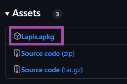
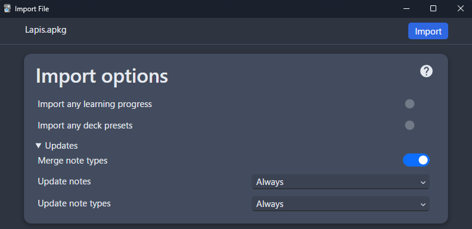

---
hide:
  - footer
---
# Memperbarui: Format Lapis

- Begini cara memperbarui Format `Lapis`, entah buat perbaiki bug atau sekadar update versi terbaru

!!!warning Pastikan backup dulu kartu-kartumu
    Kamu **wajib** `backup` deck-mu dulu buat jaga-jaga

    1. Di Anki, klik kanan pada `deck` kamu
    2. Pilih `Export`
    3. Pastikan opsi-opsi ini dicentang: `Include scheduling information`, `Include Deck presets`, `Include Media`

---

### Unduh dan Pasang

1. Unduh versi terbaru dari format [Lapis](https://github.com/donkuri/lapis/releases/latest)  
    - Scroll ke bawah ke bagian *Assets*, lalu cari file `Lapis.apkg`
    
    {height=150 width=300}

2. Pasang file `Lapis.apkg` ke Anki, lalu ikuti petunjuk di gambar bawah ini dan klik `Import`

    {height=300 width=600}

3. Hapus Deck `Lapis` dari layar utama (kalau sebelumnya kamu udah ganti nama deck lama jadi `Mining Deck`)

4. Beres deh!

---
