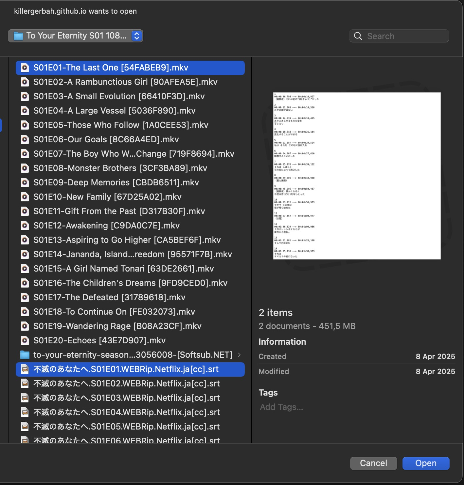

# Pengaturan Mining Anime di PC
---
## Permulaan

- `asbplayer` adalah pemutar video di browser yang bisa digunakan untuk menonton `anime` dan `subtitle`, lalu hover kata menggunakan `yomitan`.

---

## Unduh & Pasang

- Unduh `anime` dan `subtitle JP` kamu
    - Untuk subtitle JP, bisa ke [Jimaku](https://jimaku.cc/)

- (Opsional) Untuk video streaming, pasang ekstensi [asbplayer](https://chromewebstore.google.com/detail/asbplayer-language-learni/hkledmpjpaehamkiehglnbelcpdflcab)
!!! warning "Untuk Pengguna Firefox"
    Untuk pengguna Firefox, bisa instal [dari sini](https://addons.mozilla.org/en-US/firefox/addon/asbplayer-learn-with-subs/), tapi banyak fitur yang hilang, lihat [catatan ini](https://docs.asbplayer.dev/docs/compatibility).

Syarat:

- Sudah pasang Yomitan di PC

---

## Langkah-langkah

1. Di browser buka `chrome://flags` atau `edge://flags`
    - Cari `Experimental Web Platform features` lalu aktifkan

    {height=300 width=600}

2. Buka [asbplayer](https://killergerbah.github.io/asbplayer/)

3. Upload `anime` dan `subtitle` ke `asbplayer` lewat `browse`

    === "Upload File"
        {height=300 width=600}
    === "Pilih Anime & Subtitle"
        {height=300 width=600}

4. Sekarang kamu bisa mining pakai `Yomitan` dan asbplayer
    - Lihat [Demo Mining Anime](pengaturan-anime-pc.md/#info-1-demo-mining-anime)

Kamu sudah bisa mining anime di PC.

<small>Kalau ada masalah, cek [Pertanyaan Umum](pengaturan-anime-pc.md/##pertanyaan-umum)</small>

---

## Info Tambahan & Tips

#### Info 1: Demo Mining Anime

??? info "Demo Mining Anime <small>(klik untuk lihat)</small>"

    <iframe width="560" height="315" src="https://youtube.com/embed/1mOGv9hAHDc" title="Mining Demo" frameborder="0" allow="accelerometer; autoplay; clipboard-write; encrypted-media; gyroscope; picture-in-picture; web-share" allowfullscreen></iframe>

#### Tip 1: Sinkronisasi Subtitle

??? tip "Sinkronisasi Subtitle <small>(klik untuk lihat)</small>"

    Terkadang `subtitle` tidak sinkron karena beda sumber `anime`, untuk menyesuaikan:

    - +100ms - `CTRL + SHIFT + KIRI`
    - -100ms - `CTRL + SHIFT + KANAN`

#### Tip 2: Lewatkan Rekaman Audio saat Mining

??? tip "Lewatkan Rekaman Audio saat Mining <small>(klik untuk lihat)</small>"

    - Bisa lewati rekaman audio biar lebih cepat
    - Kalau kartu Anki kamu bisa dibuat <5 detik, audio rekaman hampir tidak terdengar

---

## Pertanyaan Umum

#### Pertanyaan 1: Kenapa harus aktifkan Experimental Web Platform?

??? question "Kenapa aktifkan fitur eksperimen? <small>(klik untuk lihat)</small>"

    - Beberapa anime punya banyak `audio`, kayak `jp` dan `en`, jadi kita bisa pilih `jp` kalau bukan default-nya

#### Pertanyaan 2: Aku ada eror, bisa cek di mana?

??? question "Aku ada eror tertentu saat mencoba menambang di ASBplayer <small>(klik untuk lihat)</small>"

    - Kamu bisa cek [_Common Issue_ di ASBplayer](https://docs.asbplayer.dev/docs/common-issues). Kalau masalahmu tidak ada di sana, kita diskusikan di [server](https://discord.com/channels/1370274344571240552/1376885138352242688)
