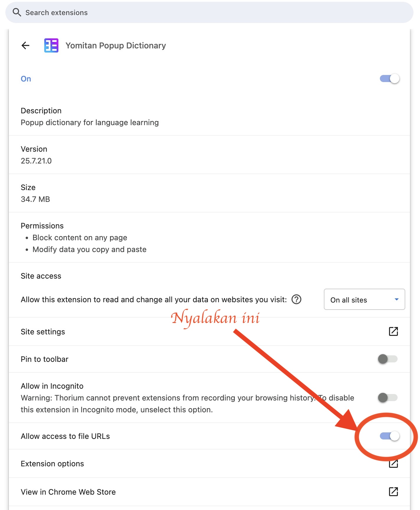
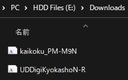
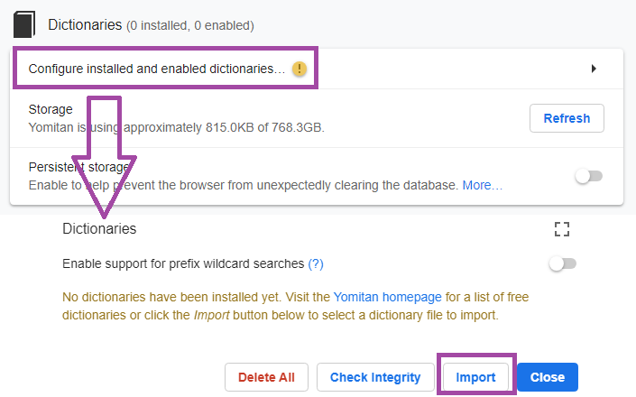

# Pengaturan Yomitan di PC [LazyGuide](https://lazyguidejp.github.io/jp-lazy-guide/setupYomitanOnPC/)

- Yomitan adalah kamus _pop up_ untuk berbagai bahasa
- Dipakai buat `mining` ke `Anki`
- Pengaturan di tutorial ini menggunakan tipe catatan (Note Type) [Lapis](https://github.com/donkuri/lapis)
- Yomitan [Light](../img/yomitan-light.png) | [Dark](../img/yomitan-dark.png) Mode ([CSS](https://pastebin.com/T9EkQQwm))

---

## Unduh dan Pasang

- Pasang [Yomitan buat Chrome/Edge](https://chrome.google.com/webstore/detail/yomitan/likgccmbimhjbgkjambclfkhldnlhbnn) atau [Yomitan buat Firefox](https://addons.mozilla.org/en-US/firefox/addon/yomitan/)

- Download dari [sini](https://drive.google.com/drive/folders/1DHJ18Lk2_tVYWJ1Adhe8XByuyFBGuTr_?usp=sharing):
    - `Font`
    - `kamus yomitan`
    - `lazyGuide-yomitan-settings` (download dua-duanya)
        - Firefox/Brave: `yomitan settings` [di sini](https://drive.google.com/drive/folders/1D_O7HgX4xMBOQcl2tLoeAQ7KUtPqyUnU?usp=sharing)

- Setelah download:
    - Ekstrak ([?](https://www.webhostinghub.com/help/learn/website/managing-files/extract-file)) `Font.7z` dan `yomitan dictionary.7z` (Pass: `lazyguide`)
    - `yomitan dictionary.7z` cuma perlu diekstrak 1x, `jangan ekstrak isi dictionary-nya`

---

## Pengaturan

1. Di halaman awal `Yomitan`, scroll ke bawah > `Permissions page` > aktifkan `clipboardRead` dan `nativeMessaging`

	???+ note "Tekan tombol `Permission Page` di halaman izin Yomitan"
		{height=250 width=500}
		
		<small>Tekan tombol `Permission Page` di halaman izin Yomitan.</small>

	???+ note "Beri Izin Yomitan"
		{height=250 width=500}
		
		<small> aktifkan `clipboardRead` dan `nativeMessaging` di bawah.</small>

2. Buka `chrome://extensions` atau `edge://extensions` atau `about:addons` (Firefox), terus buka pengaturan ekstensi `Yomitan`

3. Pastikan:
    - Chrome/Edge: aktifkan `Allow access to file URLs`
    - Firefox: aktifkan `Access your data for all websites`
    === "Chrome/Edge"
        {height=150 width=300}
    === "Firefox"
        {height=300 width=600}

4. Instal `Fonts` dengan buka file-nya dari folder `Font`
   
    {height=150 width=300}

5. Masuk ke halaman setting `Yomitan` (klik ikon ekstensi > klik ikon gir)

    {height=50 width=100}

6. Buka `Dictionaries` > `Configure installed and enabled dictionaries...` > `Import`
    - Import semua kamus dari folder `yomitan dictionary` (bisa pilih semuanya sekaligus)
    - Aktifkan semua kamus
    - Taruh `Jitendex` di paling atas (priority #1)

    {height=250 width=500}

7. Scroll ke bawah ke bagian `Backup` > `Import Settings` > pilih `lazyGuide-yomitan-settings` (yang udah didownload dari [sini](pengaturan-yomitan-pc-lazy-guide.md/#unduh-dan-pasang))
    - Pilih salah satu:
        - `lazyGuide-local-audio-yomitan-settings` (butuh: [Yomitan Local Audio](pengaturan-yomitan-pc-lazy-guide.md/#info-1-yomitan-local-audio))
        - `lazyGuide-non-local-audio-yomitan-settings`

        {align=left height=300 width=600}

8. Pilih profil, biasanya antara `Monolingual` dan `Bilingual`
    - `Bilingual` diatur default, bisa tahan `alt` sambil hover buat ganti ke `Monolingual`

        {align=left height=300 width=600}

9. Sekarang kamu udah bisa hover kata-kata!
    - Buat ganti hotkey, buka `Yomitan` settings > `Scanning` > `Scan modifier key`
    - Pilihan untuk MacOS beda, silakan sesuaikan

        {align=left height=300 width=600}

Setup Yomitan di PC udah kelar!

<small>Kalau ada masalah, cek bagian [Pertanyaan Umum](pengaturan-yomitan-pc-lazy-guide.md/#pertanyaan-umum)</small>

---

## Info Tambahan dan Tips

#### Info 1: Yomitan Local Audio

??? info "Yomitan Local Audio <small>(klik di sini)</small>"

    - Cek [source](https://github.com/themoeway/local-audio-yomichan) buat info dan update terbaru
    - Ini bisa makan waktu sekitar sejam, butuh Anki versi 2.1.50+
    - Versi Android [juga ada](https://github.com/KamWithK/AnkiconnectAndroid#additional-instructions-local-audio) tapi setup PC ini wajib

    ---

    1. Download semua dari [link ini](https://github.com/yomidevs/local-audio-yomichan?tab=readme-ov-file#steps)

    2. Di dalam `Anki`: tekan `Ctrl + Shift + A` atau `Tools` > `Add-ons` > `Get Add-ons...` > masukin `1045800357` > restart `Anki`

    3. Ekstrak `local-yomitan-audio-collection` lalu paste folder `user_files` ke:
        - Di `Add-ons window` > pilih `Local Audio Server for Yomitan` > `View Files`
        - Atau ke `C:\\Users\\NamaKamu\\AppData\\Roaming\\Anki2\\addons21\\1045800357`

    4. Kalau pakai setting-ku:
        - Buka `Yomitan settings` > `Audio` > `Configure audio playback sources...` > `Add` > `Custom URL (JSON)`
        - Paste `http://localhost:5050/?term={term}&reading={reading}` dan taruh paling atas

    5. Cek apakah udah jalan:

        {height=250 width=500}	
	SELESAI

#### Info 2: Mode Terang/Gelap Yomitan

??? info "Mode Terang & Gelap Yomitan <small>(klik di sini)</small>"

    Buat ganti tema, buka `Yomitan settings` > `Appearance` > `Theme`

    {height=300 width=600}

---

## Pertanyaan Umum

#### Pertanyaan 1: Bisa nambah/menghapus kamus Yomitan?

??? question "Bisa nambah/menghapus/mengedit kamus Yomitan? <small>(klik di sini)</small>"

    - Bisa, mayoritas kamus yang formatnya Anki kompatibel

    - Buka `Yomitan settings` > `Anki` > `Configure Anki card format...` > `MainDefinition` > pilih dari dropdown `single-glossary-YANG-KAMU-MAU`

    - Kalau ganti `MainDefinition`, harus edit tiap `Profile`

#### Pertanyaan 2: Kapan kamus di-update? Harus update sendiri?

??? question "Kapan kamusnya di-update? Perlu update sendiri gak? <small>(klik di sini)</small>"

    - Aku jarang update. Santai aja, kontennya jarang berubah kok
        - Fokusnya biar stabil dalam jangka panjang
        - Tapi kalau mau ngejar update sendiri juga boleh

#### Pertanyaan 3: Gimana cara pakai sentence card?

??? question "Cara pakai sentence card? <small>(klik di sini)</small>"

    - Masuk `Yomitan settings` > `Anki` > `Configure Anki card format...`
    - Di bagian `Expression`, scroll ke bawah, cari `IsSentenceCard` dan isi `1`
    - Terapkan ke semua profil termasuk `Monolingual`, `Bilingual`, `Android (Anime, LN & Manga)`, dan `Android (VN)`
