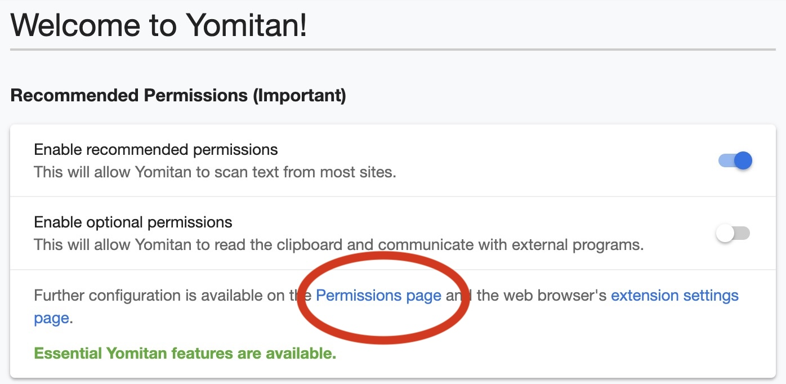
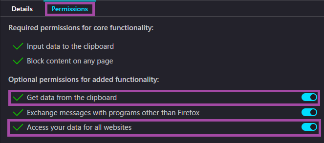

# Pengaturan Yomitan di PC (Yaaacha)
---
## <b>Persiapan</b>
Download aplikasi-aplikasi di bawah:

- [Anki](https://apps.ankiweb.net/)
- [Browser Thorium Windows](https://github.com/Alex313031/Thorium-Win/releases) atau [Browser Thorium MacOS](https://github.com/Alex313031/Thorium-MacOS/releases)
	* Windows download prioritas urutannya: AVX2, AVX, SSE3, SSE4. Instal dari prioritas pertama, kalo ga bisa, turun ke prioritas selanjutnya.
	* MacOS Intel pake x64, buat M1, M2, dan M3 pake ARM. 
	* Sangat menyarankan pake browser Thorium karena ini paling aman (gaada eror) buat play asbplayer. Kamu juga bisa pake Brave. Jangan pake Firefox, kompatibilitasnya paling jelek, bisa cek [ini](https://docs.asbplayer.dev/docs/compatibility).
- [qBittorrent](https://www.qbittorrent.org/download) utamanya buat download audio yg dipake add on local audio for yomichan

Pasang Ekstensi di browser:

- [Yomitan](https://chromewebstore.google.com/detail/yomitan-popup-dictionary/likgccmbimhjbgkjambclfkhldnlhbnn) (Chrome Webstore)
- [Yomitan](https://addons.mozilla.org/en-GB/firefox/addon/yomitan/) (Firefox)

### Impor Note Type

Sebelum memulai Mining dengan Yomitan. Kamu perlu menyesuaikan Deck Anki yang kamu gunakan terlebih dahulu.  
Download file APKG dari sini untuk mengimpor template [Note Type Mining-JP](https://github.com/rudnam/JP-study/raw/main/Mining_temp.apkg).  
Setelah didownload, langsung buka dan import.

[](/img/Ganti-Deck:Note-Type-0-5.jpg){ data-md-img="true" style="max-width: 100%; width: 40%;" }

---
### <b>Local Audio for Yomichan (Opsional)</b>
  Sebelum memulai, sebaiknya kita download terlebih dahulu file di bawah yang berisi audio untuk Add-ons Local Audio for Yomichan.

<b>Alasan kamu bisa pakai atau tidak pakai setup ini</b>
<details>
<summary><b>Manfaat:</b> <i>(Tekan sini)</i></summary>

<p><b>1.</b> Kebanyakan audionya bisa didapatkan <strong>hampir instan</strong>. Tanpa <em>local audio server</em>, mengambil audio dari Yomitan secara online bisa memakan waktu 1 detik–beberapa menit tergantung koneksi.</p>

<p>Kebanyakan kasus delay Yomitan membuat kartu biasanya dari mencari audio. Dengan kata lain, mengambil audio bisa jadi hambatan utama ketika membuat kartu Anki. Dengan add-on ini, kita bisa menghapus hambatan tadi. Kita bisa langsung membuat kartu Anki dengan hampir 0 penundaan.</p>

<p><b>2.</b> Kalau kamu tidak punya akses internet, kamu masih bisa dapat audio di kartu kamu.</p>

<p><b>3.</b> Dibandingkan audio standar dari Yomitan, add-on ini menambah cakupan audionya karena dia mengambil berbagai macam sumber yang tidak di-<em>cover</em> Yomitan, seperti Forvo (tergantung user yang dipilih), NHK 2016, dan Shinmeikai 8.</p>

<p><b>4.</b> Banyak <a href="https://github.com/Aquafina-water-bottle/local-audio-yomichan-build-scripts">pre-processing</a> yang sudah dilakukan untuk membuat audionya punya kualitas sebaik mungkin:</p>

<ul>
  <li>Semua audio sudah dinormalisasi, jadi semua volumenya relatif sama di setiap file.</li>
  <li>Bagian diam di awal dan akhir audio sudah dipotong.</li>
  <li>Dengan menggunakan data JMdict, bentuk varian dengan bacaan yang sama diisi kembali dengan audio yang ada.</li>
</ul>

</details>

<details>
<summary><b>Kekurangan:</b> <i>(Tekan sini)</i></summary>

<p><b>1.</b> Pengaturan ini butuh sekitar <strong>3–5 GB memori kosong</strong>.</p>

<p><b>2.</b> Pengaturan ini butuh Anki yang selalu terbuka (atau servernya berjalan manual) supaya Yomitan bisa mengambil datanya. Yomitan juga tetap bisa kembali ke pengaturan default kalau servernya tidak ada (Anki tidak terbuka atau local server-nya tidak nyala), atau audio dari kata yang dicari tidak ada.</p>

</details>


Pengaturan ini bisa digunakan untuk Anki versi PC (Windows, MacOS, Linux). 
Gunakan qBittorrent untuk download.
Tekan icon rantai (di bawah tulisan file di pojok kiri atas) lalu masukkan tautan ini:

	magnet:?xt=urn:btih:5bd0aa89667860e68b31a585dc6e7a2bfc811702&dn=local-yomichan-audio-collection-2023-06-11-mp3.tar.xz&tr=http%3a%2f%2fanidex.moe%3a6969%2fannounce&tr=http%3a%2f%2fnyaa.tracker.wf%3a7777%2fannounce&tr=udp%3a%2f%2fexodus.desync.com%3a6969%2fannounce&tr=udp%3a%2f%2ftracker.opentrackr.org%3a1337%2fannounce&tr=udp%3a%2f%2fopen.stealth.si%3a80%2fannounce&tr=udp%3a%2f%2ftracker.tiny-vps.com%3a6969%2fannounce&tr=udp%3a%2f%2ftracker.moeking.me%3a6969%2fannounce&tr=udp%3a%2f%2fopentracker.i2p.rocks%3a6969%2fannounce&tr=udp%3a%2f%2ftracker.openbittorrent.com%3a6969%2fannounce&tr=udp%3a%2f%2ftracker.torrent.eu.org%3a451%2fannounce&tr=udp%3a%2f%2fexplodie.org%3a6969%2fannounce&tr=udp%3a%2f%2ftracker.zerobytes.xyz%3a1337%2fannounce

<figcaption style="text-align: center; font-style: italic;">
Unduh berkas untuk Local Audio.
</figcaption>

[](/img/Awal1.jpg){ .lightbox data-group="awal" style="width: 48%; display: inline-block;" }
[](/img/Awal2.jpg){ .lightbox data-group="awal" style="width: 48%; display: inline-block;" }

[](/img/Awal3.jpg){ .lightbox data-group="awal" style="width: 48%; display: inline-block;" }
[](/img/Awal4.jpg){ .lightbox data-group="awal" style="width: 48%; display: inline-block;" }


Setelah Download selesai, ekstrak filenya. Kalau udah, sementara biarin aja buat nanti sesi pengaturan Add-ons
!!! info "**Cara pasang**"
    (Menu Tools → Add-ons → Get Add-ons... → masukkan 2 kode di bawah → Restart Anki)
    
    - `2055492159` (AnkiConnect),
    - `1045800357` (Local Audio Server for Yomichan)

---
### Pengaturan Add-ons
!!! info "Pengaturan Add-ons"
    Tools → Add-ons → Pilih Add-ons yang mau diatur → klik **Config** (pojok kanan bawah)
    Masukkan kode ini:
    


#### Anki Connect
Pilih Anki Connect. Buka menu Config. Timpa teks yang ada di konfigurasi dengan kode di bawah, tekan OK. Buka ekstensi yomitan, ke menu Anki. Matikan dan nyalakan toggle "Enable Anki integration". Done.
```
{
    "apiKey": null,
    "apiLogPath": null,
    "ignoreOriginList": [],
    "webBindAddress": "127.0.0.1",
    "webBindPort": 8765,
    "webCorsOriginList": [
        "http://localhost",
        "https://killergerbah.github.io",
        "https://reader.mokuro.app",
        "https://reader.ttsu.app"
    ]
}
```
!!! note "NB"
    Link 1 untuk **Yomitan**  
    Link 2 untuk **asbplayer** (anime dan video based material)  
    Link 3 untuk **Mokuro** (baca manga)  
    Link 4 untuk **TTSU Reader** (baca novel, LN, dll)

#### Local Audio Server for Yomichan
- Buka Anki. 
- Pergi ke Tools → Add-ons → Local Audio for Yomichan → view files. Windows baru terbuka di Anki2/addons21/1045800357. 
- Masuk ke folder `user_files`. 
- Pindahkan semua audio yang sudah didownload menggunakan qBittorrent di langkah Persiapan Awal ke folder `user_files`.
- Masuk ke browser dan buka ekstensi yomitan. Off, lalu On.
- Mulai ulang aplikasi Anki. 

Saat mining, Anki harus tetap terbuka walau di mode minimize agar Add-ons Local Audio bisa berjalan.


---
## <b>Yomitan</b>
### Kamus

Saat pertama kali menginstal Yomitan, kamu perlu memuat kamus ke dalamnya.
File kamus berformat `.zip` dan **tidak perlu diekstrak**.

Jika kamu tidak bisa bahasa inggris, silakan download [JMdict versi JP-EN-ID](https://github.com/yaaacha/Immerse-Archive/blob/main/%5BBETA%20VERSION%5D%20JMDict%20JP-EN-ID%20V.0.1.zip) dan [JIdict](https://discord.com/channels/1370274344571240552/1384364698400723056/1384364733452386416). Kamus ini hanya dimaksudkan untuk membantu di awal. Sebisa mungkin gunakan kamus monolingual saat sudah mulai bisa membaca bahasa Jepang dengan lebih baik.

Impor juga kamus-kamus lain yang bisa membantu kamu dalam proses _Immersion_ melalui daftar di bawah.

- [Koleksi Shoui](https://learnjapanese.link/dictionaries) dari TMW
- [Koleksi Marv](https://drive.google.com/drive/folders/1xURpMJN7HTtSLuVs9ZtIbE7MDRCdoU29) dari Yomitan

Kalau kamu tidak ingin punya terlalu banyak kamus, kamu bisa gunakan daftar yang ringkas

??? info "Daftar Ringkas oleh [Donkuri](https://donkuri.github.io/learn-japanese/setup/#what-if-i-dont-want-to-use-all-these-dictionaries): <small>(tekan sini)</small>"

	<ul>
	  <li>JMdict (atau Jitendex)</li>
	  <li>JMnedict</li>
	  <li>三省堂 8th Ed (or 明鏡 2nd Ed)</li>
	  <li>Kanji Jitenon</li>
	  <li>NHK2016</li>
	  <li>JPDB Frequency v2.2</li>
	</ul>

Di bawah ini Rekomendasi yang bisa kamu pilih. Bisa kamu campur atau ikutin semua, sesuai keinginanmu.

<details>
<summary><b>Daftar Rekomendasi <i>shoui</i> dari TMW TheMoeWay:</b> <i>(Tekan sini)</i></summary>

<p><b>Bilingual</b></p>
<ul>
  <li>[Bilingual] JMdict Extra (Recommended).zip</li>
  <li>[Bilingual] 新和英.zip</li>
</ul>

<p><b>Frekuensi</b></p>
<ul>
  <li>[Freq] CC100.zip</li>
  <li>[Freq] JPDB (Recommended).zip</li>
</ul>

<p><b>Kanji</b></p>
<ul>
  <li>[Kanji] KANJIDIC (English) (Recommended).zip</li>
</ul>

<p><b>Monolingual</b></p>
<ul>
  <li>[Monolingual] 実用日本語表現辞典 (Recommended).zip</li>
  <li>[Monolingual, Encyclopedia] PixivLight.zip</li>
</ul>

<p><b>Grammar</b></p>
<ul>
  <li>[Grammar] Dictionary of Japanese Grammar 日本語文法辞典 (Recommended).zip</li>
  <li>[Grammar] どんなとき使う日本語表現文型辞典.zip</li>
  <li>[Grammar] 毎日のんびり日本語教師 (nihongosensei).zip</li>
  <li>[Grammar] JLPT文法解説まとめ(nihongo_kyoushi).zip</li>
  <li>[Grammar] 絵でわかる日本語.zip</li>
</ul>

<p><b>Nama</b></p>
<ul>
  <li>[Names] JMnedict.zip</li>
</ul>

<p><b>Pitch</b></p>
<ul>
  <li>[Pitch] アクセント辞典v2 (Recommended).zip</li>
</ul>

</details>

<details>
<summary><b>Daftar Rekomendasi <i>marv</i> dari Yomitan:</b> <i>(Tekan sini)</i></summary>

<p><b>Bilingual</b></p>
<ul>
  <li>[JA-EN] jitendex-yomichan</li>
  <li>[JA-EN] NEW 斎藤和英大辞典</li>
  <li>[JA-EN] 新和英</li>
</ul>

<p><b>Grammar</b></p>
<ul>
  <li>[JA Grammar] dojg-consolidated-v1_01</li>
</ul>

<p><b>Frekuensi</b></p>
<ul>
  <li>[JA Freq] JPDB_2022-05-10T03_27_02.930Z</li>
  <li>[JA Freq] Freq_CC100</li>
  <li>[JA Freq] BCCWJ-LUW</li>
</ul>

<p><b>Monolingual</b></p>
<ul>
  <li>[JA-JA] 実用日本語表現辞典</li>
  <li>[JA-JA] デジタル大辞泉</li>
  <li>[JA-JA Encyclopedia] Pixiv</li>
</ul>

<p><b>Kanji</b></p>
<ul>
  <li>[Kanji] KANJIDIC_english</li>
  <li>[Kanji] JPDB Kanji</li>
</ul>

<p><b>Pitch Accent</b></p>
<ul>
  <li>[Pitch] 大辞泉</li>
</ul>

</details>

<details>
<summary><b>Daftar Daftar Kamus yang kupasang:</b> <i>(Tekan sini)</i></summary>

<p><b>Kamus Bilingual</b></p>
<ul>
  <li>1. JIDict<br>   Kamus Jepang-Indonesia berbasis JMdict dan Sanseido, dikembangkan oleh tim Philia Space, fokus pada hasil yang mudah dipahami oleh pelajar bahasa Jepang di Indonesia.</li>
  <li>2. JMdict<br>   Kamus Jepang-Inggris utama dengan lebih dari 180.000 entri. Banyak dipakai sebagai sumber utama untuk kamus turunan lain. Sudah terkoneksi secara default dengan Yomitan dan dapat dicek update langsung di menu <code>dictionaries</code>.</li>
  <li>3. Jitendex.org<br>   Versi gabungan dari kamus bilingual JMdict, dengan tambahan fitur-fitur khusus dari situs Jitendex.org. Sudah terkoneksi secara default dengan Yomitan dan dapat dicek update langsung di menu <code>dictionaries</code>.</li>
  <li>4. 新和英<br>   Kamus Jepang-Inggris resmi dari Kenkyusha, menawarkan definisi yang lebih formal dan kontekstual dibanding JMdict.</li>
</ul>

<p><b>Proper Noun & Kanji Dictionary</b></p>
<ul>
  <li>5. JMnedict<br>   Kamus nama-nama orang, tempat, dan organisasi dalam bahasa Jepang. Berguna saat menemui nama khusus. Sudah terkoneksi secara default dengan Yomitan dan dapat dicek update langsung di menu <code>dictionaries</code>.</li>
  <li>6. KANJIDIC (English)<br>   Informasi karakter kanji dalam bahasa Inggris, termasuk makna, bacaan, stroke, dan level JLPT. Sudah terkoneksi secara default dengan Yomitan dan dapat dicek update langsung di menu <code>dictionaries</code>.</li>
  <li>7. 漢字源<br>   Kamus kanji berbahasa Jepang dengan penjelasan etimologi dan penggunaan historis. Lebih cocok untuk pembelajar lanjutan.</li>
  <li>8. weblio 古語辞典<br>   Kamus kosakata klasik Jepang. Membantu memahami bahasa kuno yang sering muncul dalam sastra dan sejarah.</li>
</ul>
<p><b>Monolingual – Kamus Besar & Onomatope</b></p>
<ul>
  <li>9. 旺文社国語辞典 第十一版<br> Kamus modern dengan definisi mudah dipahami, cocok untuk pelajar Jepang level menengah.</li>
  <li>10. 明鏡国語辞典 第三版<br> Menyediakan definisi dengan gaya penjelasan yang jernih dan mudah dibaca.</li>
  <li>11. デジタル大辞泉<br> Kamus komprehensif modern yang sering digunakan oleh penutur asli.</li>
  <li>12. 岩波国語辞典 第八版<br> Kamus yang terkenal dengan keakuratan dan gaya konservatifnya.</li>
  <li>13. 広辞苑 第七版<br> Salah satu kamus Jepang terbesar dan paling prestisius.</li>
  <li>14. 精選版 日本国語大辞典<br> Versi ringkas dari 日本国語大辞典, tetap komprehensif namun lebih praktis.</li>
  <li>15. ハイブリッド新辞林<br> Gabungan dari berbagai sumber, cepat dan ringan untuk pencarian harian.</li>
  <li>16. 新明解国語辞典 第八版<br> Dikenal karena penjelasan yang berani dan interpretatif.</li>
  <li>17. 三省堂国語辞典 第八版<br> Kamus ringkas namun mendalam, sangat cocok untuk pengguna intermediate.</li>
  <li>18. 例解学習国語辞典 第十一版<br> Kamus anak-anak yang sangat ramah pelajar asing.</li>
  <li>19. 新選国語辞典 第十版<br> Kamus ringkas untuk referensi cepat.</li>
  <li>20. 国語辞典オンライン<br> Versi daring ringan yang berisi banyak entri praktis.</li>
  <li>21. 実用日本語表現辞典<br> Fokus pada ekspresi praktis dan idiom.</li>
  <li>22. surasura 擬声語<br> Khusus kosakata onomatope, lengkap dengan contoh penggunaan dan makna.</li>
</ul>
<p><b>Kamus untuk Bunpou & Pelajaran:</b></p>
<ul>
  <li>23. 日本語文法辞典（全集）<br> Seri lengkap kamus grammar DoJG (Beginner–Advanced) dalam format searchable.</li>
  <li>24. JLPT文法解説まとめ<br> Ringkasan grammar JLPT dari berbagai sumber, mudah dinavigasi.</li>
  <li>25. 毎日のんびり日本語教師<br> Penjelasan grammar ringan dan jelas, dengan label level JLPT.</li>
  <li>26. 絵でわかる日本語<br> Kamus grammar berbasis ilustrasi, cocok untuk pemula dan visual learner.</li>
</ul>

<p><b>Kamus Pendukung (3 kanji atau lebih):</b></p>
<ul>
  <li>27. 学研 四字熟語辞典<br> Fokus pada idiom empat kanji, termasuk makna dan contoh penggunaan.</li>
  <li>28. 新明解四字熟語辞典<br> Alternatif dengan definisi yang unik dan gaya khas 新明解.</li>
</ul>

<p><b>Kamus Khusus (dialek–peribahasa–dan sejenisnya):</b></p>
<ul>
  <li>29. 故事ことわざの辞典<br>Berisi peribahasa dan ungkapan klasik Jepang.</li>
  <li>30. 故事・ことわざ・慣用句オンライン<br>Versi daring dari berbagai sumber idiomatik.</li>
  <li>31. ことわざ・慣用句の百科事典<br>Ensiklopedia idiom dan ungkapan tetap (set phrases).</li>
  <li>32. 全国方言辞典<br>Kamus dialek dari berbagai daerah Jepang.</li>
</ul>

<p><b>Kamus JLPT, Frequency & Korpus:</b></p>
<ul>
  <li>33. JLPT<br>Kumpulan kosakata JLPT level N1–N5.</li>
  <li>34. CC100<br>Korpus bahasa Jepang yang digunakan untuk analisis frekuensi kata.</li>
  <li>35. JPDB<br>Frekuensi kosakata dari database JPDB.</li>
  <li>36. Youtube<br>Frekuensi kata berdasarkan subtitle video YouTube Jepang.</li>
  <li>37. BcCWJ<br>Balanced corpus of contemporary written Japanese (BCCWJ).</li>
  <li>38. PixivLight<br>Frekuensi kosakata dari karya buatan pengguna di Pixiv.</li>
</ul>

<p><b>Kamus Pitch Accent:</b></p>
<ul>
  <li>39. 大辞林第四版<br>Selain kamus besar, versi ini menyertakan informasi pitch accent.</li>
  <li>40. 三省堂国語辞典第八番 (pitch)<br>Tambahan aksen dari 三省堂 untuk entri tertentu.</li>
  <li>41. 新明解第八版 (pitch)<br>Informasi pitch berdasarkan edisi 新明解 ke-8.</li>
  <li>42. 大辞泉 (pitch)<br>Pitch accent versi tambahan untuk entri 大辞泉.</li>
  <li>43. アクセント辞典<br>Kamus aksen khusus untuk penutur asli dan pembelajar tingkat lanjut.</li>
  <li>44. NHK 日本語発音アクセント新辞典<br>Standar referensi aksen NHK untuk kata-kata Jepang modern.</li>
  <li>45. NHK (pitch)<br>Tambahan pitch untuk entri berdasarkan standar NHK.</li>
</ul>

</details>

### Daftar Frekuensi yang Direkomendasikan

Yomitan mendukung penggunaan **kamus frekuensi** yang menunjukkan seberapa umum sebuah kata digunakan.

<b>JPDB</b>
Merupakan daftar frekuensi yang diambil dari [jpdb.io](https://jpdb.io), sebuah situs yang menganalisis banyak *light novel*, *visual novel*, anime, dan *J-drama*. Jadi, daftar ini merefleksikan seberapa sering kata muncul dalam media fiksi berbahasa Jepang.

<b>CC100</b>
Merupakan daftar frekuensi dari data korpus internet Jepang. Kata-kata formal akan tampak lebih umum dalam daftar ini.  
Contoh: 審議会 (*council*) memiliki peringkat ke-9733 di CC100, tetapi ke-58730 di JPDB.

<b>Apa yang dimaksud dengan "kata umum"?</b>

- **Sangat umum:** 1–10.000
- **Umum:** 10.001–20.000
- **Cukup umum:** 20.001–30.000
- **Agak jarang:** 30.001–40.000
- **Jarang:** 40.001–50.000
- **Sangat jarang:** 50.001–80.000
- **Tingkat yang mungkin tidak dikenal penutur asli:** 80.000+


### Impor Kamus

???+ note "1. Buka pengaturan ekstensi yomitan"
???+ note "2. Di pengaturan Dictionaries, pilih ```Configure installed and enabled dictionaries…```"
	<figcaption style="text-align: center; font-style: italic;">
	Buka Pengaturan Dictionaries.
	</figcaption>
	[](/img/Import-Kamus-1.png){ data-md-img="true" style="max-width: 40%; width: 40%;" }

???+ note "3. Pilih import (masukkan zip kamusnya dengan drag and drop atau pilih kamusnya dari folder download)"
	<figcaption style="text-align: center; font-style: italic;">
	Impor Kamus.
	</figcaption>
	[](/img/Import-Setting-Yomitan.jpg){ data-md-img="true" style="max-width: 40%; width: 40%;" }
	
	<figcaption style="text-align: center; font-style: italic;">
	Geser taruh atau buka folder.
	</figcaption>
	[](/img/Import-Setting-Yomitan.jpg){ data-md-img="true" style="max-width: 100%; width: 40%;" }
???+ note "4. Tunggu sampai semua kamus sudah selesai didownload (ada bar progress di bawah)"
	Proses impor tergantung ukuran kamus, bisa agak lama, jadi, ditunggu saja.
???+ note "5. Kamu bisa mengaktifkan dan menonaktifkan kamus yang mau kamu pakai sesuka hati, juga mengurutkan kamusmu tergantung prioritas pribadi."
	<figcaption style="text-align: center; font-style: italic;">
	Aktifkan dan geser sesuai keinginan (Tidak perlu geser kalau mau impor pengaturan di bawah).
	</figcaption>
	[](/img/Import-Setting-Yomitan.jpg){ data-md-img="true" style="max-width: 100%; width: 40%;" }

---

### Pengaturan Yomitan

1. Di halaman awal `Yomitan`, tekan `Permissions page` > aktifkan `clipboardRead` dan `nativeMessaging`

	???+ note "Tekan tombol `Permission Page` di halaman izin Yomitan"
		{height=250 width=500}
		
		<small>Tekan tombol `Permission Page` di halaman izin Yomitan.</small>

	???+ note "Beri Izin Yomitan"
		{height=250 width=500}
		
		<small> aktifkan `clipboardRead` dan `nativeMessaging` di bawah.</small>

2. Buka `chrome://extensions` atau `edge://extensions` atau `about:addons` (Firefox), terus buka pengaturan ekstensi `Yomitan`

3. Pastikan:
    - Chrome/Edge: aktifkan `Allow access to file URLs`
    - Firefox: aktifkan `Access your data for all websites`
    === "Chrome/Edge"
        {height=150 width=300}
    === "Firefox"
        {height=300 width=600}


Kamu bisa langsung download pengaturanku [di sini](https://github.com/yaaacha/Immerse-Archive/blob/main/Yomitan%20Setting%20Full%20Lapis.json). Cara Importnya, pergi ke Backup > Import Settings>. Aku ga jamin bakal langsung work semua, karena ada beberapa yang harus disetting manual juga. Terutama untuk mining nanti. Kamu juga bisa hapus atau duplikat profile.

Aku tetap menyarankan kamu baca _startup guide_ supaya kamu bisa paham cara kerja yomitan secara umum. Kamu bisa cek pengaturan-pengaturan di bawah untuk menyesuaikan preferensi pribadi.

???+ note "Impor pengaturan dari sini."
	[](/img/Import-Setting-Yomitan.jpg){ data-md-img="true" style="max-width: 100%; width: 40%;" }

???+ note "Tekan `Configure profile...` untuk memilih profil."
	[](/img/Setting-Yomitan-1.jpg){ data-md-img="true" style="max-width: 100%; width: 40%;" }

???+ note "Pengaturan lanjutan untuk personalisasi."
	[](/img/Setting-Yomitan-2.jpg){ data-md-img="true" style="max-width: 100%; width: 40%;" }


## Penyesuaian Akhir

### Penyesuaian Deck

Kita perlu membuat dek baru.

- Klik tombol Create Deck.
- Beri nama deck, misal: Mining

### Atur Dek di Yomitan

- Buka ekstensi Yomitan → Anki → Configure Anki Flashcards...→ Sesuaikan dek seperti di gambar
- Kamu juga bisa berganti note type dengan mengimpor template note type yang lain. Untuk mengeksplore note type yang kamu suka, bisa cek [di sini](https://arbyste.github.io/jp-mining-note/alternatives/)
- Yomitan dan dek Anki siap digunakan

<div style="display: flex; flex-wrap: wrap; gap: 1rem; justify-content: center;">
  <a href="/img/Ganti-Deck:Note-Type-1.jpg" data-md-img>
    
  </a>
  <a href="/img/Ganti-Deck:Note-Type-2.jpg" data-md-img>
    
  </a>
</div>


## Penutup

Terima kasih sudah menyimak. Panduan ini jauh dari kata sempurna, mungkin akan diperbarui di masa depan. Mari berdiskusi di [Philia Space](https://discord.gg/hp55WMbbG6).
