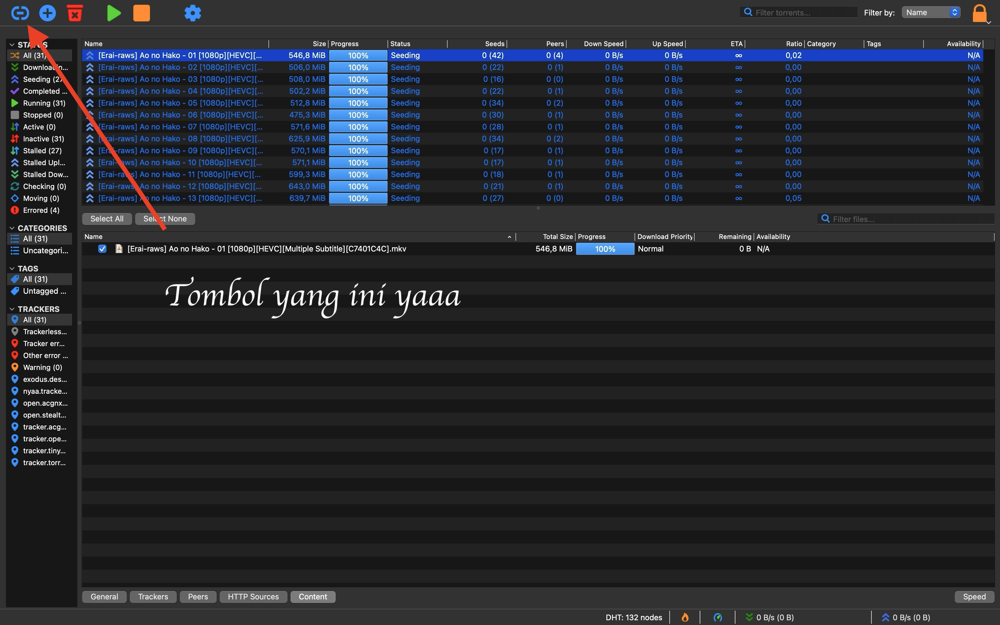
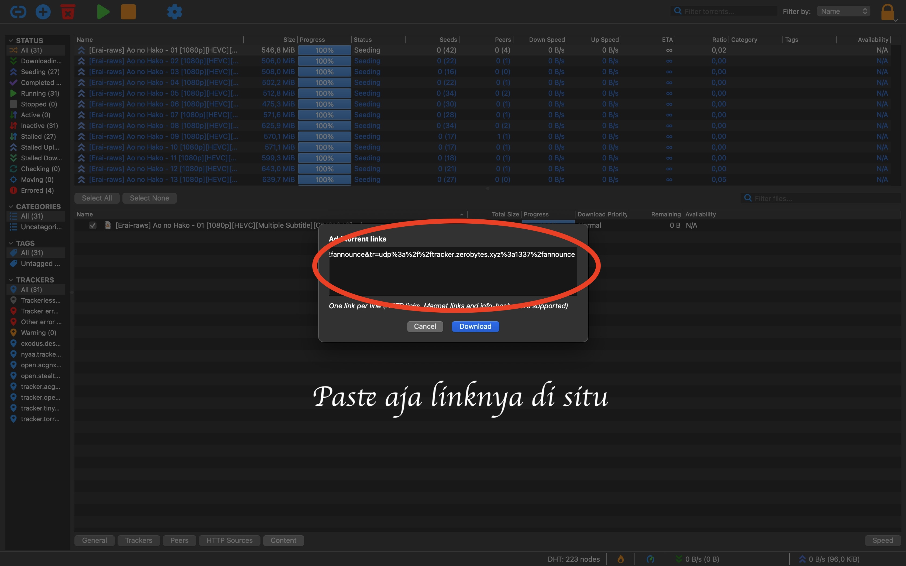
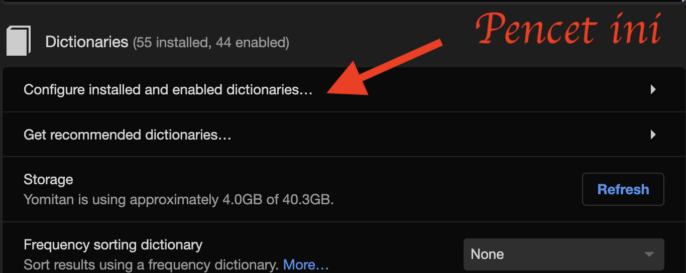

# Tutorial Menambang Sumber Daya Belajar
## Permulaan
Download aplikasi-aplikasi di bawah:
- [Anki](https://apps.ankiweb.net/)
- [Browser Thorium Windows](https://github.com/Alex313031/Thorium-Win/releases) atau [Browser Thorium MacOS](https://github.com/Alex313031/Thorium-MacOS/releases)
  * Windows download prioritas urutannya: AVX2, AVX, SSE3, SSE4. Instal dari prioritas pertama, kalo ga bisa, turun ke prioritas selanjutnya.
  * MacOS Intel pake x64, buat M1, M2, dan M3 pake ARM. 
  * Sangat menyarankan pake browser Thorium karena ini paling aman (gaada eror) buat play asbplayer. Kamu juga bisa pake Brave. Jangan pake Firefox, kompatibilitasnya paling jelek, bisa cek [ini](https://docs.asbplayer.dev/docs/compatibility).
- [qBittorrent](https://www.qbittorrent.org/download) utamanya buat download audio yg dipake add on local audio for yomichan

Pasang Ekstensi di browser:
- [Yomitan](https://chromewebstore.google.com/detail/yomitan-popup-dictionary/likgccmbimhjbgkjambclfkhldnlhbnn) (Kamus pop-up)

Opsional tergantung kebutuhan:
- [asbplayer](https://chromewebstore.google.com/detail/asbplayer-language-learni/hkledmpjpaehamkiehglnbelcpdflcab) (Video Player untuk Mining)
- [Ttsu Reader](https://reader.ttsu.app/) (Baca Epub untuk LN/Novel)
- [Mokuro](https://reader.mokuro.app/) (Baca Manga)
- [Catalog Mokuro](https://catalog.mokuro.moe/) (Baca manga di mokuro tinggal import)
- [yomitan pdf viewer](https://yomitan.wiki/yomitan-pdf-viewer/web/) (Baca PDF)

</br>

## 🧘‍♂️ Local Audio for Yomichan (Opsional)
  Sebelum memulai, sebaiknya kita download terlebih dahulu file di bawah yang berisi audio untuk Add-ons Local Audio for Yomichan. 
### - Alasan kamu bisa pakai atau tidak pakai setup ini

<details> <summary><b>Manfaat:</b> <i>(Tekan sini)</i> </summary>

1. Kebanyakan audionya bisa didapatkan **hampir instan**. Tanpa _local audio server_, mengambil audio dari yomitan secara online bisa memakan waktu 1 detik-beberapa menit tergantung koneksi.
    Kebanyakan kasus delay Yomitan membuat kartu biasanya dari mencari audio. Dengan kata lain, mengambil audio bisa jadi hambatan utama ketika membuat kartu Anki. Dengan Add on ini, kita bisa menghapus hambatan tadi. Kita bisa langsung membuat kartu Anki hampir 0 penundaan.
2. Kalau kamu tidak punya akses internet, kamu masih bisa dapat audio di kartu kamu.
3. Dibandingkan audio standar dari Yomitan, Add-on ini menambah cakupan audionya karena dia mengambil berbagai macam sumber yang tidak di-_cover_ Yomitan, seperti Forvo (tergantung user yang dipilih), NHK 2016, dan Shinmeikai 8.
4. Banyak [pre-processing](https://github.com/Aquafina-water-bottle/local-audio-yomichan-build-scripts) yang sudah dilakukan untuk membuat audionya punya kualitas sebaik mungkin:
    - Semua audio sudah dinormalisasi, jadi semua volumenya relatif sama di setiap file.
    - Bagian diam di awal dan akhir audio sudah dipotong.
    - 
1. Much [pre-processing](https://github.com/Aquafina-water-bottle/local-audio-yomichan-build-scripts) has been done to this audio to make it as high quality as possible:
    - All audio is normalized, so the volume remains relatively similar for each file.
    - Silence has been trimmed from the beginning and end of each file.
    - Dengan menggunakan data JMdict, bentuk varian dengan bacaan yang sama diisi kembali dengan audio yang ada.

</details>

<details> <summary><b>Kekurangan:</b> <i>(Tekan sini)</i> </summary>

1. Pengaturan ini butuh sekitar **3-5 GB memori kosong**.
2. Pengaturan ini butuh Anki yang selalu terbuka (atau servernya berjalan manual) supaya Yomitan bisa mengambil datanya. Yomitan juga tetap bisa kembali ke pengaturan default kalau servernya tidak ada (anki tidak terbuka atau local servernya tidak nyala) atau audio dari kata yang dicari tidak ada.

</details>

Pengaturan ini bisa digunakan untuk Anki versi PC (Windows, MacOS, Linux). 
Gunakan qBittorrent untuk download.
Tekan icon rantai (di bawah tulisan file di pojok kiri atas) lalu masukkan tautan ini:

	magnet:?xt=urn:btih:5bd0aa89667860e68b31a585dc6e7a2bfc811702&dn=local-yomichan-audio-collection-2023-06-11-mp3.tar.xz&tr=http%3a%2f%2fanidex.moe%3a6969%2fannounce&tr=http%3a%2f%2fnyaa.tracker.wf%3a7777%2fannounce&tr=udp%3a%2f%2fexodus.desync.com%3a6969%2fannounce&tr=udp%3a%2f%2ftracker.opentrackr.org%3a1337%2fannounce&tr=udp%3a%2f%2fopen.stealth.si%3a80%2fannounce&tr=udp%3a%2f%2ftracker.tiny-vps.com%3a6969%2fannounce&tr=udp%3a%2f%2ftracker.moeking.me%3a6969%2fannounce&tr=udp%3a%2f%2fopentracker.i2p.rocks%3a6969%2fannounce&tr=udp%3a%2f%2ftracker.openbittorrent.com%3a6969%2fannounce&tr=udp%3a%2f%2ftracker.torrent.eu.org%3a451%2fannounce&tr=udp%3a%2f%2fexplodie.org%3a6969%2fannounce&tr=udp%3a%2f%2ftracker.zerobytes.xyz%3a1337%2fannounce
</br>

<p float="left">
  
&nbsp; &nbsp; &nbsp; &nbsp;
   
 &nbsp; &nbsp; &nbsp; &nbsp;
  
 &nbsp; &nbsp; &nbsp; &nbsp;
  
</p>

</br>
Setelah Download selesai, ekstrak filenya. Kalau udah, sementara biarin aja buat nanti sesi pengaturan Add-ons


# 🔖 Kamus
__

Untuk pemula, silakan download [JMdict versi JP-EN-ID](https://github.com/yaaacha/Immerse-Archive/blob/main/%5BBETA%20VERSION%5D%20JMDict%20JP-EN-ID%20V.0.1.zip) dan [JIdict](https://discord.com/channels/1370274344571240552/1384364698400723056/1384364733452386416). Kamus ini hanya dimaksudkan untuk membantu di awal. Sebisa mungkin menggunakan kamus monolingual saat sudah mulai bisa membaca bahasa Jepang dengan lebih baik.

Tambahkan kamus berikut di koleksi kalian juga, yg disarankan, monolingual, pitch, nama, dan kanji, yang lain opsional.

## Daftar Ringkas (Kamusnya ada di link di bawah)
- JMdict (or Jitendex)
- JMnedict
- 三省堂 8th Ed (or 明鏡 2nd Ed)
- Kanji Jitenon
- NHK2016
- JPDB Frequency v2.2

## Daftar Rekomendasi [shoui dari TMW (TheMoeWay)](https://drive.google.com/drive/folders/1tTdLppnqMfVC5otPlX_cs4ixlIgjv_lH)
### Bilingual
- [Bilingual] JMdict Extra (Recommended).zip
- [Bilingual] 新和英.zip

### Frekuensi
- [Freq] CC100.zip
- [Freq] JPDB (Recommended).zip

### Kanji
- [Kanji] KANJIDIC (English) (Recommended).zip

### Monolingual
- [Monolingual] 実用日本語表現辞典 (Recommended).zip
- [Monolingual, Encyclopedia] PixivLight.zip

### Grammar
- [Grammar] Dictionary of Japanese Grammar 日本語文法辞典 (Recommended).zip
- [Grammar] どんなとき使う日本語表現文型辞典.zip
- [Grammar] 毎日のんびり日本語教師 (nihongosensei).zip
- [Grammar] JLPT文法解説まとめ(nihongo_kyoushi).zip
- [Grammar] 絵でわかる日本語.zip

### Nama
- [Names] JMnedict.zip

### Pitch
- [Pitch] アクセント辞典v2 (Recommended).zip

## Daftar Rekomendasi [marv dari yomitan](https://drive.google.com/drive/u/0/folders/1LXMIOoaWASIntlx1w08njNU005lS5lez).

### Bilingual
- [JA-EN] jitendex-yomichan
- [JA-EN] NEW 斎藤和英大辞典
- [JA-EN] 新和英

### Grammar
- [JA Grammar] dojg-consolidated-v1_01

### Frekuensi
- [JA Freq] JPDB_2022-05-10T03_27_02.930Z
- [JA Freq] Freq_CC100
- [JA Freq] BCCWJ-LUW

### Monolingual
- [JA-JA] 実用日本語表現辞典
- [JA-JA] デジタル大辞泉
- [JA-JA Encyclopedia] Pixiv

### Kanji
- [Kanji] KANJIDIC_english
- [Kanji] JPDB Kanji

### Pitch Accent
- [Pitch] 大辞泉

# Cara Import Kamus

1. Buka pengaturan ekstensi yomitan
2. Di pengaturan Dictionary, pilih ```Configure installed and enabled dictionaries…```
    
3. Pilih import (masukkan zip kamusnya dengan drag and drop atau pilih kamusnya dari folder download)
  
  
5. Tunggu sampai semua kamus sudah selesai didownload (ada bar progress di bawah). Memang agak lama, jadi, ditunggu saja.
6. Kamu bisa mengaktifkan dan menonaktifkan kamus yang mau kamu pakai sesuka hati, juga mengurutkan kamusmu tergantung prioritas pribadi.
  

