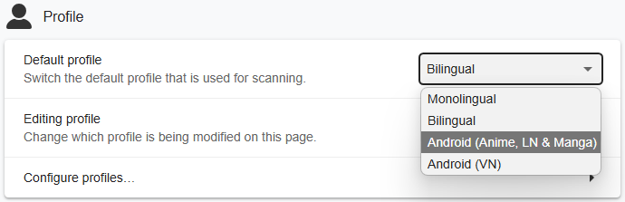
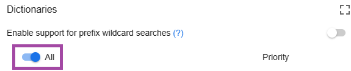

# Setup Mining LN, Buku, dan sejenisnya di Android [Lazy Guide](https://lazyguidejp.github.io/jp-lazy-guide/setupLnOnAndroid/)

- Kamu bisa pakai `Android` buat baca `Light Novel` lewat `Edge Canary` sambil scan kata pakai `Yomitan`.

---

## Download dan Install

- Download dan install file `.apk` [Ankiconnect Android](https://github.com/KamWithK/AnkiconnectAndroid/releases/latest)

- Install [Ankidroid](https://play.google.com/store/apps/details?id=com.ichi2.anki)

**Syarat:**

- [Yomitan di Android](setup-yomitan-android-lazy-guide.md) sudah ter-setup

---

## Setting Awal

1. Buka `AnkiConnect Android`, nyalakan service  
    - Buka `Ankidroid` dan biarkan tetap jalan di background

2. Di `Edge Canary`, buka `Yomitan Settings` > `Profile` > `Default` & `Editing` Profile > `Android (Anime, LN & Manga)`  
    - Kalau kamu nggak pakai setting Yomitan punyaku, cek [Info 2](setup-LN-android-lazy-guide.md/#info-2-text-replacement-pattern)

     {height=250 width=500}

3. Di `Edge Canary`, buka `https://reader.ttsu.app/` dan upload file epub `Light Novel` kamu

4. Sekarang kamu bisa `mine` di `Android` dengan `tap` kata buat scan

     {height=150 width=300}

Sekarang kamu bisa baca Light Novel di Android.

---

## Info Tambahan dan Tips

#### Info 1: TTU Settings Punyaku

??? info "TTU Settings Punyaku <small>(klik di sini)</small>"

    Ini setting `Android` punyaku untuk `TTU`:

    {height=500 width=1000}

#### Info 2: Text Replacement Pattern

??? info "Text Replacement Pattern <small>(klik di sini)</small>"

    Kalau nggak pakai setting punyaku, kamu harus masukin ini manual supaya scan teks lebih akurat:

    1. Di `Yomitan settings`, nyalain `Advanced` settings (letaknya di pojok kiri bawah atau scroll ke bawah)
    2. Masuk `Translation` > `Configure custom text replacement patterns...`
    3. Copy-paste [ini](https://pastebin.com/er57E9Hw)

#### Info 3: Android Yomitan Local Audio

??? info "Android Yomitan Local Audio <small>(klik di sini)</small>"

    **Syarat:**

    - Pastikan sudah setup [PC Yomitan Local Audio](setup-yomitan-pc-lazy-guide.md/#info-1-yomitan-local-audio)
    - Sudah install [Ankiconnect Android](https://github.com/KamWithK/AnkiconnectAndroid/releases/latest)
    - Sumber info & update ada di [sini](https://github.com/Aquafina-water-bottle/AnkiconnectAndroid/tree/local_audio#additional-instructions-local-audio)
    - Setup ini makan ruang **3GB+**

    ---
    1. Di `Anki` PC: `Tools` > `Local Audio Server` > `Generate Android database`  
         - Proses ini 30+ menit (Anki nggak bisa dipakai, tapi kamu masih bisa mining)

    2. Di `Anki` PC: ++ctrl++ + ++shift++ + A (Win) / ++cmd++ + ++shift++ + A (MacOS) atau `Tools` > `Add-ons` > pilih `Local Audio Server for Yomitan` > `View Files`  
         - Akan ada file bernama `android` atau `android.db`

    3. Di Android: buka `AnkiConnect Android` > `Settings` > `Print Local Audio Directory`  
         - Ini akan nunjukkin path dan bikin foldernya

    4. Di lokasi dari langkah 3, biasanya: `Android/data/com.kamwithk.ankiconnectandroid/files/`  
         - Paste file `android` dari PC (langkah 2) ke folder `files`  
         - Hasilnya harus: `Android/data/com.kamwithk.ankiconnectandroid/files/android.db`  
         - Alternatif: pakai file manager [MiXplorer](https://forum.xda-developers.com/t/app-2-2-mixplorer-v6-x-released-fully-featured-file-manager.1523691/#post-23109280) kalau cuma punya Android  
         - Pastikan pilih `Copy` dari folder download, jangan `Cut`, biar bisa `Paste`.

    5. Kalau pakai profil `local-audio-yomitan-settings` punyaku: `Android (Anime, LN & Manga)`  
         - Kalau nggak, masuk `Yomitan settings` > `Audio` > `Configure audio playback sources...` > `Add` > `Custom URL (JSON)`  
         - Paste: `http://localhost:8765/localaudio/get/?term={term}&reading={reading}`  
           dan pastikan ini di paling atas

    6. Cek apakah semua sumber audio ada  
         - Kalau nggak jalan, pastikan AnkiConnect Android `Start Service` aktif  
         - Matikan battery optimization untuk AnkiConnect Android, Ankidroid, dan Edge Canary

          {height=250 width=500}

        Selesai!

---

## FAQs

#### Pertanyaan 1: Gimana cara pakai Monolingual Setup di Android?

??? question "Gimana cara pakai Monolingual Setup di Android? <small>(klik di sini)</small>"

    1. Buka `Yomitan` settings > `Dictionary` > Nyalain `all`

        {height=250 width=500}
