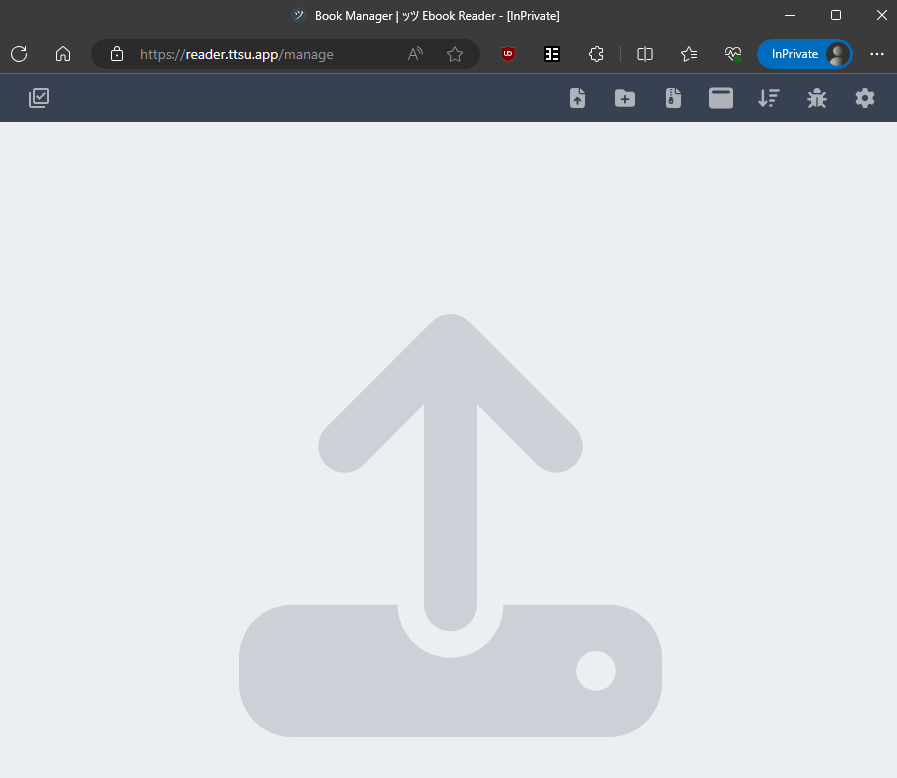
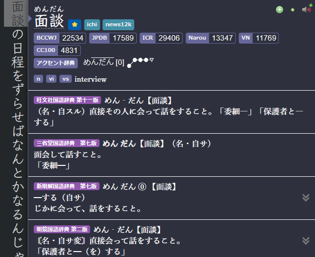
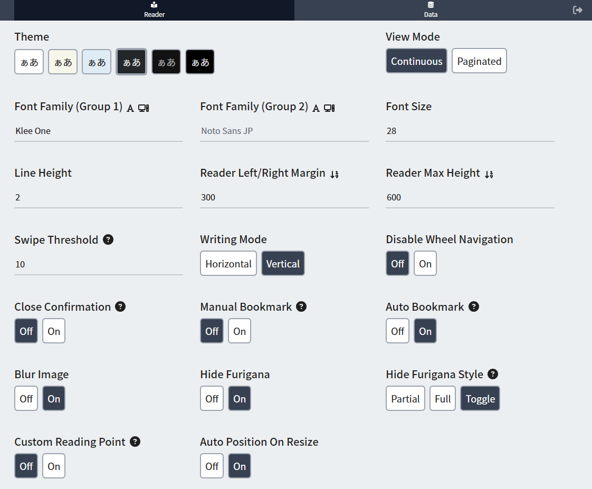

# Pengaturan Mining Light Novel dan sejenisnya [LazyGuide](https://lazyguidejp.github.io/jp-lazy-guide/setupLnOnPC/)

- Kamu bisa baca `Light Novel` di `PC` selama kamu punya file `epub` dari `Light Novel` itu, situs buat buka `epubs`-nya, dan `yomitan` sudah terpasang.

---

## Persyaratan

- Download `Light Novel` dalam format `epubs` sesuai pilihan kamu

- [Yomitan di PC](pengaturan-yomitan-pc-lazy-guide.md) sudah terpasang dan di-setup

---

## Cara Setup

1. Di `browser`, buka `https://reader.ttsu.app/`

    {height=500 width=1000}

2. Upload `File` atau `Folder` yang berisi `LN epubs`

    {height=50 width=100}

3. Sekarang kamu bisa mining pakai `Yomitan` seperti biasa

    {height=500 width=1000}

Sekarang kamu udah bisa baca Light Novel di PC.

<small>Kalau ada masalah, cek [FAQs](setupLnOnPC.md/#faqs)</small>

---

## Info Tambahan dan Tips

#### Info 1: Setting TTU Punyaku

??? info "Setting TTU Punyaku <small>(klik di sini)</small>"
    Ini setting `PC` buat `TTU`

    {height=500 width=1000}

#### Info 2: Pola Penggantian Teks (Text Replacement Pattern)

??? info "Pola Penggantian Teks <small>(klik di sini)</small>"

    Kalau nggak pakai settinganku, kamu harus masukin ini manual supaya teks bisa discan dengan akurat

    1. Di `Yomitan settings` > aktifin `Advanced` settings, ada di `pojok kiri bawah` atau `scroll ke bawah`

    2. Di menu `Translation` > pilih `Configure custom text replacement patterns...`

    3. Copy dan paste [ini](https://pastebin.com/er57E9Hw)

## FAQs
