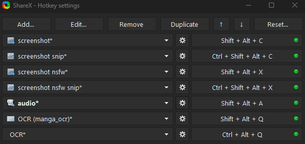
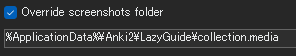

# Setup ShareX di Windows [Lazy Guide](https://lazyguidejp.github.io/jp-lazy-guide/setupShareX/)

- ShareX adalah tool otomatis untuk `screenshot`, `rekam audio`, dan `OCR` supaya bisa langsung ditempel di kartu `Anki` dengan gampang.
- **Wajib** buat semua metode mining yang aku pakai.

---

## Download dan Install

- Install [ShareX](https://getsharex.com/)
- Download [lazyGuide-ShareX-settings-17.0.0](https://drive.google.com/drive/folders/1vxkbfe7tr27NxWP5baFaLLmqnExt-3Ba?usp=sharing)  
    - Bekerja juga di versi ShareX yang lebih baru

---

## Cara Setup

1. Di `ShareX` > `Application Settings` > `Settings` > `Import` > pilih `lazyGuide-ShareX-settings`
    - Abaikan file random yang namanya aneh (isinya kosong), itu cuma sisa export yang nggak bisa dihapus

2. Di `ShareX` > `Hotkey Settings` > ganti tombol pintas/nama kalau mau

     {height=300 width=600}

3. Di `Hotkey Settings`, cari:
     - `screenshot`
     - `screenshot snip`
     - `screenshot nsfw`
     - `screenshot nsfw snip`
     - `audio`
        - Untuk tiap hotkey di atas: klik ikon `gir` > `override screenshot folder` > ubah `path`
        - Ganti `LazyGuide` jadi nama profil Anki kamu:  
         `%ApplicationData%\Anki2\**NamaProfilAnkiKamu**\collection.media`
            - Nama profil ada di pojok kiri atas Anki, atau buka `File` > `Profile`
 
             {height=150 width=300}

4. Untuk `audio`: `Hotkey settings` > `audio` > `screen recorder` > `screen recorder options`  
     - Install `recorder devices`
     - Video source: `none`
     - Audio source: `virtual-audio-capturer`

5. Tambahkan/mining kata di `Yomitan` dulu sebelum pakai hotkey `screenshot` atau `audio record` di `ShareX`
     - Pastikan `Anki` sedang terbuka biar tombol `Add(+)` muncul
     - Lihat juga [Mining Demo](setup-ShareX-pc.md/#info-1-mining-demo)

Selesai setup ShareX!

<small>Kalau ada masalah, cek [FAQs](setup-ShareX-pc.md/#faqs)</small>

---

## Extra Info dan Tips

#### Info 1: Mining Demo

??? info "Mining Demo <small>(klik di sini)</small>"

    Jangan lupa lihat Mining Demo!
    
    <iframe width="560" height="315" src="https://www.youtube.com/embed/tUiXU2gn75g" title="Mining Demo" frameborder="0" allow="accelerometer; autoplay; clipboard-write; encrypted-media; gyroscope; picture-in-picture; web-share" allowfullscreen></iframe>

#### Info 2: Fungsi Hotkey

??? info "Fungsi Hotkey <small>(klik di sini)</small>"

    - `screenshot` dan `screenshot nsfw`: ambil screenshot seluruh layar utama  
        - Kalau mau ganti monitor: `Hotkey settings` > `screenshot` > `Capture` > `Select region...`

    - `screenshot snip` dan `screenshot nsfw snip`: ambil screenshot bagian tertentu (mirip crop)

    - `OCR (manga_ocr)` dipakai di [Manga OCR](setup-manga-pc-lazy-guide.md/#setup-mining-mangaocr) sedangkan `OCR` adalah OCR bawaan ShareX

#### Tip 1: Skip Rekam Audio saat Mining

??? tip "Skip Rekam Audio saat Mining <small>(klik di sini)</small>"

    - Rekam audio bisa diskip kalau terasa makan waktu
    - Kalau kamu bisa bikin kartu Anki di bawah 5 detik per kartu, audio rekaman hampir nggak akan kedengaran

---

## Mining Satu Tangan pakai Mouse

??? info "Mining Satu Tangan pakai Mouse <small>(klik di sini)</small>"

    Install [Autohotkey](https://www.autohotkey.com/)

    Download dan jalankan Hotkey dari [sini](https://drive.google.com/drive/folders/1ex79TQF7yAliekkR_4q3LK6PhueSM_wK?usp=sharing)

    #### Opsi 1: ALT + Screenshot Hotkey
    - Tombol Forward Mouse = ALT (buat pop-up monolingual)
    - Tombol Back Mouse = Screenshot (non-NSFW)

    #### Opsi 2: Audio + Screenshot Hotkey
    - Tombol Forward Mouse = Rekam audio
    - Tombol Back Mouse = Screenshot (non-NSFW)

    #### Opsi 3: Screenshot (NSFW) + Screenshot (non-NSFW) Hotkey
    - Tombol Forward Mouse = Screenshot
    - Tombol Back Mouse = Screenshot (non-NSFW)

---

## FAQs
