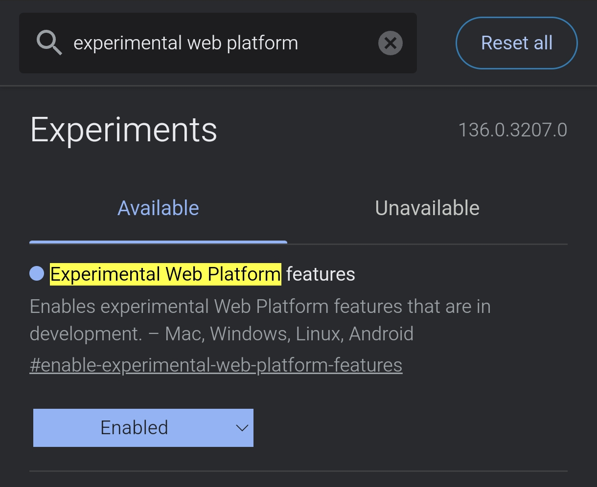
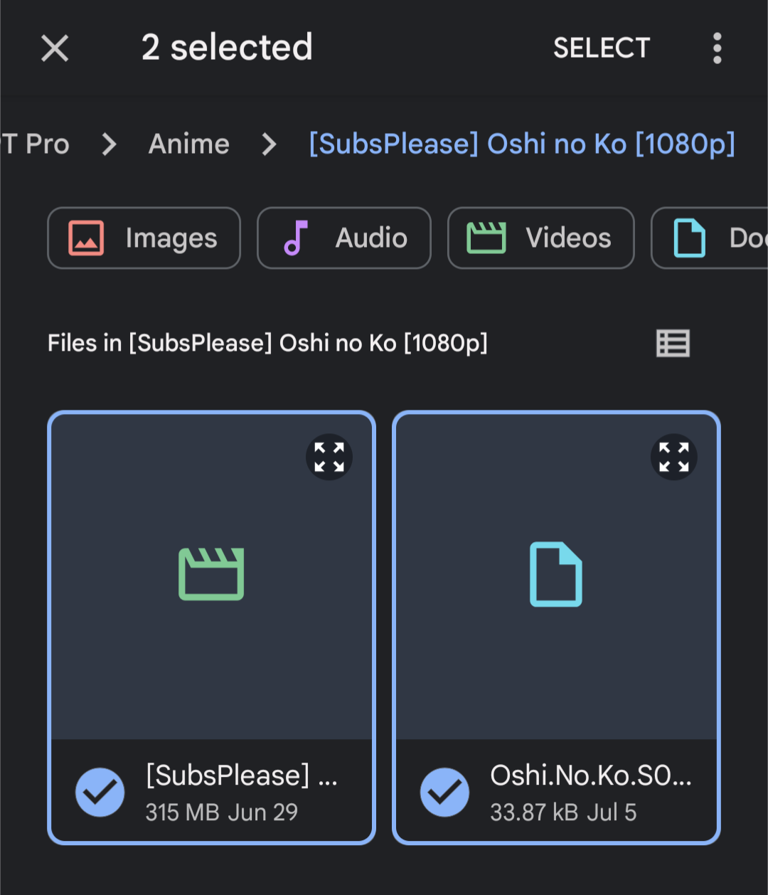
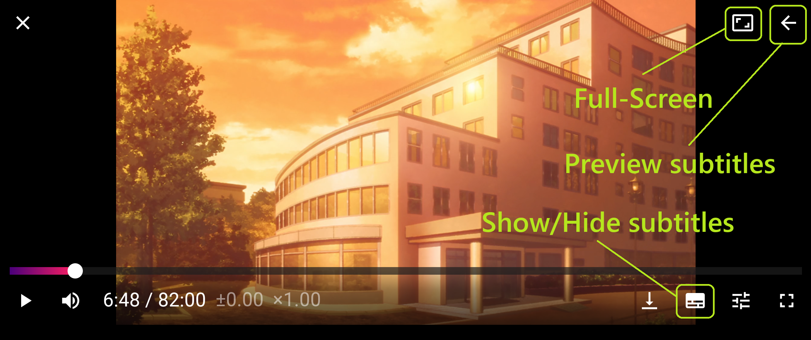
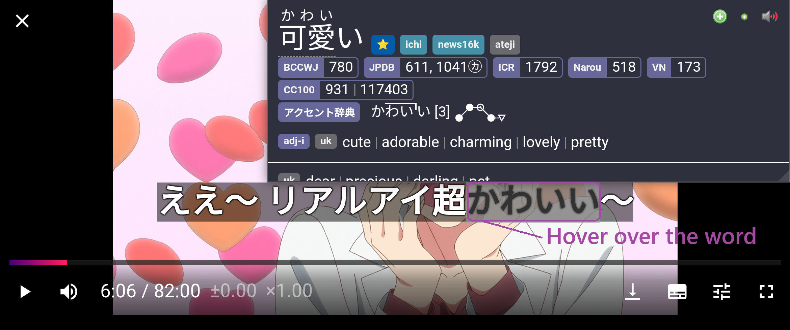

# Setup Mining Anime di Android [Lazy Guide](https://lazyguidejp.github.io/jp-lazy-guide/setupAnimeOnAndroid/)

- `asbplayer` adalah pemutar video di browser yang bisa memutar `Anime` dan `takarir` supaya kamu bisa hover kata-kata dan pakai `Yomitan`.

---

## Download dan Install

- Download `Anime` dan `JP Subtitle` kamu  
    - Untuk `JP subtitles` bisa ambil di [Jimaku](https://jimaku.cc/)

- (Opsional) Untuk video streaming, install ekstensi [asbplayer](https://chromewebstore.google.com/detail/asbplayer-language-learni/hkledmpjpaehamkiehglnbelcpdflcab)

  **Syarat:**

  - [Yomitan di Android](setup-yomitan-android-lazy-guide.md) sudah ter-setup

---

## Setting Awal

1. Di browser, buka `edge://flags`  
    - Cari `Experimental Web Platform features` > ubah jadi `Enabled`

    {height=200 width=400}

2. Buka [asbplayer](https://killergerbah.github.io/asbplayer/)  
    - Abaikan `request permission` ke `Anki` dan pemasangan ekstensi `Chrome`

3. Upload `Anime` dan `Subtitle` kamu ke `asbplayer` dengan klik `browse`  
    - Langkah ini nggak berlaku untuk platform streaming seperti `Youtube` atau `Netflix`

    === "Upload Files"
        {height=200 width=400}
    === "Pick Anime and Sub"
        {height=200 width=400}

4. Putar layar `Android` ke `Landscape` supaya tampilan `asbplayer` pas, lalu klik tombol di kanan atas untuk `full-screen`

    {height=400 width=800}

5. Sekarang kamu bisa mining pakai `Yomitan` dengan hover di kata-kata takarir  
    - Lihat [Demo Mining Anime](setup-anime-pc-lazy-guide.md/#info-1-demo-mining-anime) (untuk PC)  
    - Sayangnya, untuk ambil `Picture`, harus screenshot manual dan upload ke detail kartu di `Ankidroid`

    {height=400 width=800}

Mantap! Setup mining tools akhirnya kelar.

<small>Kalau ada masalah, cek [FAQs](setup-anime-android-lazy-guide.md/#faqs)</small>

---

## Info Tambahan dan Tips

#### Info 1: Demo Mining Anime (Untuk PC)

??? info "Demo Mining Anime <small>(klik di sini)</small>"

    Aku pakai note type Mining-JP di tutorial ini, di bagian pengaturan anki di yomitan kamu serharusnya sudah menggunakan note type Lapis. Aku pakai shortcut ++ctrl++++shift++ + X agar bisa mengedit audio/screenshot/subtitle yang akan dikirim ke `Anki`
    <iframe width="560" height="315" src="https://youtube.com/embed/1mOGv9hAHDc" title="Mining Demo" frameborder="0" allow="accelerometer; autoplay; clipboard-write; encrypted-media; gyroscope; picture-in-picture; web-share" allowfullscreen></iframe>

#### Tip 1: Sinkronisasi Subtitle

??? tip "Sinkronisasi Subtitle <small>(klik di sini)</small>"

    Tergantung sumber `Anime` kamu, `Subtitle` bisa aja nggak sinkron. Untuk menyesuaikan:

    - +100ms = ++ctrl++++shift++ + ←
    - -100ms = ++ctrl++++shift++ + →

#### Tip 2: Lewatin Rekaman Audio saat Mining

??? tip "Lewatin Rekaman Audio saat Mining <small>(klik di sini)</small>"

    - Bisa skip rekaman audio waktu mining biar nggak makan waktu
    - Kalau kartu Anki kamu bisa dikerjain di bawah 5 detik per kartu, hampir nggak bakal kepakai audionya

---

## FAQs

#### Pertanyaan 1: Gimana cara pakai Monolingual Setup di Android?

??? question "Gimana cara pakai Monolingual Setup di Android? <small>(klik di sini)</small>"

    1. Buka `Yomitan` settings > `Dictionary` > Nyalain `all`

        {height=250 width=500}

#### Pertanyaan 2: Kenapa Harus Nyalain Experimental Web Platform features?

??? question "Kenapa Harus Nyalain Experimental Web Platform features? <small>(klik di sini)</small>"

    - Beberapa `Anime` punya banyak `audio source` seperti `en` dan `jp`. Dengan fitur ini, kita bisa pilih `jp` kalau bukan default.

#### Pertanyaan 3: Kenapa Abaikan Request Permission ke Anki?

??? question "Kenapa Abaikan Request Permission ke Anki? <small>(klik di sini)</small>"

    - Karena kita pakai metode biasa supaya semua fitur `Anki` dan `Yomitan` tetap bisa dipakai.

#### Pertanyaan 4: Kenapa Nggak Install Chrome Extension?

??? question "Kenapa Nggak Install Chrome Extension? <small>(klik di sini)</small>"

    - Sama alasannya kayak `Pertanyaan 3`, soalnya `asbplayer` punya dukungan `Anki` bawaan yang fiturnya nggak selengkap setup `Anki` + `Yomitan` kita.
