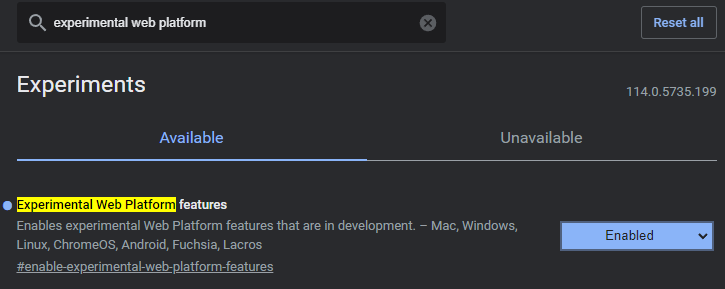
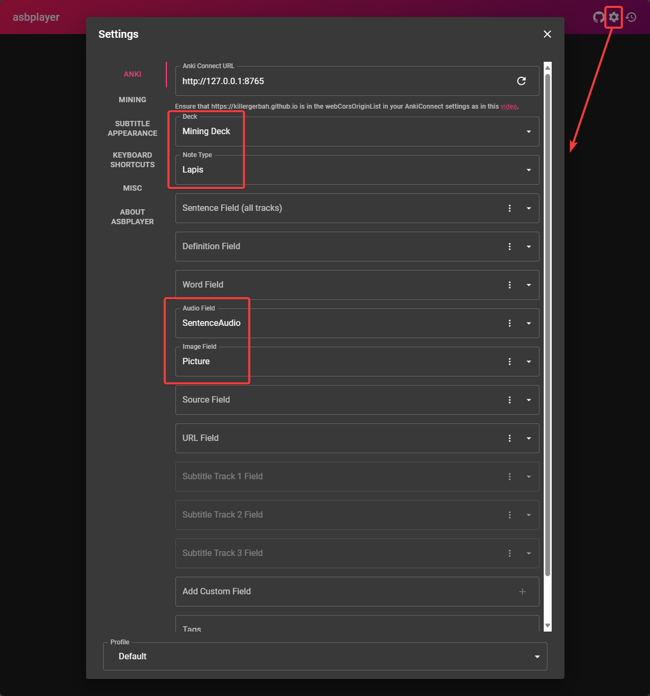
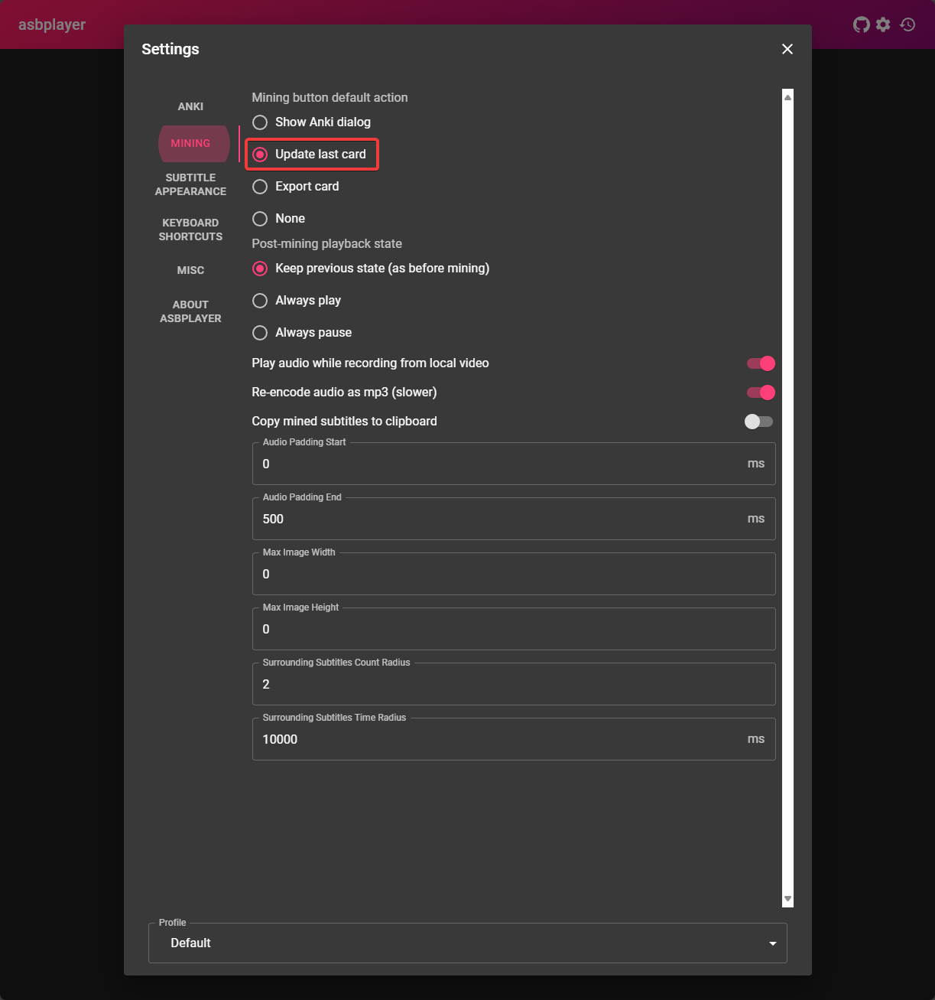
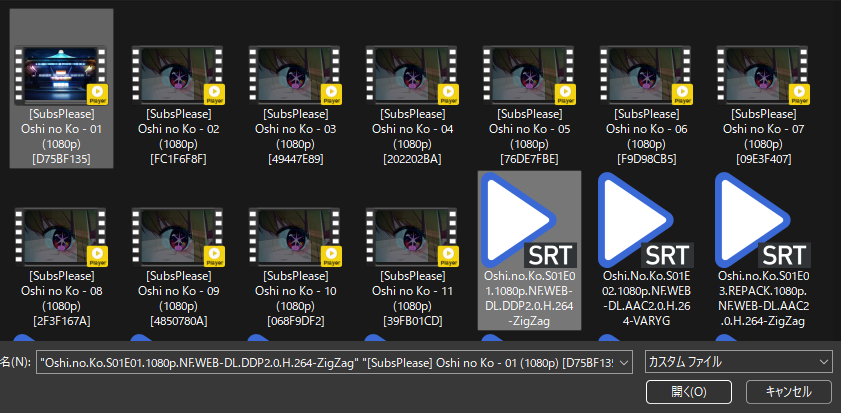
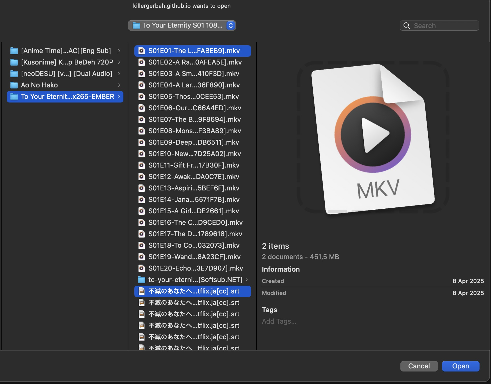

# Setup Mining Anime di PC
---
## Permulaan

- `asbplayer` adalah pemutar video di browser yang bisa digunakan untuk menonton `anime` dan `subtitle`, lalu hover kata menggunakan `yomitan`.

---

## Unduh & Pasang

- Unduh `anime` dan `subtitle JP` kamu
    - Untuk subtitle JP, bisa ke [Jimaku](https://jimaku.cc/)

- (Opsional) Untuk video streaming, pasang ekstensi [asbplayer](https://chromewebstore.google.com/detail/asbplayer-language-learni/hkledmpjpaehamkiehglnbelcpdflcab)
!!! warning "Untuk Pengguna Firefox"
    Untuk pengguna Firefox, bisa instal [dari sini](https://addons.mozilla.org/en-US/firefox/addon/asbplayer-learn-with-subs/), tapi banyak fitur yang hilang, lihat [catatan ini](https://docs.asbplayer.dev/docs/compatibility).

Syarat:

- Sudah pasang [Yomitan di PC](setup-yomitan-pc-lazy-guide.md)

---

## Langkah-langkah

1. Di browser buka `chrome://flags` atau `edge://flags`
    - Cari `Experimental Web Platform features` lalu aktifkan

    {height=300 width=600}

2. Buka [asbplayer](https://killergerbah.github.io/asbplayer/)

3. Di bagian atas kanan halaman pengaturan (ikon gir); salin [pengaturan](setup-anime-pc-lazy-guide.md/#__tabbed_1_1) di bawah

    === "Anki"
        {height=400 width=800}
    === "Mining"
        {height=400 width=800}

4. Buka `Anime` dan `Subtitle` di `asbplayer` dengan klik tombol `browse`
    - Abaikan cara ini untuk situs streaming seperti `Youtube` atau `Netflix`

    === "Buka Anime"
        {height=300 width=600}
    === "Pilih Anime dan Sub (Win)"
        {height=300 width=600}
    === "Pilih Anime dan Sub (Mac)"
        {height=300 width=600}

5. Untuk mining:
    - Arahkan kursor ke kata di subtitle dan mining dengan `Yomitan`
    - Tekan ++ctrl++++shift++ + U  untuk otomatis menambahkan `screenshot` dan `audio` ke `Anki`
    - (Opsional) Untuk mengganti shortcut: `Settings` > `Keyboard Shortcuts` > `Update last-created Anki card`

6. Sekarang kamu bisa Mining dengan `asbplayer` dan `yomitan`!
    - lihat [Demo Mining Anime](setup-anime-pc-lazy-guide.md/#info-1-demo-mining-anime)

Kamu sudah bisa mining anime di PC.  Mau lanjut cek panduan Setup Mining Light Novel?

[Lanjut ke Setup Mining Light Novel di PC](setup-LN-pc-lazy-guide.md){ .md-button .md-button }

<small>Kalau ada masalah, cek [Pertanyaan Umum](setup-anime-pc-lazy-guide.md/#pertanyaan-umum)</small>

---

## Info Tambahan & Tips

#### Info 1: Demo Mining Anime

??? info "Demo Mining Anime <small>(klik untuk lihat)</small>"

    Aku pakai note type Mining-JP di tutorial ini, di bagian pengaturan anki di yomitan kamu serharusnya sudah menggunakan note type Lapis. Aku pakai shortcut ++ctrl++++shift++ + X agar bisa mengedit audio/screenshot/subtitle yang akan dikirim ke `Anki`. Kamu bisa pakai shortcut ++ctrl++++shift++ + U untuk langsung update kartu yang ditambahkan terakhir oleh Yomitan.
    <iframe width="560" height="315" src="https://youtube.com/embed/1mOGv9hAHDc" title="Mining Demo" frameborder="0" allow="accelerometer; autoplay; clipboard-write; encrypted-media; gyroscope; picture-in-picture; web-share" allowfullscreen></iframe>

#### Tip 1: Sinkronisasi Subtitle

??? tip "Sinkronisasi Subtitle <small>(klik untuk lihat)</small>"

    Terkadang `subtitle` tidak sinkron karena beda sumber `anime`, untuk menyesuaikan:

    - +100ms = ++ctrl++++shift++ + ←
    - -100ms = ++ctrl++++shift++ + →

#### Tip 2: Lewatkan Rekaman Audio saat Mining

??? tip "Lewatkan Rekaman Audio saat Mining <small>(klik untuk lihat)</small>"

    - Bisa lewati rekaman audio biar lebih cepat
    - Kalau kartu Anki kamu dibuat <5 detik, audio rekaman bisa jadi hampir tidak terdengar

#### Tip 3: ASBPlayer di Youtube, Netflix, dan Web lain

??? tip "ASBPlayer bisa digunakan di Youtube, Netflix, dll <small>(klik untuk lihat)</small>"

    - Kamu hanya perlu buka video yang ingin diputar, tekan shortcut `` (tanda petik tunggal, di samping angka 1)`, lalu klik `Load Subtitles`
    - Kamu bisa mengaktifkan hingga 3 subtitle secara langsung dari subtitle yang disediakan webnya atau impor file .SRT
    - Untuk kompatibilitas di web lain, kamu bisa cek [ini](https://docs.asbplayer.dev/docs/compatibility#streaming-services-and-subtitle-detection)

---

## Pertanyaan Umum

#### Pertanyaan 1: Kenapa harus aktifkan Experimental Web Platform?

??? question "Kenapa aktifkan fitur eksperimen? <small>(klik untuk lihat)</small>"

    - Beberapa anime punya banyak `audio`, kayak `jp` dan `en`, jadi kita bisa pilih `jp` kalau bukan default-nya

#### Pertanyaan 2: Aku ada eror, bisa cek di mana?

??? question "Aku ada eror tertentu saat mencoba menambang di ASBplayer <small>(klik untuk lihat)</small>"

    - Kamu bisa cek [_Common Issue_ di ASBplayer](https://docs.asbplayer.dev/docs/common-issues). Kalau masalahmu tidak ada di sana, kita diskusikan di [server](https://discord.com/channels/1370274344571240552/1376885138352242688)
