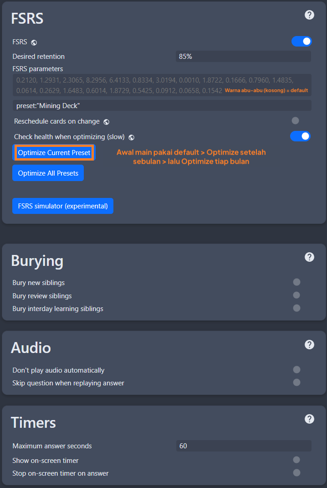
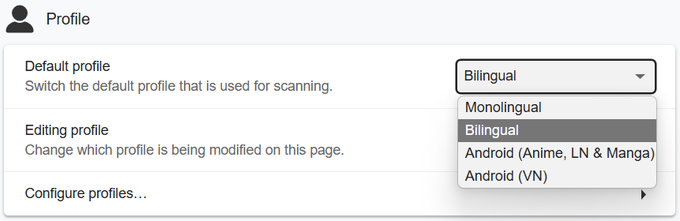

# Setup Anki di PC [LazyGuide](https://lazyguidejp.github.io/jp-lazy-guide/setupAnki/)

- Anki adalah program flash card berbasis SRS (Spaced Repetition System) untuk _review_ kartu yang penjadwalan ulangnya ditentukan oleh algoritma.
- Bisa digunakan di perangkat mobile juga.
- Tampilan Anki: [Light](img/anki-pc-light.png) | [Dark](img/anki-pc-dark.png)

---

- Mau update Format Lapis yang sudah kamu punya?
    - Buka [Memperbarui Format Lapis](pembaruan-format-lapis.md)

---

## Unduh dan Pasang

- Instal Anki di `PC` [Anki](https://apps.ankiweb.net/)
    - [Android](https://play.google.com/store/apps/details?id=com.ichi2.anki&hl=en_US) | [iOS](https://apps.apple.com/us/app/ankimobile-flashcards/id373493387) (Panduan ini untuk `PC`, tapi nanti bisa dipakai juga di HP)
- Unduh [Anki addons](https://drive.google.com/drive/folders/1dfmYAp0eg_bhhAkohUISYaS6B6QOBtww?usp=sharing)

---

## Cara Setup
1. Buka Anki, buat akun dan profil dengan klik tombol `Sync`

    {height=250 width=500}

2. Ekstrak ([?](https://www.webhostinghub.com/help/learn/website/managing-files/extract-file)) file `Anki addons21.7z` (Password: `lazyguide`) dan pindahkan folder `addons21` ke (cek sesuai OS-mu)

    === "Windows"
        Folder Windows = `C:\Users\**NamaUserKamu**\AppData\Roaming\Anki2`
        {height=70% width=70%} 
    === "MacOS"
        Folder MacOS = `/Users/macbookair/Library/Application Support/Anki2`
        {height=70% width=70%}

3. Restart Anki kamu, lalu tekan ++ctrl++++shift++ + A (Win)/++cmd++++shift++ + A (MacOS) untuk membuka menu add-ons atau pilih `Tools` > `Add-ons` > `Check for add-ons update`
    - Update semua `addons` lalu restart lagi

    {height=250 width=500}

4. Unduh format [Lapis](https://github.com/donkuri/lapis/releases/latest)
    - Scroll ke bagian Assets, cari `Lapis.apkg`

    {height=150 width=300}

5. Impor `Lapis.apkg` ke Anki dengan langsung buka file yang sudah diunduh sebelumnya, akan muncul tampilan ini, tekan `Import`

    {height=300 width=600}

6. Ganti nama `Lapis` jadi `Mining Deck`

    {height=250 width=500}

7. Masuk ke opsi `Deck` kamu, desktop dengan tekan ikon gir, Android dengan tahan `Deck` lalu pilih Deck Option, lalu salin [pengaturan ini](setup-anki-pc-lazy-guide.md/#__tabbed_2_1)
    - ([Pengaturan 2](setup-anki-pc-lazy-guide.md/#__tabbed_2_2)) Aktifkan `FSRS`
        - Isi `Desired Retention` dengan `80%`
    - ([Pengaturan 2](setup-anki-pc-lazy-guide.md/#__tabbed_2_2)) Dalam 1 bulan pertama, pakai `FSRS Parameter` default; setelah itu:
        - Gunakan tombol `Optimize` dan `Compute minimum recommended retention` setiap bulan
        - Ganti nilai `Desired retention` sesuai hasil yang muncul

    - Di menu bar (pojok kiri atas) klik `Tools` > `Preferences` dan sesuaikan dengan [pengaturan ini](setup-anki-pc-lazy-guide.md/#__tabbed_2_4)

    === "Pengaturan 1"
        {height=300 width=600}
    === "Pengaturan 2"
        {height=300 width=600}
    === "Pengaturan 3"
        {height=300 width=600}
    === "Preferensi Anki"
        {height=300 width=600}
    === "Preferensi Anki (Android)"
        {height=300 width=600}

8. Restart `Anki` kamu dan selesai deh!

Template Anki kamu udah siap, selanjutnya setup Yomitan:

[Langsung ke Setup Yomitan](setup-yomitan-pc-lazy-guide.md){ .md-button .md-button }

---

## Info Tambahan & Tips

#### Info 1: Daftar Add-ons Anki

??? info "Daftar Add-ons Anki <small>(klik untuk buka)</small>"

    Daftar Add-ons Anki yang digunakan:

    - Kamu bisa cari tahu fungsinya dengan klik `View Add-on Page`
    - Sebagian besar bisa diakses dari menu `Tools` di `Taskbar`

    {height=250 width=500}

#### Info 2: Mode Terang & Gelap Anki

??? info "Mode Terang & Gelap Anki <small>(klik untuk buka)</small>"

    Untuk ganti tema Anki, klik `Tools` > `Preferences` > `Theme`

    {height=300 width=600}

#### Info 3: Cara Atur Retention

??? info "Cara Atur Retention <small>(klik untuk buka)</small>"

    Kalau kamu merasa retensi kamu rendah, buka [Tentang Retention](tentang-retention.md) buat saran pengaturan Anki dan tips lainnya. (Tutorial belum dibuat, tunggu pembaruan selanjutnya, ya)

#### Tip 1: Saat Review di Anki

??? tip "Saat Review di Anki <small>(klik untuk buka)</small>"

    - Cukup pakai tombol `again (1 = lupa)` atau `good (spasi/3 = tahu)` aja. Gak perlu ribet mikir `easy (2)` atau `hard (4)`
    - Cara penilaian simpelnya gini:
         - Bisa baca ✅ tau makna ✅ = Good/Pass
         - Bisa baca ✅ tau makna ❌ = Again/Fail
         - Bisa baca ❌ tau makna ✅ = Again/Fail
         - Bisa baca ❌ tau makna ❌ = Again/Fail

#### Tip 2: Warna Pitch Accent Anki

??? tip "Warna Pitch Accent Anki <small>(klik untuk buka)</small>"

    Saat melihat kartu, warna menunjukkan jenis pitch accent:

    {height=250 width=500}

#### Tip 3: Ganti Kamus Bilingual/Monolingual

??? tip "Ganti Kamus Bilingual/Monolingual <small>(klik untuk buka)</small>"

    Saat review kartu, kamu bisa klik bagian kiri definisinya buat ganti antara `Monolingual` dan `Bilingual`

    {height=250 width=500}

## FAQs

#### Pertanyaan 1: Bisa nambah gambar selain screenshot?

??? question "Bisa nambah gambar selain screenshot <small>(klik untuk buka)</small>"

    - Kamu bisa tambahkan banyak gambar ke kolom `DefinitionPicture` lewat `Anki` > `Browse` > pilih `Card`

    - Atau tempel langsung saat review dengan mode `Edit` (tekan `E`)

#### Pertanyaan 2: Kalau ada masalah sama Format Lapis gimana?

??? question "Kalau ada masalah sama Format Lapis gimana? <small>(klik untuk buka)</small>"

    - Langsung cek [FAQ Lapis](https://github.com/donkuri/lapis?tab=readme-ov-file#faq)

#### Pertanyaan 3: Mau ganti font atau ukuran teks?

??? question "Mau ganti font atau ukuran teks? <small>(klik untuk buka)</small>"

    - Cek [panduan ini](https://github.com/donkuri/lapis?tab=readme-ov-file#how-can-i-change-the-font-size)

#### Pertanyaan 4: Deck bisa diganti nama?

??? question "Deck bisa diganti nama? <small>(klik untuk buka)</small>"

    - Secara teknis bisa, tapi tidak disarankan. Kamu harus setting ulang `Anki Card Format` di Yomitan dan Add-on `AutoReorder` di Anki

#### Pertanyaan 5: Gimana cara pakai sentence card?

??? question "Gimana cara pakai sentence card? <small>(klik untuk buka)</small>"

    Silakan setup [Yomitan](setup-yomitan-pc-lazy-guide.md) dulu kalau belum (ini panduan selanjutnya setelah ini)

    ??? info "Saya udah setup Yomitan kok <small>(klik untuk buka)</small>"

        Masuk ke `Yomitan settings` > `Anki` > `configure Anki card format...`

        {height=300 width=600}
        
        Di tab `Terms` (di yomitan versi lama namanya Terms, di versi baru ada di bagian Expression), scroll ke bawah, cari `IsSentenceCard`, dan isi dengan `1`, lalu tutup jendelanya

        {height=300 width=600}

        Terapkan pengaturan ini di semua profil di `Active Profile` (versi lama ada Editing dan default profile, bisa diabaikan), pastikan semua seperti `Monolingual`, `Bilingual`, `Android (Anime, LN & Manga)`, dan `Android (VN)` juga sudah diubah

        {align=left height=300 width=600}
