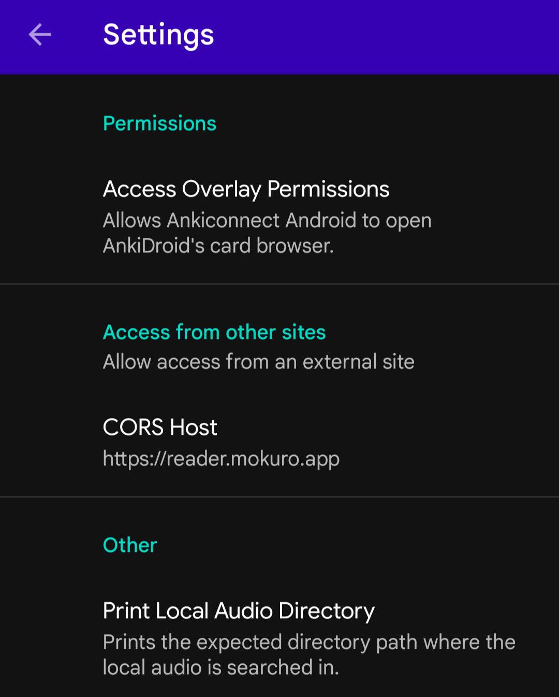
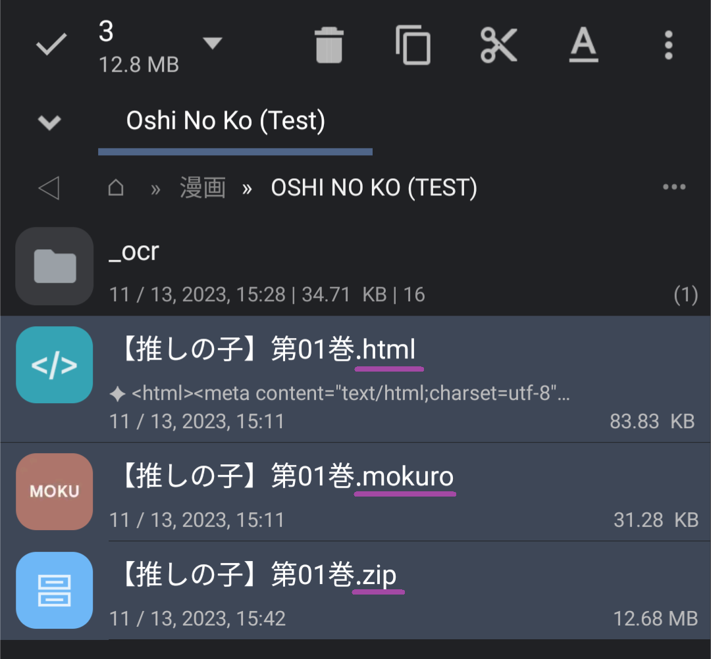
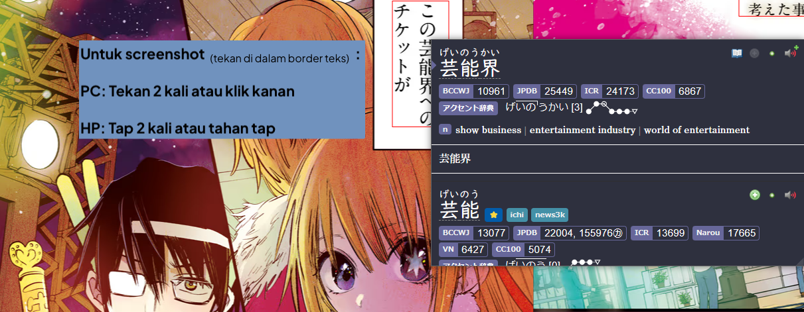

# Setup: Manga di Android

- Kamu bisa pakai `Android` buat baca `Manga` lewat `Edge Canary` sambil scan kata pakai `Yomitan`.
- Termasuk juga fitur screenshot otomatis `Manga` walaupun di `Android`.

---

## Download dan Install

- Download dan install file `.apk` [Ankiconnect Android](https://github.com/KamWithK/AnkiconnectAndroid/releases/latest/) dari bagian Assets

- Install [Ankidroid](https://play.google.com/store/apps/details?id=com.ichi2.anki)

**Syarat:**

- [Yomitan di Android](setup-yomitan-android-lazy-guide.md) sudah ter-setup
- Manga yang sudah diproses dari [Setup Mining Mokuro Manga](setup-manga-pc-lazy-guide.md/#setup-mining-mokuro-manga)
- Aplikasi kompres file seperti [7z](https://www.7-zip.org/)

---

## Setting Awal

1. Kompres file Manga kamu (yang isinya `img` atau file `.png`) jadi format `.zip` (**bukan** `.7z`)  
    - Caranya: klik kanan folder > `7-Zip` > `Compress...` > `Archive Format: .zip` > `OK`

2. Transfer `Manga yang sudah diproses` ke perangkat `Android`  
    - Semua file: file manga `.zip` hasil kompres, folder `_ocr`, dan file `.mokuro`

3. Buka `Ankiconnect Android` > `Settings` > `CORS Host` > `https://reader.mokuro.app`

     {height=200 width=400}

4. Klik `Start the Service` di `AnkiConnect Android` dan pastikan `AnkiDroid` juga dibuka

5. Di `Edge Canary`, buka [Mokuro Reader](https://reader.mokuro.app/) > klik ikon `Upload` (kanan atas) > `choose files` (**bukan** `choose directory`)  
    - Pilih file `.html`, `.mokuro`, dan `.zip` dari manga (hasil langkah 2)

     {height=150 width=300}

    ??? examplecode "Struktur Folder <small>(klik di sini)</small>"
        
        ```
        ├── Folder Manga
        │   ├── _ocr folder
        │   ├── .html
        │   ├── .mokuro
        │   └── .zip
        │   |    └── file gambar manga (.jpg/.png)
        ```

6. Di kanan atas, buka `settings` > `Profile` > `Select a File` > [Mokuro Profile](https://drive.google.com/drive/folders/17EzQL9ONQ3MVsCJwC7ejmL0317EwdR--?usp=sharing) > `Import Profiles` > pilih `Mobile Profile`  
    - Atau bikin profil sendiri, yang penting bagian `Anki Connect` sudah diatur lengkap.

7. Untuk mining, cukup tambahkan kata pakai `Yomitan` dengan `tekan dan tahan` untuk scan kata  
    - Untuk screenshot, pastikan double tap atau tap tahan di dalam `text border` (default-nya tidak terlihat)

     {height=400 width=800}

8. Sekarang kamu bisa mining dan screenshot manga di Android dengan gampang.

Setup Manga Mining di Android sudah selesai. 

<small>Kalau ada masalah, cek [FAQs](setup-manga-android-lazy-guide.md/#faqs)</small>

---

## Info Tambahan dan Tips

#### Info 1: Android Mining Demo

??? info "Android Mining Demo <small>(klik di sini)</small>"

    - Demo mining dengan screenshot manga
    - Sudah agak lama tapi masih nunjukin fungsi dasarnya
    - Untuk screenshot, double tap atau tap tahan di dalam `text border`

    {height=200 width=400}

---

## FAQs

#### Pertanyaan 1: Gimana cara pakai Monolingual Setup di Android?

??? question "Gimana cara pakai Monolingual Setup di Android? <small>(klik di sini)</small>"

    1. Buka `Yomitan` settings > `Dictionary` > Nyalain `all`

        {height=250 width=500}
