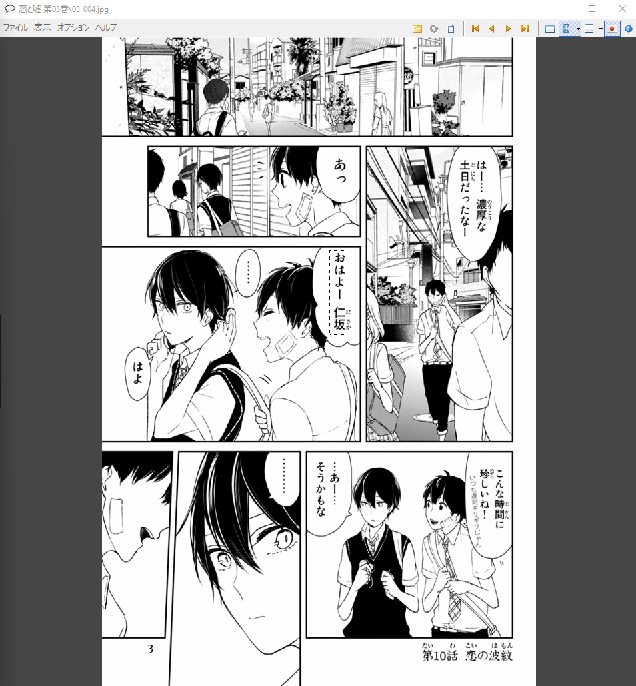
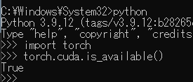
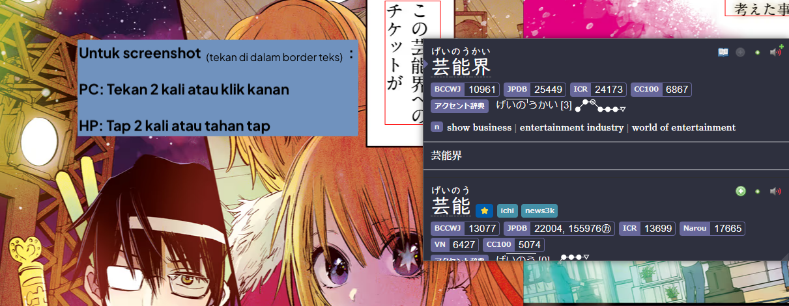
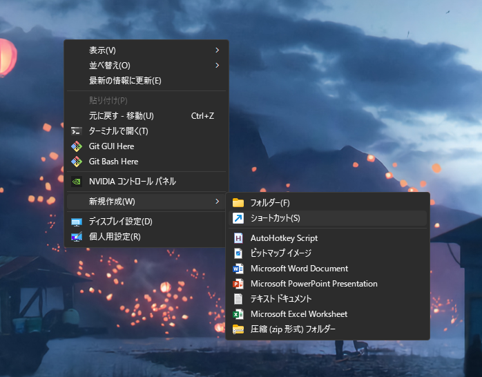

# Setup Mining Manga di PC Windows [Lazy Guide](https://lazyguidejp.github.io/jp-lazy-guide/setupMangaOnPC/) 

- [MangaOCR](setup-manga-pc-lazy-guide.md/#setup-mining-mangaocr) adalah tool yang dipakai buat scan teks `Jepang` dan langsung nyimpen hasilnya ke clipboard, yang nanti bisa kamu scan pakai `Yomitan`.

- (Rekomendasi) [Mokuro Manga](setup-manga-pc-lazy-guide.md/#setup-mining-mokuro-manga) adalah setup yang memproses `manga` dulu supaya kamu bisa hover kata-katanya dan langsung scan pakai `Yomitan`.

---

## MangaOCR

**Kebutuhan:**

- Install [CDisplayEx](https://www.cdisplayex.com/desktop/)  
    - Reader Manga untuk `PC`
- [Yomitan di PC](setup-yomitan-pc-lazy-guide.md) dan [ShareX](setup-ShareX-pc.md) sudah ter-setup

---

## Setup Mining MangaOCR

1. Download [python](https://www.python.org/downloads/release/python-31011/) (`hanya versi 3.10.xx`)  
    - Scroll ke bawah, pilih Windows`INSTALLER (64-bit)` dan install  
    - Centang `Add Python to PATH`

    {height=300 width=600}

2. Buka `command prompt` lewat tombol Windows/search > ketik `cmd`

3. Ketik `pip3 install mokuro`  
    - Tunggu sampai selesai install (butuh beberapa menit)  
    - Kalau muncul error `pip3 is not recognized...`:
        - Uninstall `Python` (ulang step 1) > restart PC > install lagi Python (ulangi kalau masih error, ya emang agak nyebelin)

4. Buka `Hotkey Settings` di [ShareX](setup-ShareX-pc.md) > `OCR (manga_ocr)` > klik ikon `COG` > `override screenshot folder` > ganti `path` ke folder OCR yang kamu mau

    {height=150 width=300}

5. Di `command prompt` ketik:
    - `manga_ocr "\path\to\sharex\screenshot\folder"`  
        - ganti `path` sesuai folder OCR yang kamu set di step 4, lalu minimize window
    - Bisa juga cuma ketik `manga_ocr` tanpa path, cara ini bakal scan layar dari mana aja
    - Kalau mau bikin shortcut program, cek [Info 1](setup-manga-pc-lazy-guide.md/#info-1-shortcut-program-mangaocr)

6. Untuk scan, capture gambar pakai hotkey `Shift + Alt + Q` (atau sesuai setting OCR kamu di ShareX)  
   - Pastikan [Yomitan Search Page](setup-manga-pc-lazy-guide.md/#__tabbed_1_1) udah kebuka  
   - Kalau mau scan pakai tombol mouse, cek [Info 2](setup-manga-pc-lazy-guide.md/#info-2-scan-pakai-tombol-mouse)

7. Sekarang kamu udah bisa mulai baca Manga pakai MangaOCR

    ??? info "Video Cara Pakai <small>(klik di sini)</small>"
        <iframe width="560" height="315" src="https://user-images.githubusercontent.com/22717958/150238361-052b95d1-0152-485f-a441-48a957536239.mp4" title="MangaOCR How-to" frameborder="0" allow="accelerometer; autoplay; clipboard-write; encrypted-media; gyroscope; picture-in-picture; web-share" allowfullscreen></iframe>

    === "Yomitan Search Page"
        {height=300 width=600}
    === "CDisplayEx Manga"
        {height=300 width=600}

Kalau mau coba metode lain, cek [Mokuro Manga](setup-manga-pc-lazy-guide.md/#setup-mining-mokuro-manga).

---

## Setup Mining Mokuro Manga

Kamu bisa pilih 3 metode:

- [Metode Instan](setup-manga-pc-lazy-guide.md/#metode-instan): tinggal impor dan langsung baca manga
- [Metode Online](setup-manga-pc-lazy-guide.md/#metode-online): proses ±200 halaman manga dalam ±15 menit, gampang tinggal ikutin panduan
- [Metode Lokal](setup-manga-pc-lazy-guide.md/#metode-lokal): lebih bagus kalau PC kamu kuat, cocok buat yang udah paham teknis

!!! note "Mining di Android"
    Kalau mau mining di Android, cek [Setup Manga di Android](setup-manga-android-lazy-guide.md)

---

### Metode Instan

1. Buka [Katalog Mokuro](https://catalog.mokuro.moe/).

2. Cari manga pilihanu. Pilih volume yang mau dibaca. Impor.

3. Tunggu hingga manga selesai diimpor.

4. Lihat [Baca Manga yang Udah Diproses](setup-manga-pc-lazy-guide.md/#baca-manga-yang-udah-diproses) ke langkah 1, lalu lompat ke langkah 3. 

---

### Metode Online

1. Ikuti [Panduan ini](https://colab.research.google.com/drive/1k-M1zr4hBnZTxlRODtNFn9r08XS5bKYB?usp=sharing)

2. Download folder Manga yang udah diproses dan lanjut ke [Baca Manga yang Udah Diproses](setup-manga-pc-lazy-guide.md/#baca-manga-yang-udah-diproses)

---

### Metode Lokal

1. Download [python](https://www.python.org/downloads/release/python-31011/) (**hanya versi 3.10.xx**)  
    - Scroll ke bawah, pilih Windows`INSTALLER (64-bit)` dan install  
    - Centang `Add Python to PATH`
    {height=300 width=600}

2. Download dan install [Git](https://git-scm.com/downloads) (pilih 64-bit)

3. Buka `command prompt` dengan tombol `Windows` atau `search` > ketik `cmd`

4. Ketik `pip3 install mokuro`
    - Terus tunggu aja beberapa menit sampai proses download/install selesai dan kamu bisa ngetik lagi
    - Kalau muncul `pip3 is not recognized...` maka:
        - Uninstall `Python` (langkah 1) > Restart PC > install ulang `Python` (ulang lagi kalau masih gagal; iya, nyebelin emang)

5. (Opsional) Pakai `GPU CUDA`
    - Cek dulu apakah GPU kamu [compatible sama CUDA](https://developer.nvidia.com/cuda-gpus)
    - Download [CUDA Toolkit 11.8.0](https://developer.nvidia.com/cuda-toolkit-archive) sesuai OS dan versimu
    - Ketik `pip install torch torchvision torchaudio --index-url https://download.pytorch.org/whl/cu118` di `cmd` (tetap di `CUDA 11.8`)

    {height=300 width=600}

    - Buat cek apakah udah kepasang, ketik `python` > `import torch` > `torch.cuda.is_available()`

        {height=150 width=300}

    - Kalau malah kebuka Microsoft Store:  
        - Buka `Windows Powershell` > paste `input Remove-Item $env:USERPROFILE\AppData\Local\Microsoft\WindowsApps\python*.exe` > lalu tekan `enter`
    - Kalau ada masalah, install ulang pytorch dengan `pip uninstall torch` di `cmd` lalu ulangin langkah di atas, kalau masih gagal, cek [di sini](https://pytorch.org/get-started/locally/#windows-verification) buat cara verifikasi lain

6. Ada dua opsi proses, buka `cmd` lalu:
    - Semua volume Manga:
        - Paste: `mokuro --parent_dir F:\Manga\Saenai`
            - Ganti path lengkap, "Saenai" sama nama manga kamu
            - Vol1, 2, 3, dst. harus ada di dalam folder `Saenai` dengan urutan nama yang seragam & berurutan naik
    - Volume Manga tertentu:
        - Paste: `mokuro F:\Manga\Saenai\Vol3`
            - Ganti path lengkap, "Saenai" sama nama manga kamu dan nomor volume

    ??? examplecode "Struktur Folder <small>(klik di sini)</small>"
        
        ```
        ├── Manga Folder
        │   ├── _ocr folder
        │   ├── .html
        │   ├── .mokuro
        │   └── .zip
        │        └── file gambar manga (.jpg/.png)
        ```

7. Lihat [Baca Manga yang Udah Diproses](setup-manga-pc-lazy-guide.md/#baca-manga-yang-udah-diproses)

---

### Baca Manga yang Udah Diproses

??? examplecode "Perhatian <small>(klik di sini)</small>"
    Skip `Step 1` kalau kamu pakai [setup](setup-anki-pc-lazy-guide.md) punyaku
    

1. Di Anki kamu, tekan ++ctrl++++shift++ + A (Win) / ++cmd++++shift++ + A (MacOS) atau `Tools` > `Add-ons`
    - Pilih [AnkiConnect](https://ankiweb.net/shared/info/2055492159) > `Config`
    - Di bagian `webCorsOriginList` paste `https://reader.mokuro.app` atau copy config di bawah ini:

    ??? examplecode "AnkiConnect Config <small>(klik di sini)</small>"

        ```
        {
            "apiKey": null,
            "apiLogPath": null,
            "ignoreOriginList": [],
            "webBindAddress": "127.0.0.1",
            "webBindPort": 8765,
            "webCorsOriginList": [
                "http://localhost",
                "https://killergerbah.github.io",
                "https://reader.mokuro.app",
                "https://reader.ttsu.app",
                "https://app.asbplayer.dev"
                ]
        }
        ```

    {height=150 width=300}

2. Pergi ke [Mokuro Reader](https://reader.mokuro.app/) > ikon `Upload` (pojok kanan atas) > `choose directory`
    - Pilih folder `Manga` yang isinya manga, file hasil mokuro, dan `.mokuro`
    - Klik `Upload`

    {height=300 width=600}

3. Di pojok kanan atas, buka `settings` > `Profile` > `Select a File` > [Mokuro Profile](https://drive.google.com/drive/folders/17EzQL9ONQ3MVsCJwC7ejmL0317EwdR--?usp=sharing) > `Import Profiles` > pilih `PC Profile`
    - Alternatifnya, kamu bisa bikin profil sendiri, pastiin bagian `Anki Connect` udah di-setup semua
    
     {height=50 width=100}

4. Biar bisa mining, cukup tambahin kata pakai `Yomitan`
    - Buat screenshot, pastiin kamu double click/tap di dalam `text border` (secara default nggak kelihatan)

    {height=400 width=800}

5. Sekarang kamu udah bisa mining dan screenshot di manga kamu dengan gampang

!!! note "_ocr folder"

    File ocr opsional tapi disarankan buat disimpan

Sekarang kamu bisa mining Manga di PC.

<small>Kalau ada masalah, cek [FAQs](setup-manga-pc-lazy-guide.md/#faqs)</small>


---

## Extra Info & Tips

#### Info 1: Shortcut Program MangaOCR

??? info "Shortcut Program MangaOCR <small>(klik di sini)</small>"
    1. `Klik Kanan` di area kosong di `Desktop` kamu > `New` > `Shortcut`

        {height=300 width=600}

    2. Ketik lokasi item-nya seperti ini:
        - Default: `C:\Windows\System32\cmd.exe /k manga_ocr`
        - OCR hanya dari folder tertentu: `C:\Windows\System32\cmd.exe /k manga_ocr "\lokasi\ke\folder\screenshot\pilihan"`
            - Contoh: `C:\Windows\System32\cmd.exe /k manga_ocr "F:\Pictures\OCR Picture"`
            - Klik `Next` lalu `pilih nama` shortcut-nya, selesai.

#### Info 2: Scan pakai Tombol Mouse

??? info "Scan pakai Tombol Mouse <small>(klik di sini)</small>"
    1. Download dan install [AutoHotkey](https://www.autohotkey.com/)

    2. Download [Hotkey](https://drive.google.com/drive/folders/1U94qH4k6L00Wd_96tJBmI2fsOA-HS1uK?usp=sharing) punyaku, lalu jalankan.

    3. Gunakan `Forward Button` di mouse untuk jalanin scan
        - Ini dengan asumsi hotkey `OCR (manga_ocr)` di `ShareX` masih default `Shift + Alt + Q`
        - Kalau mau, kamu bisa ubah hotkey-nya dengan ngedit script-nya.

## FAQs

