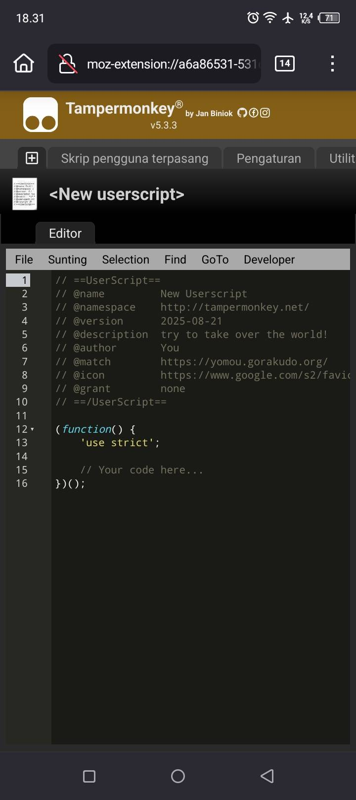

# Tutorial OCR Manga Android (Versi [Mangatan](https://github.com/kaihouguide/Mangatan?tab=readme-ov-file#-for-android))

Panduan ini disusun berdasarkan referensi dari [Kaihou Guide Mangatan](https://github.com/kaihouguide/Mangatan?tab=readme-ov-file#-for-android).

---

## Unduh dan Pasang

1. **Instal Termux**
    - Unduh Termux dari [F-droid](https://f-droid.org/en/packages/com.termux/), atau  
    - [Github](https://github.com/termux/termux-app/releases)

2. **Browser yang mendukung ekstensi**
    - Gunakan Firefox, Edge Canary, atau browser lain yang bisa memasang ekstensi.  
    - (Rekomendasi: **Firefox**)

3. **Pasang ekstensi Tampermonkey**
    - Tambahkan [Tampermonkey](https://chromewebstore.google.com/detail/tampermonkey/dhdgffkkebhmkfjojejmpbldmpobfkfo?hl=en-US&utm_source=ext_sidebar) di browser pilihan kamu

    === "Buat Skrip Baru"
         Buat skrip baru

        {height=70% width=70%}
    === "Hapus isi default"
         Hapus semua isi default skrip

        {height=70% width=70%}
    === "Timpa Isi"
         Salin dan tempel skrip Mangatan versi mobile dari [Kaihou Guide](https://github.com/kaihouguide/Mangatan) ke lokasi di gambar sebelumnya, lalu pencet tombol `file` di pojok kiri atas lalu save 

        {height=70% width=70%}
    === "Berhasil"
         Jika berhasil, akan muncul seperti pada gambar di bawah

        {height=70% width=70%}

---

## Langkah-Langkah

> ⚠️ **Catatan penting:** Gunakan **session baru** di Termux untuk setiap script. Jangan ditimpa agar Suwayomi dan Mangatan bisa berjalan bersamaan.

1. **Memasang Suwayomi**
    - Salin script Suwayomi di bawah  
      ```bash
      pkg update -y && pkg install -y openjdk-21 wget jq && mkdir -p ~/suwayomi/bin && LATEST_JAR_URL=$(curl -s https://api.github.com/repos/Suwayomi/Suwayomi-Server/releases/latest | jq -r '.assets[] | select(.name | endswith(".jar")) | .browser_download_url') && wget -O ~/suwayomi/SuwayomiServer.jar "$LATEST_JAR_URL" && echo -e '#!/data/data/com.termux/files/usr/bin/bash\njava -jar ~/suwayomi/SuwayomiServer.jar' > ~/suwayomi/bin/suwayomi && chmod +x ~/suwayomi/bin/suwayomi && echo 'export PATH="$HOME/suwayomi/bin:$PATH"' >> ~/.bashrc && source ~/.bashrc
      ``` 
    - Tempelkan di Termux. Tunggu beberapa menit hingga selesai.

2. **Memasang Mangatan**
    - Buat session baru
    - Salin script Mangatan di bawah
      ```bash
      rm -rf ~/Mangatan && pkg install -y git nodejs && git clone https://github.com/kaihouguide/Mangatan && cd Mangatan/ocr-server-legacy && npm install express chrome-lens-ocr multer node-fetch --force && mkdir -p ~/bin && echo -e '#!/data/data/com.termux/files/usr/bin/sh\ncd ~/Mangatan/ocr-server-legacy && node server.js' > ~/bin/mangatan && chmod +x ~/bin/mangatan && echo 'export PATH=$HOME/bin:$PATH' >> ~/.bashrc && source ~/.bashrc
      ```  
    - Tempel di Termux, lalu tunggu hingga selesai.

3. **Menjalankan aplikasi**
    - Di Termux, ketik:
      ```bash
      suwayomi
      ```
    - Buka session baru, lalu ketik:
      ```bash
      mangatan
      ```
    ⚠️ **Penting:** Jangan timpa session. Harus ada **2 session**
    terpisah di Termux.

4. **Akses dari browser**
    - Buka [http://127.0.0.1:4567](http://127.0.0.1:4567) di browser.  
    - Buka ekstensi Suwayomi lalu tambahkan link berikut:  
      ```
      https://raw.githubusercontent.com/keiyoushi/extensions/repo/index.min.json
      ```
📌 Catatan: Bagian konfigurasi Suwayomi di Android hampir sama dengan
versi PC.


Jika semua langkah dilakukan dengan benar, maka OCR manga Android dengan **Mangatan + Suwayomi** sudah bisa dijalankan.

---

## Info Tambahan & Tips

---

## FAQs

