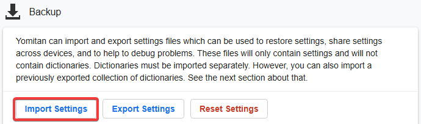
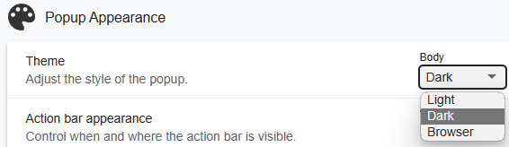
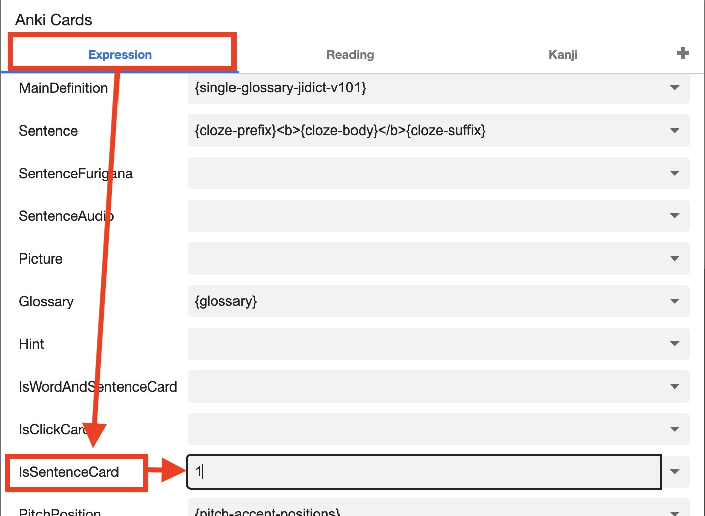

# Setup Yomitan di Android [LazyGuide](https://lazyguidejp.github.io/jp-lazy-guide/setupYomitanOnAndroid/)


- Yomitan adalah kamus hover untuk bahasa Jepang
- Dipakai buat `mining` ke `Anki`
- Yomitan [Light](img/yomitan-light.png) | [Dark](img/yomitan-dark.png) Mode ([CSS](https://pastebin.com/T9EkQQwm))

---

## Download dan Install

- Install [Edge Canary](https://play.google.com/store/apps/details?id=com.microsoft.emmx.canary)

- Download dari [sini](https://drive.google.com/drive/folders/1DHJ18Lk2_tVYWJ1Adhe8XByuyFBGuTr_?usp=sharing):
    - `Font`
    - `yomitan dictionary`
    - `lazyGuide-yomitan-settings` (download dua-duanya)
    - Tambahan kamus [JIDict](https://drive.google.com/file/d/1VPvizJLN3ShjzdNbTxpY4dN33UI9l0FR/view?usp=drivesdk) dan [JMDict Trilingual JP-EN-ID](https://github.com/phi-li-a/PhiliaArchive/blob/main/Yomitan/Trilingual/%5BBETA%20VERSION%5D%20JMDict%20JP-EN-ID%20V.0.1.zip)

- Setelah download:
    - Extract ([?](https://www.webhostinghub.com/help/learn/website/managing-files/extract-file)) `Font.7z` dan `yomitan dictionary.7z` (Password: `lazyguide`)
    - `yomitan dictionary.7z` cukup di-extract sekali, **jangan extract dictionary di dalamnya**.

---

## Setting Awal

1. Masuk `Menu` > `Settings` > `About Microsoft Edge` > `Privacy and Terms` > tap `Edge Canary build number` 7 kali  
    - `Developer Options` akan aktif

     {height=200 width=400}

2. Kembali ke `Settings` > `Developer Options` > `Extension install by id` > paste ini:

    ```bash
    idelnfbbmikgfiejhgmddlbkfgiifnnn
    ```

3. Klik `Add` Yomitan Extension lalu tunggu sampai selesai download  
    - `Welcome Page` akan muncul otomatis, atau buka `Settings` > `Extensions` > tap `Yomitan Popup Dictionary` > `Settings (ikon roda gigi)`

4. Di `Welcome Page`, nyalakan `Enable optional permissions`

     {height=200 width=400}

5. Selanjutnya, buka `Settings Page` atau `Settings` > `Extensions` > tap `Yomitan Popup Dictionary` > `Settings (ikon roda gigi)`

6. Masuk ke `Dictionary` > `Configure installed and enabled dictionaries...` > `Import`
     - Import semua kamus dari folder `yomitan dictionary` (bisa pilih semua sekaligus)
     - Nyalakan `JIDict` dan taruh di prioritas #1 (paling atas)

     {height=250 width=500}

7. Scroll ke bawah, di `Backup` > `Import Settings` > pilih `lazyGuide-yomitan-settings` (file dari [sini](setup-yomitan-android-lazy-guide.md/#download-dan-install))
     - Pilih salah satu:
         - `lazyGuide-local-audio-yomitan-settings` (Instal [Yomitan Local Audio](setup-yomitan-android-lazy-guide.md/#info-1-android-yomitan-local-audio) kalau pake yang ini)
         - `lazyGuide-non-local-audio-yomitan-settings`

         {align=left height=300 width=600}

8. Pilih profil `Android (Anime, LN & Manga)` sebagai `Active Profile`

     {align=left height=300 width=600}

Setup Yomitan selesai.

<small>Kalau ada masalah cek [FAQs](setup-yomitan-android-lazy-guide.md/#faqs)</small>

---

## Info Tambahan dan Tips

#### Info 1: Android Yomitan Local Audio

??? info "Android Yomitan Local Audio <small>(klik di sini)</small>"

    Syarat:
    
    - Pastikan kamu sudah setup [PC Yomitan Local Audio](setup-yomitan-pc-lazy-guide.md/#info-1-yomitan-local-audio)
    - Sudah install [Ankiconnect Android](https://github.com/KamWithK/AnkiconnectAndroid/releases/latest)
    - Sumber [info](https://github.com/Aquafina-water-bottle/AnkiconnectAndroid/tree/local_audio#additional-instructions-local-audio) utama atau update lain
    - Setup ini makan ruang **3GB+**

    ---
    1. Di `Anki` PC: `Tools` > `Local Audio Server` > `Generate Android database`  
         - Proses ini 30+ menit (Anki nggak bisa dipakai untuk sementara, tapi masih bisa mining)
    
    2. Di `Anki` PC: ++ctrl++++shift++ + A (Win) / ++cmd++++shift++ + A (MacOS) atau `Tools` > `Add-ons` > pilih `Local Audio Server for Yomitan` > `View Files`  
         - Akan ada file `android` atau `android.db`

    3. Di Android, buka `AnkiConnect Android` > `Settings` > `Print Local Audio Directory`  
         - Bakal munculin path dan bikin foldernya

    4. Di lokasi dari langkah 3, biasanya: `Android/data/com.kamwithk.ankiconnectandroid/files/`  
         - Paste file `android` dari PC (langkah 2) ke folder `files`  
         - Hasilnya harus: `Android/data/com.kamwithk.ankiconnectandroid/files/android.db`

    5. Pakai profil `local-audio-yomitan-settings` punyaku: `Android (Anime, LN & Manga)`  
         - Kalau nggak pakai profilku, masuk `Yomitan settings` > `Audio` > `Configure audio playback sources...` > `Add` > `Custom URL (JSON)`  
         - Paste:  
           `http://localhost:8765/localaudio/get/?sources=jpod,jpod_alternate,nhk16,forvo&term={term}&reading={reading}`  
           dan pastikan ini di paling atas

    6. Cek apakah semua sumber audio ada  
         - Kalau nggak jalan, pastikan AnkiConnect Android `Start Service` aktif  
         - Matikan battery optimization untuk AnkiConnect Android, Ankidroid, dan Edge Canary

          {height=250 width=500}

          Selesai!

#### Info 2: Yomitan Light dan Dark Mode

??? info "Yomitan Light dan Dark Mode <small>(klik di sini)</small>"

    Untuk ganti tema Yomitan, masuk `Yomitan settings` > `Appearance` > `Theme`

    {height=300 width=600}

---

## FAQs

#### Pertanyaan 1: Boleh nggak nambahin kamus Yomitan sendiri?

??? question "Boleh nggak nambah, hapus, atau ubah kamus Yomitan? <small>(klik di sini)</small>"

    - Silakan, mayoritas kamus yang formatnya Anki kompatibel, tinggal lakukan langkah ke 6 di bagian [setup](setup-yomitan-pc-lazy-guide.md/#setup)

    - Kamu bisa cek koleksi kamus lain di [koleksi Shoui](https://learnjapanese.link/dictionaries) dari TMW atau [koleksi Marv](https://drive.google.com/drive/folders/1xURpMJN7HTtSLuVs9ZtIbE7MDRCdoU29) dari Yomitan

    - Kamu juga bisa edit di bagian `Yomitan settings` > `Anki` > `Configure Anki card format...` > `MainDefinition` > pilih dari dropdown `single-glossary-YANG-KAMU-MAU`

    - Kalau ganti `MainDefinition`, kamu harus edit tiap `Profile`

#### Pertanyaan 2: Kapan kamus di-update? Harus update sendiri?

??? question "Kapan kamusnya di-update? Perlu update sendiri gak? <small>(klik di sini)</small>"

    - Aku jarang update; nggak perlu buru-buru ke versi terbaru karena isinya jarang berubah.  
      - Tujuanku stabilitas jangka panjang tanpa pusing update.  
      - Tapi kalau mau ngejar yang paling baru, bisa update sendiri.

#### Pertanyaan 3: Gimana cara pakai sentence card?

??? question "Gimana cara pakai sentence card? <small>(klik di sini)</small>"

    Di `Yomitan settings` > `Anki` > `configure Anki flashcard...`

    {height=300 width=600}
    
    Di `Expression`, scroll ke bawah dan cari `IsSentenceCard`, ubah nilainya jadi `1` lalu tutup.

    {height=300 width=600}

    Terapkan ini di semua profil dan pastikan `Monolingual`, `Bilingual`, `Android (Anime, LN & Manga)` dan `Android (VN)` udah diubah konfigurasinya.

    {align=left height=300 width=600}
