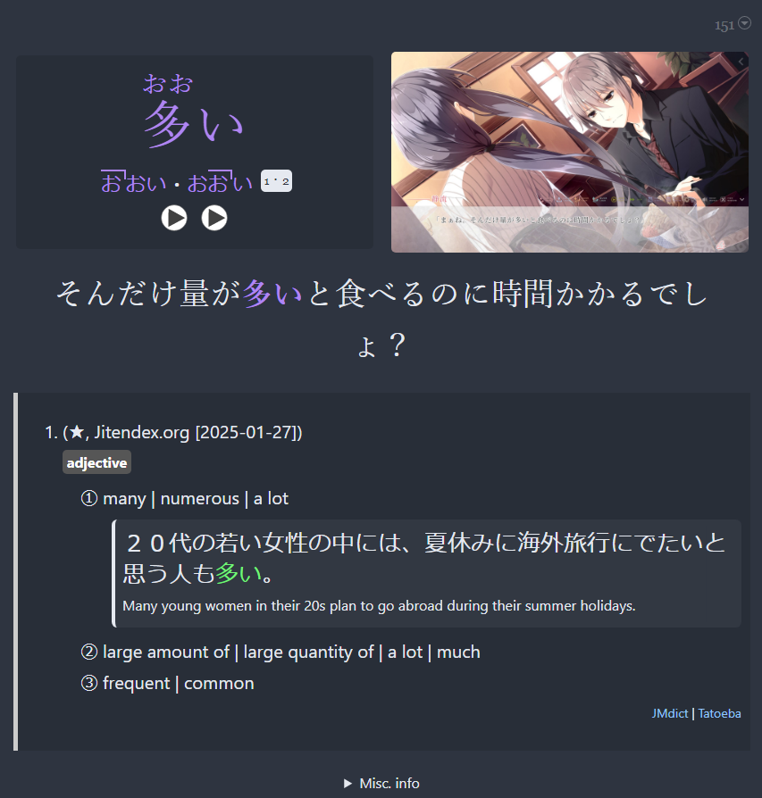
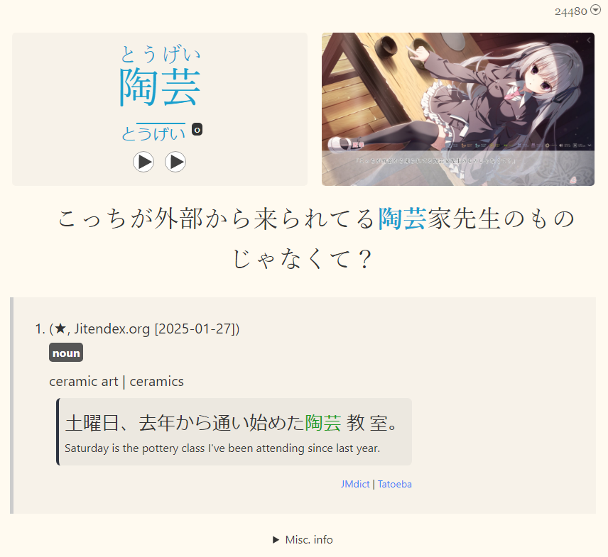
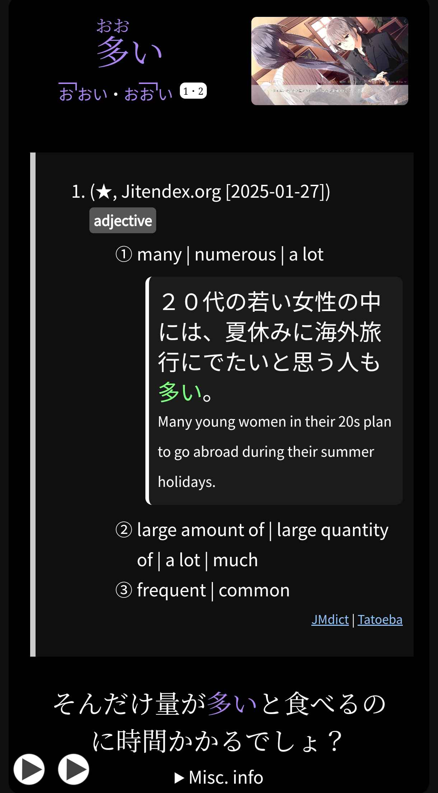
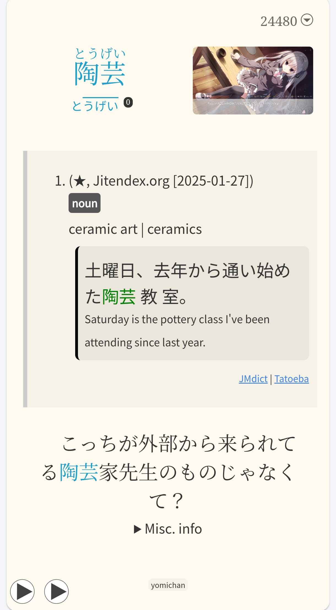
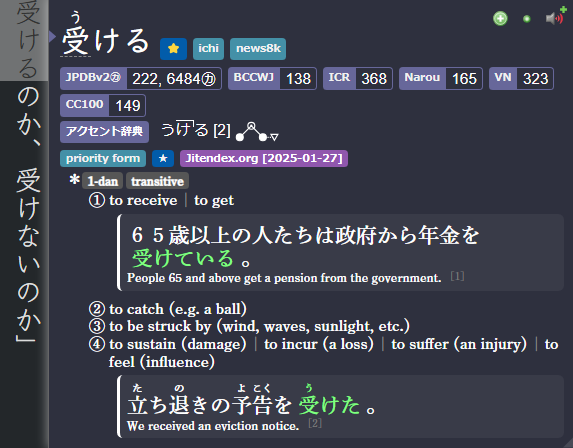
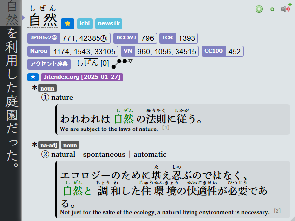
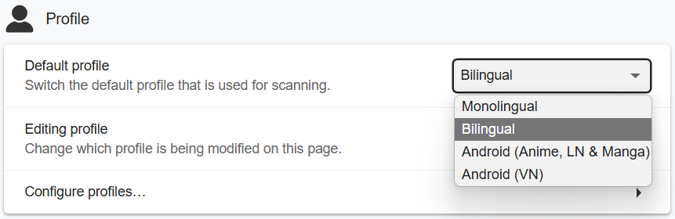

# Pengantar Setup

---

??? note "Apa sih tujuan dari Panduan ini? <small>(klik di sini)</small>"

    - Buat kamu yang males ribet ngatur ini itu atau ngerti hal-hal teknis
    - Buat yang pengen langsung impor semua tools sekaligus tanpa harus nyari-nyari satu-satu
    - Kamu pengen tool yang stabil dan awet dipakai selamanya (asal nggak diupdate, ya nggak bakal rusak)

    Mau panduan yang super lengkap dan nggak cuma tinggal pakai? Cek [Panduan Donkuri](https://donkuri.github.io/learn-japanese/)

---

Baru mulai belajar Jepang dan pengen cepet immersion? Lihat [Panduan Singkat untuk Mulai Japanese](panduan-ringkas-JP.md).

---

## Format Anki dan Yomitan

- Support 4-in-1 Profile: `Monolingual`, `Bilingual`, `Android (Anime, LN & Manga)`, `Android (VN)`

=== "Anki"
    === "PC | Dark"
        {height=300 width=600}
    === "PC | Light"
        {height=300 width=600}
    === "Mobile | Dark"
        {height=600 width=350}
    === "Mobile | Light"
        {height=600 width=350}
=== "Yomitan"
    === "Yomitan | Dark"
        {height=300 width=600}
    === "Yomitan | Light"
        {height=300 width=600}
    === "Yomitan Profile"
        {height=300 width=600}

---

## [Demo Mining](https://youtu.be/tUiXU2gn75g)

??? info "Demo Mining Visual Novel <small>(klik untuk lihat)</small>"

    <iframe width="560" height="315" src="https://www.youtube.com/embed/tUiXU2gn75g" title="Mining Demo" frameborder="0" allow="accelerometer; autoplay; clipboard-write; encrypted-media; gyroscope; picture-in-picture; web-share" allowfullscreen></iframe>

??? info "Demo Mining Anime <small>(klik untuk lihat)</small>"

    di tutorial ini aku pakai note type Mining-JP, di bagian pengaturan anki kamu cocokkan dengan note type Lapis.
    <iframe width="560" height="315" src="https://youtube.com/embed/1mOGv9hAHDc" title="Mining Demo" frameborder="0" allow="accelerometer; autoplay; clipboard-write; encrypted-media; gyroscope; picture-in-picture; web-share" allowfullscreen></iframe>

Kalau kamu baru pertama kali setup, ikuti panduan ini dari atas sampai bawah ya, soalnya ada bagian-bagian yang memang harus diikutin urut.

Panduan ini adalah Setup Hybrid dari [Lapis](https://github.com/donkuri/lapis), Add-ons Anki, Yomitan, dan setting tools yang aku (LazyGuide) pakai.

{height=500 width=1000}

[Klik di sini buat mulai pengaturan](setup-anki-pc-lazy-guide.md){ .md-button .md-button }
